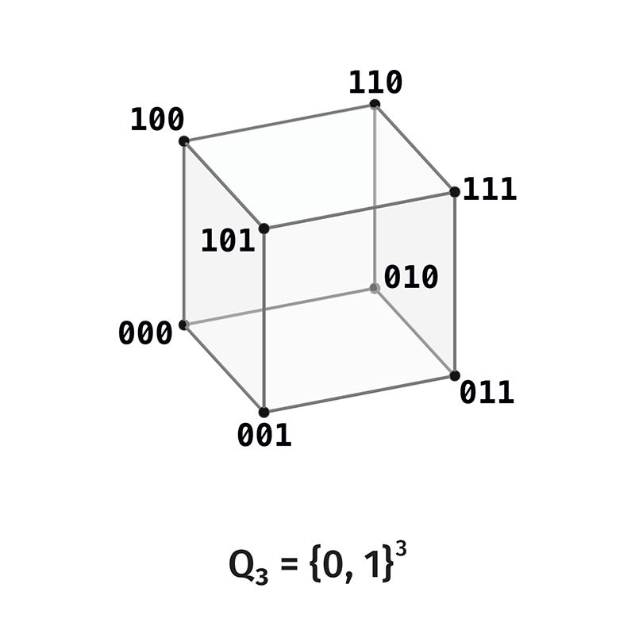
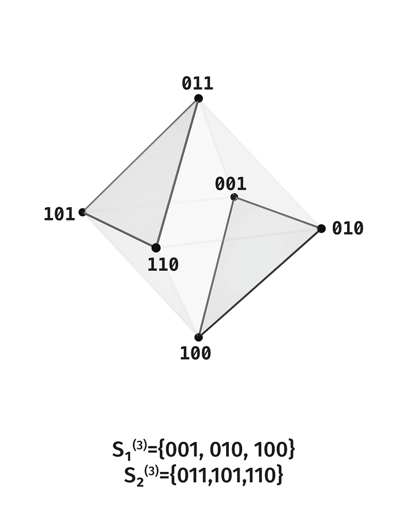

# Distinction Observable Theory

# Volume 0. Foundations

---

# §0. Entry Into the Theory

---

Before beginning, fix the main orientation.

\[
\boxed{
\text{DOT studies how distinction becomes a held structure.}
}
\]

A notation such as \(a\neq b\) fixes a late trace of distinction: \(a\)
and \(b\) are already given as distinguishable. The theory asks about the
preceding arrangement: what must be in place for two sides to be readable
as sides of one distinction.

Everywhere symmetry appears below, we will read it as the trace of one
invariant. Symmetry shows that several sides are held as manifestations of
one. Asymmetry shows that the achieved structure has internal excess and
can become the substrate of the next unfolding.

---

## Block 1. The Absolute Invariant \(\mathbb I\)

---

### The Question

DOT begins with the question:

\[
\boxed{
\text{what must be in place for there to be distinction?}
}
\]

Two sides give distinction only when they are connected as sides of one.
The simple coexistence of two entities does not yet define distinction. A
third structural position is needed: that one with respect to which the
sides are sides.

\[
\boxed{
\text{the first side},\qquad
\text{the second side},\qquad
\text{the one thing they are together.}
}
\]

This one has a different status from the sides: it holds them as sides of
one structure. We will call it the **absolute invariant**:

\[
\boxed{
\mathbb I.
}
\]

### The Word “Invariant”

In standard mathematics, an invariant is usually defined with respect to
transformations: there is a structure, there are admissible
transformations, and the invariant is what is preserved under those
transformations.

In DOT, \(\mathbb I\) fixes an earlier status: the possibility that sides
can be held as sides of one at all. Therefore invariance under
transformations appears later, as a local form of this initial status.

\[
\boxed{
\mathbb I
\text{ is the condition of meaningful preservation.}
}
\]

### \(\mathbb I\) as Monad

\(\mathbb I\) has the status of initial unity before localization.
Position, carrier, configuration, boundary, and operator will appear
later. Here only one thing is fixed: distinction requires that which holds
sides as sides of one.

In this sense \(\mathbb I\) may be called the **monad** of DOT: the
initial invariant status that later receives local forms.

---

## Block 2. First Localization: Dyad, Triad, Substrate

---

### The First Dyad

The first manifestation of \(\mathbb I\) has dyadic form:

\[
\boxed{
\text{unmanifest} \quad / \quad \text{manifest}.
}
\]

This dyad gives the preliminary form of a scene: the one can be in the
mode of nonmanifestation and in the mode of manifestation.

In later terminology, these sides will be read as:

\[
\boxed{
\text{background} \quad / \quad \text{structure}.
}
\]

Background is the side on which structure has not yet been distinguished.
Structure is the side on which a distinguishable form appears.

### The Triad of Holding

The dyad must be held as one dyad. Therefore, together with the two sides,
a third place appears: the **scene**.

\[
\boxed{
\text{background},\qquad
\text{structure},\qquad
\text{scene}.
}
\]

The scene is the place of togetherness in which background and structure
are connected as two sides of one distinction. From the outside, the first
manifestation looks binary: background / structure. Internally, it is
triadic: background, structure, scene.

\[
\boxed{
\text{the dyad is manifested binarily, but arranged triadically.}
}
\]

Here the first asymmetry appears: the external manifestation is poorer
than the internal arrangement. This asymmetry gives motion to the next
unfolding.

### Reflexive Incompleteness

The law of holding must be inscribed on the structure that it holds. When
this happens, the structure receives a new internal layer: it contains the
sides and the record of its own holding. This new layer itself requires
holding.

\[
\boxed{
\text{a structure that contains the record of its own holding becomes
the substrate of the next unfolding.}
}
\]

Call this **reflexive incompleteness**. This is the law of growth: the
holding of one level becomes the material for the next level.

### New Substrate

What was manifestation becomes the substrate of the next manifestation.

\[
\boxed{
\text{the manifested content of one level becomes the substrate of the next.}
}
\]

Thus a ladder of localizations of \(\mathbb I\) arises. Each rank is a new
finite form of the same invariant structure.

---

## Block 3. Three Modes of Localization of \(\mathbb I\)

---

One \(\mathbb I\) receives three modes of localization. These modes denote
three ways in which one invariant holds distinction.

\[
\boxed{
\mathbb I
\rightsquigarrow
(\mathbb I^{\mathrm{lim}},
\mathbb I^{\mathrm{str}},
\mathbb I^{\mathrm{law}}).
}
\]

### Limiting Mode

\[
\boxed{
\mathbb I^{\mathrm{lim}}
\;:\;
\text{the mode of limits.}
}
\]

The limiting mode sets the frame in which distinction has a lower and an
upper boundary. Before a finite locus is introduced, these boundaries are
read in content terms:

- lower limiting mode: nothing is locally distinguished;

- upper limiting mode: everything is fused into one complete inclusion.

Both forms are limiting forms of one \(\mathbb I\): in the first, local
distinction has not yet appeared; in the second, it has been absorbed by
full fusion.

### Structural Mode

\[
\boxed{
\mathbb I^{\mathrm{str}}
\;:\;
\text{the mode of sides.}
}
\]

The structural mode sets polarity: one side of distinction has a
complementary side. Later, after the locus is introduced, this will receive
the strict form of the pair

\[
q \quad / \quad q^\perp.
\]

Here only the principle itself is fixed: distinction is held as a pair of
conjugate sides.

### Operator Mode

\[
\boxed{
\mathbb I^{\mathrm{law}}
\;:\;
\text{the mode of the law of return.}
}
\]

The operator mode sets the law of exchange between sides. If one side
passes into the other, the double passage must return to the initial side.
After the locus is introduced, this will be written by the operator

\[
\kappa^2=\operatorname{id}.
\]

At this level, the meaning is what matters: distinction is stable when the
transition between sides has a law of return.

### One Invariant in Three Modes

\[
\boxed{
\mathbb I^{\mathrm{lim}},
\mathbb I^{\mathrm{str}},
\mathbb I^{\mathrm{law}}
\text{ are three records of one } \mathbb I.
}
\]

The limiting mode is responsible for the frame, the structural mode for
conjugate sides, and the operator mode for the law of exchange. Their
coordination forms a scene of distinction.

---

## Block 4. Reductions

---

A reduction is a transition into another type of scene when one mode of
localization is lost. The initial \(\mathbb I\) preserves its status, but
its local form changes.

Three directions of reduction:

- \(\rho_C\): loss of the limiting mode. The frame of the scene becomes
  blurred.

- \(\rho_D\): loss of the structural mode. The sides are no longer held
  as distinguishable.

- \(\rho_F\): loss of the operator mode. The trace of transition stops
  being recoverable.

\[
\boxed{
\rho_C,\rho_D,\rho_F
\text{ are three directions of transition into other types of scenes.}
}
\]

In later volumes, these reductions receive an operator reading. In §0,
their place is fixed: they are boundary modes of localization of
\(\mathbb I\).

---

## Block 5. Carrier, Locus, and Configurations

---

### Carrier

For the three modes of localization to become a finite structure, they
need a medium of realization. We will call this medium the **carrier**.

The carrier is the connected basis on which positions of distinction can
appear. It sets the togetherness of future configurations: everything that
will be distinguished will be distinguished inside one carrier.

### Locus

When the carrier receives a finite system of positions of distinction, a
**locus** appears:

\[
\boxed{
L_n=\{\ell_1,\ldots,\ell_n\}.
}
\]

A locus is a finite system of positions of distinction.

\[
p\in L_n
\]

means that \(p\) is a position of distinction in the given locus. A
position has formal status: it is the minimal local projection of
distinguishability.

The number

\[
\boxed{
n=|L_n|
}
\]

is called the **rank**. The rank shows how many positions of distinction
are held in the given locus.

### Carrier of Configurations

Each locus defines a full carrier of configurations:

\[
\boxed{
Q_n=\mathcal P(L_n).
}
\]

A configuration is a subset of the locus:

\[
\boxed{
q\subseteq L_n,\qquad q\in Q_n.
}
\]

A configuration has the status of an integral record of which positions of
distinction are held together.

The combinatorics of DOT studies possible integral configurations of one
locus and the relations between them.

### Two Limits

After \(L_n\) is introduced, the two limiting modes receive a strict
record:

\[
\boxed{
\varnothing
\qquad
L_n.
}
\]

\(\varnothing\) is the lower limit: no position of the locus is included
in the configuration.

\(L_n\) is the upper limit: the whole locus is included.

Both limits are limiting configurations. In the first case, local
distinguishability has not yet been distinguished. In the second, it has
coincided with the whole locus and no longer gives internal difference.

### Non-Limiting Carrier

The working domain of DOT is the configurations between the two limits:

\[
\boxed{
U_n=Q_n\setminus\{\varnothing,L_n\}.
}
\]

\[
\boxed{
|Q_n|=2^n,\qquad |U_n|=2^n-2.
}
\]

\(U_n\) is the carrier of non-limiting configurations. The word “active”
may be used as a short name: the active carrier is the domain where
distinction already has a local form and has not yet been absorbed by the
limit.

---

## Block 6. Background, Exchange, and Boundary

---

### Background of a Configuration

For each configuration \(q\subseteq L_n\), the complementary side is
defined:

\[
\boxed{
q^\perp=L_n\setminus q.
}
\]

This side is called the **background of the configuration**. The
background is the internal complementary side of the same configuration
inside the same locus.

### Polar Exchange

Polar exchange sends a configuration to its background:

\[
\boxed{
\kappa(q)=q^\perp.
}
\]

Double exchange returns the initial configuration:

\[
\boxed{
\kappa^2=\operatorname{id}.
}
\]

This is the strict form of the operator mode
\(\mathbb I^{\mathrm{law}}\).

### Boundary

Boundary is the relation of a configuration to its background inside one
locus.

\[
\boxed{
\text{boundary connects } q \text{ and } q^\perp
\text{ as two sides of one scene.}
}
\]

In the chain language, boundary is written by the operator

\[
\partial q,
\]

and coboundary by the operator

\[
\delta q.
\]

Their coordination with polar exchange has the form:

\[
\boxed{
\kappa\partial=\delta\kappa.
}
\]

The meaning of this formula: the passage to the background sends internal
boundary to coboundary. The detailed operator unfolding is given in the
volume on boundary operators; here the place of boundary in the foundation
is fixed.

---

## Block 7. Observer

---

The observer in DOT is the mode of coordination of the three localizations
of one \(\mathbb I\) on one carrier.

\[
\boxed{
O_n
=
\mathbb I
\text{ in the mode of coordinating }
(\mathbb I^{\mathrm{lim}},
\mathbb I^{\mathrm{str}},
\mathbb I^{\mathrm{law}})
\text{ on } L_n.
}
\]

The observer holds the scene as one scene: limits, sides, and the law of
exchange are read together. Therefore the observer belongs not to the
carrier of configurations, but to the invariant structure of reading of
this carrier.

\[
\boxed{
O_n\in \operatorname{Inv}(S_n).
}
\]

In bridge readings, this mode may be compared with consciousness, a frame
of reference, or a standard of measurement. In the strict foundation of
DOT, only the structural content is fixed: the observer is the invariant
of scene coordination.

---

## Block 8. Ascent Through Ranks

---

### Rank 1: Pure Polarity

\[
L_1=\{\ell_1\}.
\]

The full carrier:

\[
Q_1=\{\varnothing,L_1\}.
\]

The non-limiting carrier is empty:

\[
U_1=\varnothing.
\]

At rank 1 there are only two limiting modes and polar exchange between
them:

\[
\kappa(\varnothing)=L_1,\qquad \kappa(L_1)=\varnothing.
\]

*Figure 0.1. Polar pair: two limiting sides and the exchange between them.*

This is pure polarity. There is not yet an internal non-limiting
configuration.

### Rank 2: The First Internal Pair

\[
L_2=\{a,b\}.
\]

The full carrier:

\[
Q_2=\{\varnothing,\{a\},\{b\},L_2\}.
\]

The non-limiting carrier:

\[
\boxed{
U_2=\{\{a\},\{b\}\}.
}
\]

*Figure 0.2. Full carrier \(Q_2\): two limits and two non-limiting configurations.*

On the full \(Q_2\), two paths between the limits are visible:

\[
\varnothing\to\{a\}\to L_2,
\qquad
\varnothing\to\{b\}\to L_2.
\]

Rank 2 gives the first internal polar pair:

\[
\{a\}\leftrightarrow\{b\}.
\]

The scene already has a non-limiting domain, but there is only one pair in
it. Therefore rank 2 is a pre-scene of full DOT: there is internal
polarity, but no system of several independent relations.

### Rank 3: The First Complete Scene

\[
L_3=\{1,2,3\}.
\]

\[
|U_3|=2^3-2=6.
\]

The six non-limiting configurations split into two shells:

\[
S_1^{(3)}=\{\{1\},\{2\},\{3\}\},
\]

\[
S_2^{(3)}=\{\{1,2\},\{1,3\},\{2,3\}\}.
\]

Polar exchange sends the shells into one another:

\[
\boxed{
\kappa:S_1^{(3)}\leftrightarrow S_2^{(3)}.
}
\]

#### Six Basic Names

At rank 3 the two shells receive a content reading:

\[
\boxed{
S_1^{(3)}
=
\{\text{background},\text{observer},\text{scene}\}.
}
\]

\[
\boxed{
S_2^{(3)}
=
\{\text{boundary},\text{content},\text{distinction}\}.
}
\]

The three axes of polar exchange are:

\[
\boxed{
\text{background}\leftrightarrow\text{distinction},
\qquad
\text{observer}\leftrightarrow\text{content},
\qquad
\text{scene}\leftrightarrow\text{boundary}.
}
\]

This reading accompanies the strict combinatorics of \(U_3\) and gives a
semantic projection of the first complete scene.

#### Three Relations

On \(U_3\), Hamming relations are introduced:

\[
R_d(q,r)\iff |q\triangle r|=d.
\]

At rank 3 they give:

\[
\boxed{
R_1\cong C_6,
}
\]

\[
\boxed{
R_2\cong K_3\sqcup K_3,
}
\]

\[
\boxed{
R_3\cong 3K_2.
}
\]

These three relations partition all pairs of the six configurations:

\[
|R_1|=6,\qquad |R_2|=6,\qquad |R_3|=3,
\]

\[
\boxed{
6+6+3=15=\binom62.
}
\]

The octahedral skeleton:

\[
\boxed{
(U_3,R_1\cup R_2)\cong K_{2,2,2}.
}
\]

*Figure 0.3. Octahedral skeleton of the first complete scene. In the image
caption, the old notation \(X_{\mathrm{adm}}\) corresponds to \(U_3\).*

The complete scene of rank 3:

\[
\boxed{
S_3=(U_3;R_1,R_2,R_3).
}
\]

Rank 3 is the first complete scene because here the following are present
simultaneously:

- polar pairs \(R_3\);

- two triadic chambers \(R_2\);

- a closed cycle \(R_1\).

---

## Block 9. The Law of Rank Growth

---

### Projective Closure

For rank \(n\), introduce the carrier without the lower limit:

\[
\boxed{
Q_n^*=Q_n\setminus\{\varnothing\}.
}
\]

\[
\boxed{
|Q_n^*|=2^n-1.
}
\]

This is the projective closure of rank \(n\): all nonempty configurations
of the given locus.

### Symmetric Doubling

In the transition to rank \(n+1\), each nonempty configuration of rank
\(n\) receives a polar pair in the new locus.

\[
\boxed{
|U_{n+1}|=2|Q_n^*|=2(2^n-1).
}
\]

Thus the active carrier of rank \(n+1\) is the symmetric doubling of the
projective closure of rank \(n\).

\[
\boxed{
Q_n^*
\longleftrightarrow
U_{n+1}/\kappa.
}
\]

In content terms: a nonempty configuration of one rank becomes an axis of
polar exchange at the next rank.

---

## Block 10. Projective Factor and Higher Ranks

---

Polar exchange \(\kappa\) partitions \(U_n\) into pairs:

\[
\{q,q^\perp\}.
\]

The quotient by these pairs:

\[
\boxed{
U_n/\kappa.
}
\]

For \(n\ge 2\):

\[
\boxed{
U_n/\kappa\cong PG(n-2,2)
}
\]

as the set of points of projective space over \(\mathbb F_2\).

The number of axes:

\[
\boxed{
|U_n/\kappa|=2^{n-1}-1.
}
\]

Table of the first ranks:

| Rank \(n\) | \(|U_n|\) | \(|U_n/\kappa|\) | Projective factor |
|---:|---:|---:|---|
| 2 | 2 | 1 | \(PG(0,2)\) |
| 3 | 6 | 3 | \(PG(1,2)\), the projective line |
| 4 | 14 | 7 | \(PG(2,2)\), the Fano plane |
| 5 | 30 | 15 | \(PG(3,2)\) |

### Rank 4 and the Fano Plane

At rank 4:

\[
\boxed{
U_4/\kappa\cong PG(2,2).
}
\]

The seven Fano points are the seven complementary axes of \(U_4\). They
have two types:

- 4 axes of type \((1,3)\): vertex / opposite face;

- 3 axes of type \((2,2)\): edge / opposite edge.

Fano lines have two types:

- six lines contain two axes of type \((1,3)\) and one axis of type
  \((2,2)\);

- one special line contains three axes of type \((2,2)\).

\[
\boxed{
\text{the Fano factor of rank }4
\text{ threads the types of complementary axes.}
}
\]

This is the strict reading. Lifted geometric readings of Fano are built
separately from the factor fact \(U_4/\kappa\).

### Symmetry of Layers

The full carrier is stratified by configuration size:

\[
S_k^{(n)}=\{q\subseteq L_n:\ |q|=k\}.
\]

Polar exchange sends a layer to the complementary layer:

\[
\boxed{
\kappa:S_k^{(n)}\leftrightarrow S_{n-k}^{(n)}.
}
\]

When \(n\) is even, a self-dual layer appears:

\[
S_{n/2}^{(n)}.
\]

It is sent to itself by \(\kappa\). When \(n\) is odd, all non-limiting
layers are split into polar pairs.

---

## Entry Chain

---

This paragraph introduces the first notions in one chain:

\[
\boxed{
\mathbb I
\to
\text{dyad}
\to
\text{three modes of localization}
\to
\text{carrier}
\to
L_n
\to
Q_n
\to
U_n
\to
\kappa
\to
O_n
\to
S_3
\to
U_n/\kappa.
}
\]

Each step refines the previous one. One \(\mathbb I\) is successively
localized as limit, structure, law of exchange, carrier, scene, observer,
and projective factor.

Symmetry holds the structure of a rank. Asymmetry between external
manifestation and internal arrangement gives the transition to the next
rank.

---

## Summary of Introduced Terms

| Term | Notation | Content |
|---|---|---|
| Absolute invariant | \(\mathbb I\) | Initial status of unity before localization |
| Dyad | background / structure | First two-sided manifestation of \(\mathbb I\) |
| Scene | — | Place of togetherness of background and structure |
| Reflexive incompleteness | — | Growth through the record of holding inside the structure itself |
| Limiting mode | \(\mathbb I^{\mathrm{lim}}\) | \(\mathbb I\) as frame of limits |
| Structural mode | \(\mathbb I^{\mathrm{str}}\) | \(\mathbb I\) as conjugation of sides |
| Operator mode | \(\mathbb I^{\mathrm{law}}\) | \(\mathbb I\) as law of return |
| Reductions | \(\rho_C,\rho_D,\rho_F\) | Transitions to other scene types when a mode is lost |
| Carrier | — | Connected medium of realization of distinctions |
| Locus | \(L_n\) | Finite system of positions of distinction |
| Position | \(p\in L_n\) | Minimal local projection of distinguishability |
| Rank | \(n=|L_n|\) | Number of positions of distinction in the locus |
| Carrier of configurations | \(Q_n=\mathcal P(L_n)\) | All configurations of the locus |
| Configuration | \(q\subseteq L_n\) | Integral record of held positions |
| Limits | \(\varnothing,L_n\) | Lower and upper limiting configurations |
| Non-limiting carrier | \(U_n=Q_n\setminus\{\varnothing,L_n\}\) | Configurations between the limits |
| Background | \(q^\perp=L_n\setminus q\) | Complementary side of a configuration |
| Polar exchange | \(\kappa(q)=q^\perp\) | Law of exchange of sides |
| Boundary | \(\partial q,\delta q\) | Relation of a configuration to its background |
| Observer | \(O_n\) | \(\mathbb I\) in the mode of scene coordination |
| Layer | \(S_k^{(n)}\) | Configurations of size \(k\) |
| Projective closure | \(Q_n^*=Q_n\setminus\{\varnothing\}\) | All nonempty configurations of the rank |
| Law of growth | \(|U_{n+1}|=2|Q_n^*|\) | Symmetric doubling in the rank transition |
| Projective factor | \(U_n/\kappa\cong PG(n-2,2)\) | Space of complementary axes |

All records with \(\mathbb I\) refer to one and the same invariant viewed
in different modes of localization.

---

# §1. Formal Scene

---

In §0 the first places of the theory were introduced:

\[
\mathbb I,\qquad
L_n,\qquad
Q_n,\qquad
U_n,\qquad
\kappa,\qquad
O_n.
\]

The next step is to assemble them into one strict form. This form is the
**scene of distinction**.

\[
\boxed{
\text{a scene of distinction is a finite carrier of configurations together
with a grammar of relations and invariants of reading.}
}
\]

A scene fixes which configurations of a locus participate in distinction,
which connections between them are allowed, and what preserves the scene
as one scene.

---

## 1.1. Locus and Configurations

Let a finite locus be given:

\[
\boxed{
L_n=\{\ell_1,\ldots,\ell_n\}.
}
\]

Its elements are called **positions of distinction**. A position is the
minimal local projection of distinguishability.

The full carrier of configurations:

\[
\boxed{
Q_n=\mathcal P(L_n).
}
\]

A configuration is a subset of the locus:

\[
\boxed{
q\subseteq L_n.
}
\]

A configuration has integral status: it fixes which positions of
distinction are held together. Therefore one configuration is read as one
state of the locus.

The two limits:

\[
\boxed{
\varnothing,\qquad L_n.
}
\]

The non-limiting carrier:

\[
\boxed{
U_n=Q_n\setminus\{\varnothing,L_n\}.
}
\]

\(U_n\) is the main carrier of the scene of distinction.

---

## 1.2. Background of a Configuration and Polar Exchange

For each configuration \(q\subseteq L_n\), the background is defined:

\[
\boxed{
q^\perp=L_n\setminus q.
}
\]

The background is the complementary side of the configuration inside the
same locus. The pair

\[
\boxed{
\{q,q^\perp\}
}
\]

sets a local polarity.

Polar exchange:

\[
\boxed{
\kappa(q)=q^\perp.
}
\]

Law of exchange:

\[
\boxed{
\kappa^2=\operatorname{id}.
}
\]

This formula fixes the operator mode of \(\mathbb I\): the transition to
the complementary side returns to the initial configuration after the
second step.

---

## 1.3. Grammar of the Scene

Specifying a scene includes relations, operators, and ways of reading that
work on the carrier \(U_n\).

Call this the **grammar of the scene**:

\[
\boxed{
\mathcal A_n.
}
\]

The grammar of a scene may include:

- relations between configurations;

- exchange operators;

- boundary operators;

- cyclic traversals;

- factorizations;

- rules for recovering a trace.

In general form, a scene of rank \(n\) is written as:

\[
\boxed{
S_n=(U_n,\mathcal A_n,\operatorname{Inv}(S_n)).
}
\]

Here:

\[
U_n
\]

is the non-limiting carrier of configurations;

\[
\mathcal A_n
\]

is the grammar of relations and operators;

\[
\operatorname{Inv}(S_n)
\]

is the invariant structure of the scene.

---

## 1.4. Invariant Structure of the Scene

The invariants of a scene are what preserve it as one scene under
admissible readings and transformations.

\[
\boxed{
\operatorname{Inv}(S_n)
}
\]

contains data about what remains stable when the grammar \(\mathcal A_n\)
acts.

For the minimal polar pair, the stable law is:

\[
\kappa^2=\operatorname{id}.
\]

For the complete scene of rank \(3\), stability is richer: polar pairs,
triadic chambers, and a cycle must be coordinated. Therefore the invariant
structure grows together with the grammar of the scene.

\[
\boxed{
\text{the richer the grammar, the richer the invariant structure.}
}
\]

---

## 1.5. Observer of the Scene

The observer \(O_n\) is the mode of coordination of the scene:

\[
\boxed{
O_n\in\operatorname{Inv}(S_n).
}
\]

It holds the joint reading of:

- limits;

- configurations;

- background;

- polar exchange;

- relations inside \(U_n\);

- operator laws.

In the formula of §0:

\[
\boxed{
O_n
=
\mathbb I
\text{ in the mode of coordination of the scene }S_n.
}
\]

The observer belongs to the invariant structure of reading. Its place is
in the coordination of the grammar of the scene.

---

## 1.6. Three Modes of Holding the Scene

A scene is held through three modes of localization of \(\mathbb I\):

\[
\boxed{
\mathbb I^{\mathrm{lim}},
\qquad
\mathbb I^{\mathrm{str}},
\qquad
\mathbb I^{\mathrm{law}}.
}
\]

In the formal scene they are read as follows:

| Mode of \(\mathbb I\) | What it holds | Formal domain |
|---|---|---|
| \(\mathbb I^{\mathrm{lim}}\) | limits of the scene | \(\varnothing,L_n\) |
| \(\mathbb I^{\mathrm{str}}\) | conjugate sides | \(q,q^\perp\) |
| \(\mathbb I^{\mathrm{law}}\) | law of return | \(\kappa^2=\operatorname{id}\) |

These three modes give the basic form of the scene. At rank \(3\), they
receive their first complete internal unfolding through the three
relations \(R_1,R_2,R_3\).

---

## 1.7. Reductions as Scene Transitions

If one of the modes of holding is lost, the scene passes into another
type. The three directions of reduction are:

\[
\boxed{
\rho_C,\qquad \rho_D,\qquad \rho_F.
}
\]

Their relation to the modes:

\[
\boxed{
\rho_C \leftrightarrow \mathbb I^{\mathrm{lim}},
}
\]

\[
\boxed{
\rho_D \leftrightarrow \mathbb I^{\mathrm{str}},
}
\]

\[
\boxed{
\rho_F \leftrightarrow \mathbb I^{\mathrm{law}}.
}
\]

Meaning:

- \(\rho_C\): the scene loses its limiting frame;

- \(\rho_D\): the scene loses the distinguishability of sides;

- \(\rho_F\): the scene loses the recoverable trace of transition.

A reduction sends the scene into another mode of localization of
\(\mathbb I\). In the following sections, these reductions will be
connected with concrete graphs, operators, and boundary structures.

---

## 1.8. Minimal Scene and Complete Scene

Rank \(1\) sets pure polarity:

\[
Q_1=\{\varnothing,L_1\},
\qquad
U_1=\varnothing.
\]

Rank \(2\) sets the first internal pair:

\[
U_2=\{\{a\},\{b\}\}.
\]

This is already a non-limiting scene, but its grammar contains only one
polar pair.

Rank \(3\) gives the first complete scene:

\[
\boxed{
|U_3|=6.
}
\]

On this carrier, three independent grammars appear:

\[
\boxed{
R_1,\qquad R_2,\qquad R_3.
}
\]

This is why \(S_3\) becomes the first complete scene of DOT.

---

## 1.9. The Scene of Rank \(3\) as the Next Step

After the formal definition of a scene, the next section unfolds the
concrete scene:

\[
\boxed{
S_3=(U_3;R_1,R_2,R_3).
}
\]

It will show:

- why \(U_3\) has six configurations;

- how the two shells \(S_1^{(3)}\) and \(S_2^{(3)}\) arise;

- why Hamming relations give

\[
R_1=C_6,
\qquad
R_2=K_3\sqcup K_3,
\qquad
R_3=3K_2;
\]

- how the octahedral skeleton arises from \(R_1\cup R_2\);

- how the observer \(O_3\) is read as the coordination of three grammars.

---

## Summary of §1

In this section, the scene received the strict form:

\[
\boxed{
S_n=(U_n,\mathcal A_n,\operatorname{Inv}(S_n)).
}
\]

Its elements:

| Level | Notation | Meaning |
|---|---|---|
| Locus | \(L_n\) | finite system of positions of distinction |
| Configurations | \(Q_n=\mathcal P(L_n)\) | all integral states of the locus |
| Non-limiting carrier | \(U_n\) | configurations between limits |
| Grammar | \(\mathcal A_n\) | relations and operators of the scene |
| Invariants | \(\operatorname{Inv}(S_n)\) | stable content of the scene |
| Observer | \(O_n\) | coordination of the scene as one scene |

The main transition:

\[
\boxed{
\text{from the locus }L_n
\text{ to the scene }S_n.
}
\]

Now one can pass to the first complete scene: rank \(3\).

---

# §2. Rank \(3\): The First Complete Scene

---

In §1 the scene was set in general form:

\[
\boxed{
S_n=(U_n,\mathcal A_n,\operatorname{Inv}(S_n)).
}
\]

Now we unfold the first rank where this form receives a complete internal
grammar.

\[
\boxed{
\text{the first complete scene of DOT is rank }3.
}
\]

Ranks \(1\) and \(2\) give the necessary preparations: limits, polarity, and
the first internal pair. Rank \(3\) is the first to contain three independent
types of connectedness on one non-limiting carrier.

---

## 2.1. Locus of Rank \(3\)

Let

\[
\boxed{
L_3=\{1,2,3\}.
}
\]

The full carrier of configurations is

\[
\boxed{
Q_3=\mathcal P(L_3).
}
\]

Its eight configurations are

\[
\varnothing,\quad
\{1\},\{2\},\{3\},\quad
\{1,2\},\{1,3\},\{2,3\},\quad
\{1,2,3\}.
\]

The two limits are

\[
\boxed{
\varnothing,\qquad L_3.
}
\]

The non-limiting carrier is

\[
\boxed{
U_3=Q_3\setminus\{\varnothing,L_3\}.
}
\]

Therefore

\[
\boxed{
|U_3|=2^3-2=6.
}
\]

*Figure 2.1. The full carrier \(Q_3\): eight configurations, of which two
limits are removed in the passage to \(U_3\).*

These are the six configurations between the lower and upper limits.

---

## 2.2. Two Shells

The carrier \(U_3\) is stratified by the size of the configuration:

\[
S_1^{(3)}=\{\{1\},\{2\},\{3\}\},
\]

\[
S_2^{(3)}=\{\{1,2\},\{1,3\},\{2,3\}\}.
\]

The first layer contains one-point configurations. The second layer contains
two-point configurations.

The polar exchange

\[
\kappa(q)=L_3\setminus q
\]

translates the shells into each other:

\[
\boxed{
\kappa:S_1^{(3)}\leftrightarrow S_2^{(3)}.
}
\]

Concretely:

\[
\{1\}\leftrightarrow\{2,3\},
\qquad
\{2\}\leftrightarrow\{1,3\},
\qquad
\{3\}\leftrightarrow\{1,2\}.
\]

Thus the three complementary axes of rank \(3\) arise.

---

## 2.3. Bit Notation

For computations it is convenient to write configurations as bit strings:

\[
\{1\}\leftrightarrow100,
\qquad
\{2\}\leftrightarrow010,
\qquad
\{3\}\leftrightarrow001,
\]

\[
\{1,2\}\leftrightarrow110,
\qquad
\{1,3\}\leftrightarrow101,
\qquad
\{2,3\}\leftrightarrow011.
\]

Then:

\[
Q_3=\{000,001,010,011,100,101,110,111\},
\]

\[
U_3=Q_3\setminus\{000,111\}.
\]

Bit notation is the computational language for the same simplicial carrier.

---

## 2.4. Hamming Relations

On \(U_3\), define relations by Hamming distance:

\[
\boxed{
R_d(q,r)\iff |q\triangle r|=d.
}
\]

Here \(q\triangle r\) is the symmetric difference of configurations.

Since there are six points in \(U_3\), the total number of unordered pairs is

\[
\binom62=15.
\]

These pairs split into three classes:

\[
\boxed{
R_1,\qquad R_2,\qquad R_3.
}
\]

Thus three different grammars of connection arise on one carrier.

---

## 2.5. The Relation \(R_3\): Polar Pairs

Distance \(3\) means that the configurations differ in all three positions of
the locus. Therefore \(R_3\) coincides with the polar exchange \(\kappa\):

\[
\boxed{
R_3=\{\{q,\kappa q\}:q\in U_3\}.
}
\]

Concretely:

\[
100\leftrightarrow011,
\]

\[
010\leftrightarrow101,
\]

\[
001\leftrightarrow110.
\]

The graph is

\[
\boxed{
(U_3,R_3)\cong 3K_2.
}
\]

*Figure 2.2. The relation \(R_3\): three complementary axes of the first
complete scene.*

These are the three complementary axes of the first complete scene.

---

## 2.6. The Relation \(R_2\): Two Triadic Chambers

Distance \(2\) connects configurations inside one layer.

In the first layer:

\[
100\leftrightarrow010,\qquad
010\leftrightarrow001,\qquad
001\leftrightarrow100.
\]

In the second layer:

\[
110\leftrightarrow101,\qquad
101\leftrightarrow011,\qquad
011\leftrightarrow110.
\]

Therefore:

\[
\boxed{
(U_3,R_2)\cong K_3\sqcup K_3.
}
\]

*Figure 2.3. The relation \(R_2\): two triadic chambers \(S_1^{(3)}\) and
\(S_2^{(3)}\).*

These are the two triadic chambers of the scene:

\[
\boxed{
S_1^{(3)}
\quad\text{and}\quad
S_2^{(3)}.
}
\]

The relation \(R_2\) works horizontally:

\[
\boxed{
R_2:S_k^{(3)}\to S_k^{(3)}.
}
\]

The boundary operators \(\partial\) and \(\delta\) will work differently:
they pass between layers.

---

## 2.7. The Relation \(R_1\): The Six-Cycle

Distance \(1\) connects configurations of adjacent layers.

One possible traversal:

\[
\boxed{
100\to110\to010\to011\to001\to101\to100.
}
\]

Every adjacent pair in this traversal differs in exactly one position of the
locus. Therefore:

\[
\boxed{
(U_3,R_1)\cong C_6.
}
\]

*Figure 2.4. The relation \(R_1\): a closed six-cycle on the non-limiting
carrier.*

\(R_1\) gives a closed traversal of the whole non-limiting scene.

---

## 2.8. Partition of All Pairs

The three relations \(R_1,R_2,R_3\) partition all pairs of points of \(U_3\):

\[
|R_1|=6,
\qquad
|R_2|=6,
\qquad
|R_3|=3.
\]

\[
\boxed{
6+6+3=15=\binom62.
}
\]

Thus every pair of distinct configurations of \(U_3\) has exactly one type of
connection:

— distance \(1\);

— distance \(2\);

— distance \(3\).

In this way \(U_3\) becomes a fully distinguished carrier.

---

## 2.9. Octahedral Skeleton

The union of the relations \(R_1\) and \(R_2\) gives the graph

\[
\boxed{
(U_3,R_1\cup R_2)\cong K_{2,2,2}.
}
\]

*Figure 2.5. The union \(R_1\cup R_2\) gives the octahedral surface. In the
caption of the image, the old notation \(X_{\mathrm{adm}}\) corresponds to
\(U_3\).*

This graph is the skeleton of the octahedron.

The relation \(R_3\) sets the three diagonals of the octahedron:

\[
\boxed{
(U_3,R_3)\cong 3K_2.
}
\]

Therefore the complete scene of rank \(3\) contains:

— the octahedral surface \(R_1\cup R_2\);

— the three internal polar axes \(R_3\).

\[
\boxed{
S_3=(U_3;R_1,R_2,R_3).
}
\]

---

## 2.10. Three Modes of \(\mathbb I\) on \(U_3\)

At rank \(3\), the three localization modes of \(\mathbb I\) receive their
first complete carriers of manifestation.

\[
\boxed{
\mathbb I^{\mathrm{str}}
\rightsquigarrow
R_3=3K_2.
}
\]

The structural mode manifests as three polar axes.

\[
\boxed{
\mathbb I^{\mathrm{law}}
\rightsquigarrow
R_2=K_3\sqcup K_3.
}
\]

The operator mode manifests as two chambers inside which the recoverable trace
of configuration is preserved.

\[
\boxed{
\mathbb I^{\mathrm{lim}}
\rightsquigarrow
R_1=C_6.
}
\]

The limiting mode manifests as a closed traversal of the whole non-limiting
scene.

This correspondence gives the first complete deciphering of the scene:

| Mode of \(\mathbb I\) | Carrier of manifestation on \(U_3\) | Meaning |
|---|---|---|
| \(\mathbb I^{\mathrm{str}}\) | \(R_3=3K_2\) | polar pairs |
| \(\mathbb I^{\mathrm{law}}\) | \(R_2=K_3\sqcup K_3\) | recoverable trace in chambers |
| \(\mathbb I^{\mathrm{lim}}\) | \(R_1=C_6\) | closed limiting frame |

---

## 2.11. Observer of the Complete Scene

The observer of rank \(3\) coordinates three grammars:

\[
R_1,\qquad R_2,\qquad R_3.
\]

Formally:

\[
\boxed{
O_3\in \operatorname{Inv}(S_3).
}
\]

Substantively:

\[
\boxed{
O_3
=
\mathbb I
\text{ in the mode of coordination of }
(R_1,R_2,R_3)
\text{ on }U_3.
}
\]

The observer of the complete scene holds:

— polar axes;

— two triadic chambers;

— cyclic traversal;

— their belonging to one carrier \(U_3\).

Therefore the observer of rank \(3\), for the first time, has a complete
internal structure.

---

## 2.12. Six Basic Names

In §0, the semantic projection of the six configurations of rank \(3\) was
introduced:

\[
\boxed{
S_1^{(3)}
=
\{\text{background},\text{observer},\text{scene}\},
}
\]

\[
\boxed{
S_2^{(3)}
=
\{\text{boundary},\text{content},\text{distinction}\}.
}
\]

The polar exchange connects them into three axes:

\[
\boxed{
\text{background}\leftrightarrow\text{distinction},
}
\]

\[
\boxed{
\text{observer}\leftrightarrow\text{content},
}
\]

\[
\boxed{
\text{scene}\leftrightarrow\text{boundary}.
}
\]

This projection accompanies the strict relations \(R_1,R_2,R_3\) and shows how
the basic concepts of DOT can be placed on the first complete scene.

---

## 2.13. Why Rank \(3\) Is the First Complete Rank

Rank \(1\):

\[
U_1=\varnothing.
\]

There is limiting polarity, but no internal non-limiting configuration.

Rank \(2\):

\[
U_2=\{\{a\},\{b\}\}.
\]

There is an internal pair, but no several independent grammars.

Rank \(3\):

\[
U_3=\{100,010,001,110,101,011\}.
\]

Here the following arise at once:

\[
3K_2,
\qquad
K_3\sqcup K_3,
\qquad
C_6.
\]

\[
\boxed{
\text{rank }3
\text{ is the first rank where the scene has polarity, triadicity, and cycle.}
}
\]

---

## 2.14. Passage to Boundary Operators

On \(U_3\), two different grammars are already visible and must be separated.

Horizontal grammar:

\[
R_2:S_k^{(3)}\to S_k^{(3)}.
\]

It works inside a layer.

Vertical grammar:

\[
\partial:S_k^{(3)}\to S_{k-1}^{(3)},
\qquad
\delta:S_k^{(3)}\to S_{k+1}^{(3)}.
\]

It works between layers.

Therefore the next section introduces the boundary operators

\[
\partial,\qquad \delta,
\]

and their agreement with \(\kappa\):

\[
\boxed{
\kappa\partial=\delta\kappa.
}
\]

---

## Summary of §2

The first complete scene:

\[
\boxed{
S_3=(U_3;R_1,R_2,R_3).
}
\]

Carrier:

\[
\boxed{
|U_3|=6.
}
\]

Three relations:

\[
\boxed{
R_1=C_6,
\qquad
R_2=K_3\sqcup K_3,
\qquad
R_3=3K_2.
}
\]

Octahedral skeleton:

\[
\boxed{
(U_3,R_1\cup R_2)\cong K_{2,2,2}.
}
\]

Meaning of rank \(3\):

\[
\boxed{
\text{the first scene where one } \mathbb I
\text{ is localized as polarity, triad, and cycle.}
}
\]

---

# §3. Boundary Grammar

---

In §2 the horizontal relations on the first complete scene were unfolded:

\[
R_1,\qquad R_2,\qquad R_3.
\]

The next grammar is **boundary grammar**. It works as a transition between a
configuration and its immediate faces.

\[
\boxed{
\text{boundary grammar describes how a configuration unfolds through
its smaller parts.}
}
\]

---

## 3.1. Layers of the Carrier

Let a locus be given:

\[
L_n=\{\ell_1,\ldots,\ell_n\}.
\]

The full carrier of configurations is

\[
Q_n=\mathcal P(L_n).
\]

The layer of size \(k\):

\[
\boxed{
S_k^{(n)}
=
\{q\subseteq L_n:\ |q|=k\}.
}
\]

That is, \(S_k^{(n)}\) consists of all configurations that contain exactly
\(k\) positions of distinction.

*Figure 3.1. The two shells \(S_1^{(3)}\) and \(S_2^{(3)}\), between which the
polar exchange acts.*

Layer decomposition:

\[
\boxed{
Q_n=\bigsqcup_{k=0}^{n} S_k^{(n)}.
}
\]

The limits are the extreme layers:

\[
S_0^{(n)}=\{\varnothing\},
\qquad
S_n^{(n)}=\{L_n\}.
\]

The non-limiting carrier is

\[
\boxed{
U_n=\bigsqcup_{k=1}^{n-1}S_k^{(n)}.
}
\]

---

## 3.2. Horizontal and Vertical Grammars

The relations \(R_d\) work between configurations of one carrier:

\[
\boxed{
R_d(q,r)\iff |q\triangle r|=d.
}
\]

At rank \(3\), the relation \(R_2\) works inside layers:

\[
\boxed{
R_2:S_k^{(3)}\to S_k^{(3)}.
}
\]

For example:

\[
S_1^{(3)}=\{100,010,001\}
\]

forms a triangle \(K_3\), and

\[
S_2^{(3)}=\{110,101,011\}
\]

forms the second triangle \(K_3\).

Boundary operators work vertically:

\[
\boxed{
\partial:S_k^{(n)}\to S_{k-1}^{(n)},
}
\]

\[
\boxed{
\delta:S_k^{(n)}\to S_{k+1}^{(n)}.
}
\]

They pass between adjacent layers.

---

## 3.3. The Boundary Operator \(\partial\)

For a configuration \(q\subseteq L_n\), the boundary operator is given by the
formula

\[
\boxed{
\partial q
=
\sum_{p\in q}(q\setminus\{p\}).
}
\]

Meaning: \(\partial q\) gathers all immediate faces of the configuration
\(q\), obtained by removing one position.

If

\[
q=\{a,b,c\},
\]

then

\[
\partial q
=
\{b,c\}+\{a,c\}+\{a,b\}.
\]

If

\[
q=\{a,b\},
\]

then

\[
\partial q
=
\{a\}+\{b\}.
\]

The boundary lowers the layer:

\[
\boxed{
q\in S_k^{(n)}
\quad\Longrightarrow\quad
\partial q\in \operatorname{span} S_{k-1}^{(n)}.
}
\]

---

## 3.4. The Law \(\partial^2=0\)

The boundary operator satisfies the standard chain law:

\[
\boxed{
\partial^2=0.
}
\]

Meaning: the boundary of a boundary cancels mutually.

For the example of a triple:

\[
\partial\{a,b,c\}
=
\{b,c\}+\{a,c\}+\{a,b\}.
\]

One more step gives

\[
\partial^2\{a,b,c\}
=
(\{b\}+\{c\})
+(\{a\}+\{c\})
+(\{a\}+\{b\}).
\]

Each one-point configuration appears twice. Over \(\mathbb F_2\), double
appearance gives zero:

\[
\{a\}+\{a\}=0,
\qquad
\{b\}+\{b\}=0,
\qquad
\{c\}+\{c\}=0.
\]

Therefore:

\[
\boxed{
\partial^2\{a,b,c\}=0.
}
\]

---

## 3.5. The Coboundary Operator \(\delta\)

The coboundary operator goes in the opposite direction:

\[
\boxed{
\delta q
=
\sum_{p\notin q}(q\cup\{p\}).
}
\]

Meaning: \(\delta q\) gathers all immediate extensions of the configuration
\(q\), obtained by adding one position of the locus.

If

\[
L_3=\{a,b,c\},
\qquad
q=\{a\},
\]

then

\[
\delta\{a\}
=
\{a,b\}+\{a,c\}.
\]

The coboundary raises the layer:

\[
\boxed{
q\in S_k^{(n)}
\quad\Longrightarrow\quad
\delta q\in \operatorname{span} S_{k+1}^{(n)}.
}
\]

It also satisfies the law

\[
\boxed{
\delta^2=0.
}
\]

---

## 3.6. Agreement With Polar Exchange

The polar exchange

\[
\kappa(q)=q^\perp=L_n\setminus q
\]

translates a layer into its complementary layer:

\[
\boxed{
\kappa:S_k^{(n)}\leftrightarrow S_{n-k}^{(n)}.
}
\]

Boundary and coboundary agree through \(\kappa\):

\[
\boxed{
\kappa\partial=\delta\kappa.
}
\]

Let us check the meaning of the formula.

First take the boundary of a configuration \(q\), then pass to the complement:

\[
q \xrightarrow{\partial} \partial q
\xrightarrow{\kappa} \kappa\partial q.
\]

The other path: first pass to the background \(q^\perp\), then take the
coboundary:

\[
q \xrightarrow{\kappa} q^\perp
\xrightarrow{\delta} \delta(q^\perp).
\]

The formula

\[
\kappa\partial=\delta\kappa
\]

says that these two paths give one result.

\[
\boxed{
\text{the passage to the background translates boundary into coboundary.}
}
\]

---

## 3.7. Analysis at Rank \(3\)

Let

\[
L_3=\{1,2,3\}.
\]

Take the configuration

\[
q=\{1,2\}.
\]

Its boundary:

\[
\partial\{1,2\}
=
\{1\}+\{2\}.
\]

Its background:

\[
\kappa\{1,2\}=\{3\}.
\]

The coboundary of the background:

\[
\delta\{3\}
=
\{1,3\}+\{2,3\}.
\]

Now apply \(\kappa\) to the boundary:

\[
\kappa(\{1\}+\{2\})
=
\{2,3\}+\{1,3\}.
\]

We obtained the same result:

\[
\boxed{
\kappa\partial\{1,2\}
=
\delta\kappa\{1,2\}.
}
\]

---

## 3.8. \(R_2\) and \(\partial\)

At rank \(3\), it is easy to confuse two triadic structures:

\[
R_2=K_3\sqcup K_3
\]

and

\[
\partial.
\]

Their roles are different.

The relation \(R_2\) works inside a layer:

\[
\boxed{
R_2:S_k^{(3)}\to S_k^{(3)}.
}
\]

It builds two horizontal chambers:

\[
S_1^{(3)}
\qquad
\text{and}
\qquad
S_2^{(3)}.
\]

The operator \(\partial\) works between layers:

\[
\boxed{
\partial:S_k^{(3)}\to S_{k-1}^{(3)}.
}
\]

It unfolds a configuration through its immediate faces.

Briefly:

\[
\boxed{
R_2 \text{ connects configurations of one layer;}
\qquad
\partial \text{ lowers the layer.}
}
\]

---

## 3.9. Boundary and Three Modes of \(\mathbb I\)

Boundary grammar clarifies the three localization modes of \(\mathbb I\).

The limiting mode

\[
\mathbb I^{\mathrm{lim}}
\]

sets the extreme layers:

\[
S_0^{(n)},\qquad S_n^{(n)}.
\]

The structural mode

\[
\mathbb I^{\mathrm{str}}
\]

sets the polar pair:

\[
q,\qquad q^\perp.
\]

The operator mode

\[
\mathbb I^{\mathrm{law}}
\]

sets the agreement:

\[
\kappa\partial=\delta\kappa.
\]

Thus boundary enters the general scene:

\[
\boxed{
\text{boundary connects layers, background, and law of return in one grammar.}
}
\]

---

## 3.10. Passage to Conditions of Holding

Now the conditions of holding a scene can be formulated more precisely.

A scene is held when the following are preserved at once:

— the limiting frame;

— distinguishability of conjugate sides;

— recoverable trace of transition.

This gives three conditions:

\[
\mathcal H_C,\qquad
\mathcal H_D,\qquad
\mathcal H_F,
\]

and three reductions:

\[
\rho_C,\qquad \rho_D,\qquad \rho_F.
\]

The next section connects these conditions with the three modes of
\(\mathbb I\), the three relations \(R_1,R_2,R_3\) on \(U_3\), and the three
directions of reduction.

---

## Summary of §3

Boundary grammar:

\[
\boxed{
\partial q
=
\sum_{p\in q}(q\setminus\{p\}).
}
\]

Coboundary grammar:

\[
\boxed{
\delta q
=
\sum_{p\notin q}(q\cup\{p\}).
}
\]

Laws:

\[
\boxed{
\partial^2=0,\qquad \delta^2=0.
}
\]

Agreement with polar exchange:

\[
\boxed{
\kappa\partial=\delta\kappa.
}
\]

Separation of grammars:

\[
\boxed{
R_2:S_k^{(3)}\to S_k^{(3)},
\qquad
\partial:S_k^{(3)}\to S_{k-1}^{(3)}.
}
\]

Meaning:

\[
\boxed{
\text{boundary translates the scene from horizontal relations to vertical
operators.}
}
\]

---

# §4. Conditions of Holding and Reductions

---

In §3 boundary grammar showed that a scene is held by relations inside the
carrier and operators between layers:

\[
\partial,\qquad \delta,\qquad \kappa.
\]

Now we formulate the conditions under which a scene remains a scene of
distinction.

\[
\boxed{
\text{a condition of holding is a requirement under which distinction remains
readable inside the scene.}
}
\]

The conditions of holding are connected with the three localization modes of
one \(\mathbb I\):

\[
\mathbb I^{\mathrm{lim}},
\qquad
\mathbb I^{\mathrm{str}},
\qquad
\mathbb I^{\mathrm{law}}.
\]

---

## 4.1. Three Conditions of Holding

A scene of distinction requires three coordinated conditions.

The first condition is **liminality**:

\[
\boxed{
\mathcal H_C.
}
\]

It holds the frame of the scene: the lower limit, the upper limit, and the
domain between them.

The second condition is **distinguishability of sides**:

\[
\boxed{
\mathcal H_D.
}
\]

It holds configuration and background as two sides of one polar pair.

The third condition is **recoverable trace**:

\[
\boxed{
\mathcal H_F.
}
\]

It holds the law of transition so that distinction can be read after
transformation.

In summary:

| Condition | What it holds | Mode of \(\mathbb I\) |
|---|---|---|
| \(\mathcal H_C\) | limiting frame | \(\mathbb I^{\mathrm{lim}}\) |
| \(\mathcal H_D\) | distinguishability of sides | \(\mathbb I^{\mathrm{str}}\) |
| \(\mathcal H_F\) | recoverable trace | \(\mathbb I^{\mathrm{law}}\) |

---

## 4.2. Liminality \(\mathcal H_C\)

Liminality gives the scene its frame:

\[
\varnothing,\qquad L_n.
\]

These two limits bound the domain of non-limiting configurations:

\[
U_n=Q_n\setminus\{\varnothing,L_n\}.
\]

The meaning of \(\mathcal H_C\):

\[
\boxed{
\text{the scene has a lower limit, an upper limit, and a domain between them.}
}
\]

Without the limiting frame, it is unclear what counts as the full locus, what
is the lower limit, and which configurations lie between them.

In the mode of \(\mathbb I\):

\[
\boxed{
\mathcal H_C\leftrightarrow \mathbb I^{\mathrm{lim}}.
}
\]

---

## 4.3. Distinguishability of Sides \(\mathcal H_D\)

For every non-limiting configuration

\[
q\in U_n
\]

there is a background:

\[
q^\perp=L_n\setminus q.
\]

The condition \(\mathcal H_D\) holds the pair

\[
\boxed{
q\leftrightarrow q^\perp
}
\]

as a pair of distinguishable sides.

The meaning of \(\mathcal H_D\):

\[
\boxed{
\text{configuration and background are distinguishable, but belong to one scene.}
}
\]

In the mode of \(\mathbb I\):

\[
\boxed{
\mathcal H_D\leftrightarrow \mathbb I^{\mathrm{str}}.
}
\]

---

## 4.4. Recoverable Trace \(\mathcal H_F\)

Distinction must leave a trace by which the transition between sides can be
recovered.

The basic law:

\[
\boxed{
\kappa^2=\operatorname{id}.
}
\]

The boundary law:

\[
\boxed{
\kappa\partial=\delta\kappa.
}
\]

The first law says: double polar exchange returns the configuration.

The second law says: the passage to the background coordinates boundary and
coboundary.

The meaning of \(\mathcal H_F\):

\[
\boxed{
\text{an operator transition leaves a recoverable trace of the scene.}
}
\]

In the mode of \(\mathbb I\):

\[
\boxed{
\mathcal H_F\leftrightarrow \mathbb I^{\mathrm{law}}.
}
\]

---

## 4.5. Three Reductions

Each condition of holding has a corresponding reduction: a transition into
another type of scene when this condition is lost.

\[
\boxed{
\rho_C,\qquad \rho_D,\qquad \rho_F.
}
\]

Reduction of liminality:

\[
\boxed{
\rho_C:\ \mathcal H_C \text{ loses force.}
}
\]

The frame of the scene becomes blurred: the lower and upper limits no longer
hold the domain of non-limiting configurations as one domain.

Reduction of distinguishability:

\[
\boxed{
\rho_D:\ \mathcal H_D \text{ loses force.}
}
\]

Configuration and background cease to be read as two distinguishable sides of
one pair.

Reduction of trace:

\[
\boxed{
\rho_F:\ \mathcal H_F \text{ loses force.}
}
\]

The transition ceases to give a recoverable trace. In boundary grammar this
means that reading through \(\partial,\delta,\kappa\) ceases to coordinate as
one scene.

In summary:

| Condition | Reduction | What changes |
|---|---|---|
| \(\mathcal H_C\) | \(\rho_C\) | limiting frame |
| \(\mathcal H_D\) | \(\rho_D\) | distinguishability of sides |
| \(\mathcal H_F\) | \(\rho_F\) | recoverability of trace |

---

## 4.6. Reduction as a Transition of the Scene

A reduction translates a scene into another type of scene. The initial
invariant \(\mathbb I\) keeps its status, but its localization changes.

\[
\boxed{
\rho_i:S\to S_i'.
}
\]

Here \(S\) is the initial scene, and \(S_i'\) is the scene after reduction in
direction \(i\).

Reductions show the boundary of applicability of a given scene. They answer
the question: what happens when one of the modes of holding ceases to work in
its former form.

---

## 4.7. Manifestation of Conditions at Rank \(3\)

On the first complete scene, the conditions of holding receive explicit
carriers of manifestation.

Condition of distinguishability:

\[
\boxed{
\mathcal H_D
\rightsquigarrow
R_3=3K_2.
}
\]

Three polar pairs hold distinguishability of sides.

Condition of recoverable trace:

\[
\boxed{
\mathcal H_F
\rightsquigarrow
R_2=K_3\sqcup K_3.
}
\]

Two triadic chambers hold the trace inside the shells.

Condition of liminality:

\[
\boxed{
\mathcal H_C
\rightsquigarrow
R_1=C_6.
}
\]

The cycle holds the internal closure of the whole non-limiting scene.

This correspondence has the status of the first complete manifestation of the
conditions:

| Condition | Carrier of manifestation on \(U_3\) | Type |
|---|---|---|
| \(\mathcal H_D\) | \(R_3=3K_2\) | polarity |
| \(\mathcal H_F\) | \(R_2=K_3\sqcup K_3\) | triadicity |
| \(\mathcal H_C\) | \(R_1=C_6\) | cycle |

---

## 4.8. Status of the Correspondence

A condition of holding has general status. A graph on \(U_3\) is its first
complete carrier of manifestation.

Therefore the notation

\[
\mathcal H_D\rightsquigarrow R_3
\]

means: at rank \(3\), the condition \(\mathcal H_D\) first becomes completely
visible through \(R_3\).

Analogously:

\[
\mathcal H_F\rightsquigarrow R_2,
\qquad
\mathcal H_C\rightsquigarrow R_1.
\]

At higher ranks, the same conditions will have richer carriers.

---

## 4.9. Borromean Character of the Conditions

The three conditions of holding work jointly.

\[
\boxed{
\mathcal H_C,\qquad
\mathcal H_D,\qquad
\mathcal H_F.
}
\]

At rank \(3\), this is visible through the three relations:

\[
R_1,\qquad R_2,\qquad R_3.
\]

The complete scene requires their joint presence:

\[
\boxed{
S_3=(U_3;R_1,R_2,R_3).
}
\]

If only one relation remains, the scene loses the two other grammars. If two
relations remain, the third grammar requires a separate carrier of
manifestation. Completeness appears in the triple.

\[
\boxed{
\text{the complete scene is held by a triple of conditions.}
}
\]

This is the Borromean motif of DOT: the whole is held by the jointness of
three linkages.

---

## 4.10. Reductions on \(U_3\)

At rank \(3\), reductions can be read through the loss of one of the three
relations.

Reduction \(\rho_D\):

\[
R_3=3K_2
\]

ceases to work as a layer of polar pairs. The axes lose the status of
distinguishable complementarities.

Reduction \(\rho_F\):

\[
R_2=K_3\sqcup K_3
\]

ceases to work as two triadic chambers. The trace inside the shells loses
recoverability.

Reduction \(\rho_C\):

\[
R_1=C_6
\]

ceases to work as a closed traversal. The non-limiting scene loses cyclic
closure.

In each case some structure remains, but it is already another type of scene.

---

## 4.11. Conditions and Observer

The observer \(O_3\) of the complete scene coordinates the three conditions:

\[
\boxed{
O_3
=
\mathbb I
\text{ in the mode of coordination of }
(\mathcal H_C,\mathcal H_D,\mathcal H_F)
\text{ on }U_3.
}
\]

Through the graphs of rank \(3\):

\[
\boxed{
O_3
=
\mathbb I
\text{ in the mode of coordination of }
(R_1,R_2,R_3).
}
\]

Thus the observer receives an exact place: it belongs to the invariant
structure of the scene that holds the three conditions as one scene.

---

## 4.12. Passage to Rank Growth

The conditions of holding explain why rank \(3\) is complete. The next
question is how the scene grows further.

In §0 the formula was already given:

\[
\boxed{
|U_{n+1}|=2|Q_n^*|.
}
\]

In the next section it unfolds as a law of development:

\[
\boxed{
\text{a configuration of rank }n
\text{ becomes an axis of rank }n+1.
}
\]

The next section builds this law in detail.

---

## Summary of §4

The three conditions of holding:

\[
\boxed{
\mathcal H_C,\qquad \mathcal H_D,\qquad \mathcal H_F.
}
\]

Their connection with the modes of \(\mathbb I\):

\[
\boxed{
\mathcal H_C\leftrightarrow \mathbb I^{\mathrm{lim}},
\qquad
\mathcal H_D\leftrightarrow \mathbb I^{\mathrm{str}},
\qquad
\mathcal H_F\leftrightarrow \mathbb I^{\mathrm{law}}.
}
\]

Their first complete carriers on \(U_3\):

\[
\boxed{
\mathcal H_D\rightsquigarrow R_3=3K_2,
}
\]

\[
\boxed{
\mathcal H_F\rightsquigarrow R_2=K_3\sqcup K_3,
}
\]

\[
\boxed{
\mathcal H_C\rightsquigarrow R_1=C_6.
}
\]

Three reductions:

\[
\boxed{
\rho_C,\qquad \rho_D,\qquad \rho_F.
}
\]

Meaning of the section:

\[
\boxed{
\text{the complete scene is held by a triple of conditions and has three
directions of reduction.}
}
\]

---

# §5. Rank Growth Law

---

In the previous sections the following were built:

\[
L_n,\qquad Q_n,\qquad U_n,\qquad \kappa,\qquad S_n.
\]

Now we fix the transition of a scene to the next rank.

The main formula:

\[
\boxed{
|U_{n+1}|=2|Q_n^*|.
}
\]

The meaning of this formula:

\[
\boxed{
\text{a nonempty configuration of rank }n
\text{ becomes an axis of rank }n+1.
}
\]

---

## 5.1. Full Carrier and Non-Limiting Carrier

Let a locus of rank \(n\) be given:

\[
L_n=\{\ell_1,\ldots,\ell_n\}.
\]

The full carrier of configurations:

\[
\boxed{
Q_n=\mathcal P(L_n).
}
\]

The number of configurations:

\[
\boxed{
|Q_n|=2^n.
}
\]

The two limits:

\[
\varnothing,\qquad L_n.
\]

The non-limiting carrier:

\[
\boxed{
U_n=Q_n\setminus\{\varnothing,L_n\}.
}
\]

The number of non-limiting configurations:

\[
\boxed{
|U_n|=2^n-2.
}
\]

---

## 5.2. Projective Closure \(Q_n^*\)

For the growth law, we need a domain in which all nonempty configurations of
rank \(n\) are preserved.

Define:

\[
\boxed{
Q_n^*=Q_n\setminus\{\varnothing\}.
}
\]

Then:

\[
\boxed{
|Q_n^*|=2^n-1.
}
\]

\(Q_n^*\) contains:

— all non-limiting configurations \(U_n\);

— the upper limit \(L_n\).

That is:

\[
\boxed{
Q_n^*=U_n\sqcup\{L_n\}.
}
\]

In this sense \(Q_n^*\) is the projective closure of rank \(n\): it returns
the upper limit \(L_n\) to the non-limiting domain.

---

## 5.3. Symmetric Doubling

The next rank builds a polar pair for every nonempty configuration of rank
\(n\).

If

\[
a\in Q_n^*,
\]

then at the next rank it corresponds to an axis:

\[
\boxed{
\{a^-,a^+\}\subset U_{n+1}.
}
\]

This axis has two sides connected by polar exchange:

\[
\boxed{
\kappa(a^-)=a^+,\qquad \kappa(a^+)=a^-.
}
\]

Therefore every point of \(Q_n^*\) gives two points in \(U_{n+1}\).

\[
\boxed{
|U_{n+1}|=2|Q_n^*|.
}
\]

Since

\[
|Q_n^*|=2^n-1,
\]

we obtain:

\[
\boxed{
|U_{n+1}|=2(2^n-1)=2^{n+1}-2.
}
\]

This agrees with the general formula:

\[
|U_{n+1}|=2^{n+1}-2.
\]

---

## 5.4. Factor Form of the Law

The polar pairs of \(U_{n+1}\) form the quotient:

\[
U_{n+1}/\kappa.
\]

Since each pair came from one nonempty configuration of rank \(n\), we obtain
the correspondence:

\[
\boxed{
Q_n^*\cong U_{n+1}/\kappa.
}
\]

This is the factor form of the growth law.

Substantively:

\[
\boxed{
\text{configurations of rank }n
\text{ become axes of rank }n+1.
}
\]

The new rank turns previous configurations into polar directions of the new
scene.

---

## 5.5. Check on the First Ranks

### Rank \(1\to2\)

\[
Q_1=\{\varnothing,L_1\}.
\]

\[
Q_1^*=\{L_1\}.
\]

\[
|Q_1^*|=1.
\]

The law gives:

\[
|U_2|=2|Q_1^*|=2.
\]

And indeed:

\[
U_2=\{\{a\},\{b\}\}.
\]

One nonempty configuration of rank \(1\) becomes one polar axis of rank \(2\).

---

### Rank \(2\to3\)

\[
|Q_2^*|=2^2-1=3.
\]

The law gives:

\[
|U_3|=2|Q_2^*|=6.
\]

Three nonempty configurations of rank \(2\) become three axes of rank \(3\):

\[
\boxed{
U_3/\kappa
\cong
Q_2^*.
}
\]

This explains why exactly three axes arise at rank \(3\):

\[
3K_2.
\]

---

### Rank \(3\to4\)

\[
|Q_3^*|=2^3-1=7.
\]

The law gives:

\[
|U_4|=2|Q_3^*|=14.
\]

Seven nonempty configurations of rank \(3\) become seven axes of rank \(4\):

\[
\boxed{
U_4/\kappa
\cong
Q_3^*.
}
\]

These seven axes form the Fano projective plane:

\[
\boxed{
U_4/\kappa\cong PG(2,2).
}
\]

---

### Rank \(4\to5\)

\[
|Q_4^*|=2^4-1=15.
\]

The law gives:

\[
|U_5|=2|Q_4^*|=30.
\]

Fifteen nonempty configurations of rank \(4\) become fifteen axes of rank
\(5\):

\[
\boxed{
U_5/\kappa
\cong
Q_4^*.
}
\]

The projective factor:

\[
\boxed{
U_5/\kappa\cong PG(3,2).
}
\]

---

## 5.6. Why the Upper Limit Enters \(Q_n^*\)

The non-limiting carrier \(U_n\) excludes both limits:

\[
U_n=Q_n\setminus\{\varnothing,L_n\}.
\]

But in the passage to the next rank, the upper limit \(L_n\) plays the role of
a nonempty full configuration of the previous locus. Therefore it enters the
projective closure:

\[
Q_n^*=U_n\sqcup\{L_n\}.
\]

At the next rank, this full configuration also receives a polar pair.

Example:

\[
Q_2^*=\{\{a\},\{b\},\{a,b\}\}.
\]

These three configurations give the three axes of \(U_3\).

Thus the upper limit of one rank becomes an ordinary axis of the next rank.

\[
\boxed{
\text{the limit of rank }n
\text{ becomes a direction of rank }n+1.
}
\]

---

## 5.7. Connection With Reflexive Incompleteness

In §0 the rule was introduced:

\[
\boxed{
\text{the manifestation of one level becomes the substrate of the next.}
}
\]

Now it has received a formal notation.

\[
Q_n^*
\]

gathers the nonempty manifestations of rank \(n\).

\[
U_{n+1}
\]

makes each such manifestation a polar axis of the new rank.

What was a configuration at rank \(n\) becomes a direction of distinction at
rank \(n+1\).

\[
\boxed{
\text{the content of one rank becomes the grammar of the next.}
}
\]

---

## 5.8. Connection With Projective Space

Since

\[
Q_n^*\cong U_{n+1}/\kappa,
\]

and also

\[
U_{n+1}/\kappa\cong PG(n-1,2),
\]

we obtain:

\[
\boxed{
Q_n^*\cong PG(n-1,2)
}
\]

as the set of points of projective space over \(\mathbb F_2\).

Table:

| \(n\) | \(|Q_n^*|\) | Projective reading |
|---:|---:|---|
| 1 | 1 | \(PG(0,2)\) |
| 2 | 3 | \(PG(1,2)\) |
| 3 | 7 | \(PG(2,2)\) |
| 4 | 15 | \(PG(3,2)\) |

This table shows that the growth law and the projective factor are two sides
of one structure:

\[
\boxed{
Q_n^*
\cong
U_{n+1}/\kappa
\cong
PG(n-1,2).
}
\]

---

## 5.9. Asymmetric and Symmetric Sides of the Law

One and the same law has two forms.

Asymmetric form:

\[
\boxed{
Q_n^*\longmapsto U_{n+1}.
}
\]

It shows rank growth: each point of the previous projective closure unfolds
into a pair.

Symmetric form:

\[
\boxed{
U_{n+1}\longmapsto U_{n+1}/\kappa.
}
\]

It shows that the new pair folds again into an axis.

Together:

\[
\boxed{
Q_n^*
\longmapsto
U_{n+1}
\longmapsto
U_{n+1}/\kappa
\cong
Q_n^*.
}
\]

Thus rank growth and preservation of invariant structure work jointly.

---

## 5.10. Passage to Higher Ranks

The growth law explains the sizes of carriers:

\[
|U_3|=6,
\qquad
|U_4|=14,
\qquad
|U_5|=30.
\]

Higher ranks differ by the number of configurations and by the types of axes.

At rank \(3\), all axes have type:

\[
(1,2).
\]

At rank \(4\), two types appear:

\[
(1,3),
\qquad
(2,2).
\]

At rank \(5\):

\[
(1,4),
\qquad
(2,3).
\]

The next section introduces types of axes and shows how higher ranks extend
the first complete scene.

---

## Summary of §5

Projective closure:

\[
\boxed{
Q_n^*=Q_n\setminus\{\varnothing\}.
}
\]

Growth law:

\[
\boxed{
|U_{n+1}|=2|Q_n^*|.
}
\]

Factor form:

\[
\boxed{
Q_n^*\cong U_{n+1}/\kappa.
}
\]

Projective form:

\[
\boxed{
Q_n^*\cong PG(n-1,2).
}
\]

Main meaning:

\[
\boxed{
\text{a configuration of rank }n
\text{ becomes an axis of rank }n+1.
}
\]

---

---

# §6. Higher Ranks and Types of Axes

---

In §5 the growth law was obtained:

\[
\boxed{
Q_n^*\cong U_{n+1}/\kappa.
}
\]

The meaning of the law: nonempty configurations of rank \(n\) become
complementary axes of rank \(n+1\).

Now we consider what happens after the first complete scene \(S_3\). The main
new feature of higher ranks is the appearance of different **types of axes**.

\[
\boxed{
\text{a higher rank differs by the number of configurations and the types
of complementarity.}
}
\]

---

## 6.1. Axis as a Complementary Pair

At rank \(n\), every non-limiting configuration

\[
q\in U_n
\]

has a background:

\[
q^\perp=L_n\setminus q.
\]

The complementary pair

\[
\boxed{
\{q,q^\perp\}
}
\]

is called an **axis**.

The quotient by axes:

\[
\boxed{
U_n/\kappa.
}
\]

Each point of this quotient is one complementary axis of the scene.

---

## 6.2. Type of an Axis

If

\[
|q|=k,
\]

then

\[
|q^\perp|=n-k.
\]

Therefore the axis has type:

\[
\boxed{
(k,n-k).
}
\]

Since the pair is read without order, the types

\[
(k,n-k)
\]

and

\[
(n-k,k)
\]

are read as one and the same type.

Usually we take the smaller side:

\[
1\le k\le \lfloor n/2\rfloor.
\]

---

## 6.3. Number of Axes of Type \((k,n-k)\)

If

\[
k<n/2,
\]

then the number of axes of type \((k,n-k)\) is

\[
\boxed{
\binom nk.
}
\]

Each \(k\)-configuration sets a unique axis with its complementary
\((n-k)\)-configuration.

If

\[
k=n/2
\]

for even \(n\), the axis has self-dual type:

\[
(k,k).
\]

Then each axis is counted twice, so the number of such axes is

\[
\boxed{
\frac12\binom n{k}.
}
\]

The total number of axes:

\[
\boxed{
|U_n/\kappa|=2^{n-1}-1.
}
\]

---

## 6.4. Rank \(3\): Homogeneous Case

At rank \(3\):

\[
|U_3/\kappa|=2^{2}-1=3.
\]

All axes have one type:

\[
\boxed{
(1,2).
}
\]

The three axes:

\[
\{1\}\leftrightarrow\{2,3\},
\]

\[
\{2\}\leftrightarrow\{1,3\},
\]

\[
\{3\}\leftrightarrow\{1,2\}.
\]

Therefore rank \(3\) is homogeneous by types of axes. This explains why the
first complete scene looks especially symmetric: all its complementary
directions have one type.

---

## 6.5. Rank \(4\): First Stratification of Axes

At rank \(4\):

\[
|U_4|=2^4-2=14.
\]

*Figure 6.1. The non-limiting carrier \(U_4\): the full four-bit carrier
without the two limits.*

The number of axes:

\[
|U_4/\kappa|=2^3-1=7.
\]

Two types of axes appear:

\[
\boxed{
(1,3)
}
\]

and

\[
\boxed{
(2,2).
}
\]

Axes of type \((1,3)\):

\[
\binom41=4.
\]

These are pairs:

\[
\text{vertex}\leftrightarrow\text{opposite face}.
\]

Axes of type \((2,2)\):

\[
\frac12\binom42=3.
\]

These are pairs:

\[
\text{edge}\leftrightarrow\text{opposite edge}.
\]

*Figure 6.2. The middle layer \(S_2^{(4)}\): the first self-dual layer of
higher ranks.*

In summary:

| Type of axis | Number | Reading |
|---|---:|---|
| \((1,3)\) | 4 | vertex / opposite face |
| \((2,2)\) | 3 | edge / opposite edge |

Total:

\[
4+3=7.
\]

---

## 6.6. Fano Factor of Rank \(4\)

By the general formula:

\[
\boxed{
U_4/\kappa\cong PG(2,2).
}
\]

This is the Fano plane as the factor of complementary axes.

The seven Fano points are the seven axes of \(U_4\):

— four points of type \((1,3)\);

— three points of type \((2,2)\).

Fano lines have two types.

The first type: six lines of the form

\[
\boxed{
(1,3),(1,3),(2,2).
}
\]

The second type: one special line of the form

\[
\boxed{
(2,2),(2,2),(2,2).
}
\]

Thus the Fano factor shows relations between types of complementary axes.

\[
\boxed{
\text{Fano at rank }4
\text{ is the projective architecture of axes.}
}
\]

---

## 6.7. Rank \(4\) as the First Meta-Scene

Rank \(3\) has only one type of axes:

\[
(1,2).
\]

Rank \(4\) is the first to divide axes into different types:

\[
(1,3)
\qquad
\text{and}
\qquad
(2,2).
\]

The type \((2,2)\) is self-dual: both sides of the axis have the same size.

\[
\boxed{
(2,2)\text{ is the first self-dual type of axis.}
}
\]

This is a new phenomenon. It is absent at rank \(3\). Therefore rank \(4\) is
the first scene where the system of axes itself receives an internal
stratification.

---

## 6.8. Rank \(5\)

At rank \(5\):

\[
|U_5|=2^5-2=30.
\]

The number of axes:

\[
|U_5/\kappa|=2^4-1=15.
\]

Types of axes:

\[
\boxed{
(1,4)
}
\]

and

\[
\boxed{
(2,3).
}
\]

Axes of type \((1,4)\):

\[
\binom51=5.
\]

Axes of type \((2,3)\):

\[
\binom52=10.
\]

In summary:

| Type of axis | Number | Reading |
|---|---:|---|
| \((1,4)\) | 5 | vertex / opposite tetrahedral face |
| \((2,3)\) | 10 | edge / opposite triangular face |

Total:

\[
5+10=15.
\]

The projective factor:

\[
\boxed{
U_5/\kappa\cong PG(3,2).
}
\]

---

## 6.9. Even and Odd Ranks

The difference between even and odd ranks manifests in the layers.

The polar exchange translates a layer into its complementary layer:

\[
\boxed{
\kappa:S_k^{(n)}\leftrightarrow S_{n-k}^{(n)}.
}
\]

If \(n\) is even, there is a middle layer:

\[
\boxed{
S_{n/2}^{(n)}.
}
\]

It maps to itself under \(\kappa\). This is the self-dual layer.

If \(n\) is odd, there is no middle layer. All non-limiting layers form pairs:

\[
S_k^{(n)}
\leftrightarrow
S_{n-k}^{(n)}.
\]

Thus an even-odd pattern appears:

| Rank | Middle layer | Type |
|---:|---|---|
| even | present | self-dual |
| odd | absent | all layers paired |

---

## 6.10. Table of the First Ranks

| Rank \(n\) | \(|U_n|\) | \(|U_n/\kappa|\) | Types of axes |
|---:|---:|---:|---|
| 2 | 2 | 1 | \((1,1)\) |
| 3 | 6 | 3 | \((1,2)\) |
| 4 | 14 | 7 | \((1,3), (2,2)\) |
| 5 | 30 | 15 | \((1,4), (2,3)\) |
| 6 | 62 | 31 | \((1,5), (2,4), (3,3)\) |
| 7 | 126 | 63 | \((1,6), (2,5), (3,4)\) |

The table shows the general law: as the rank grows, the number of axes and
the number of types of complementarity grow.

---

## 6.11. Meaning of Higher Ranks

Rank \(3\) gives the first complete scene:

\[
3K_2,\qquad K_3\sqcup K_3,\qquad C_6.
\]

Rank \(4\) adds stratification of axes:

\[
(1,3),\qquad (2,2).
\]

Rank \(5\) increases the number of axes and translates the projective factor
into three-dimensional projective space:

\[
PG(3,2).
\]

The main meaning:

\[
\boxed{
\text{higher ranks unfold different types of complementarity.}
}
\]

What at rank \(3\) was a single system of axes becomes a stratified
architecture at higher ranks.

---

## 6.12. Passage to Projective Architecture

In this section the projective factor was used as a counter and carrier of
types of axes:

\[
U_n/\kappa.
\]

The next section considers it separately:

\[
\boxed{
U_n/\kappa\cong PG(n-2,2).
}
\]

Here the following are strictly separated:

— the non-limiting carrier \(U_n\);

— the axial factor \(U_n/\kappa\);

— projective space \(PG(n-2,2)\);

— geometric avatars of Fano and higher projective structures.

---

## Summary of §6

An axis of rank \(n\):

\[
\boxed{
\{q,q^\perp\}.
}
\]

Type of an axis:

\[
\boxed{
(k,n-k),\qquad |q|=k.
}
\]

Number of axes:

\[
\boxed{
|U_n/\kappa|=2^{n-1}-1.
}
\]

Rank \(4\):

\[
\boxed{
U_4/\kappa\cong PG(2,2),
}
\]

with types:

\[
\boxed{
(1,3),\qquad (2,2).
}
\]

Rank \(5\):

\[
\boxed{
U_5/\kappa\cong PG(3,2),
}
\]

with types:

\[
\boxed{
(1,4),\qquad (2,3).
}
\]

Meaning:

\[
\boxed{
\text{after the first complete scene, stratification of complementary axes begins.}
}
\]

---

# §7. Projective Architecture

---

In §6 the projective factor was used to describe types of axes. Here it is
separated as an independent line of the theory.

The main formula:

\[
\boxed{
U_n/\kappa\cong PG(n-2,2).
}
\]

This formula says: complementary axes of the non-limiting carrier form the
points of projective space over \(\mathbb F_2\).

---

## 7.1. Three Levels

In projective architecture it is important to distinguish three levels.

The first level is the non-limiting carrier:

\[
\boxed{
U_n=Q_n\setminus\{\varnothing,L_n\}.
}
\]

Its elements are non-limiting configurations of the locus.

The second level is the axial factor:

\[
\boxed{
U_n/\kappa.
}
\]

Its elements are complementary pairs:

\[
\{q,q^\perp\}.
\]

The third level is the projective reading:

\[
\boxed{
PG(n-2,2).
}
\]

This is the standard projective space over the field \(\mathbb F_2\), whose
points coincide with the nonzero vectors of the corresponding vector space.

In summary:

| Level | Notation | What is a point |
|---|---|---|
| Non-limiting carrier | \(U_n\) | configuration \(q\) |
| Axial factor | \(U_n/\kappa\) | pair \(\{q,q^\perp\}\) |
| Projective reading | \(PG(n-2,2)\) | projective point |

---

## 7.2. Why the Quotient by \(\kappa\) Appears

The polar exchange

\[
\kappa(q)=q^\perp
\]

splits \(U_n\) into pairs.

Since the limits are excluded from \(U_n\), every non-limiting configuration
has a non-limiting background. Therefore \(\kappa\) acts on \(U_n\) without
fixed points:

\[
\boxed{
q\ne q^\perp
\quad
\text{for all }q\in U_n.
}
\]

Thus every orbit of \(\kappa\) has two points:

\[
\boxed{
\{q,q^\perp\}.
}
\]

The number of orbits:

\[
\boxed{
|U_n/\kappa|
=
\frac{|U_n|}{2}
=
\frac{2^n-2}{2}
=
2^{n-1}-1.
}
\]

This number coincides with the number of points of \(PG(n-2,2)\).

---

## 7.3. From Boolean Carrier to Projective Factor

The full carrier can be read as a Boolean vector carrier:

\[
Q_n\cong \mathbb F_2^n.
\]

The lower limit:

\[
\varnothing\leftrightarrow 0^n.
\]

The upper limit:

\[
L_n\leftrightarrow 1^n.
\]

The polar exchange has the form

\[
\boxed{
\kappa(x)=x+1^n.
}
\]

Factorization by \(\kappa\) corresponds to factorization by the subspace
generated by \(1^n\):

\[
\boxed{
\mathbb F_2^n/\langle 1^n\rangle
\cong
\mathbb F_2^{n-1}.
}
\]

The pair of limits \(\varnothing,L_n\) forms the zero orbit. After removing
this orbit, the nonzero points of the factor space remain.

Therefore:

\[
\boxed{
U_n/\kappa
\cong
\mathbb F_2^{n-1}\setminus\{0\}.
}
\]

Over \(\mathbb F_2\), every nonzero one-dimensional line contains one nonzero
point. Therefore the set of nonzero vectors coincides with the set of
projective points:

\[
\boxed{
U_n/\kappa\cong PG(n-2,2).
}
\]

---

## 7.4. Rank \(2\)

At rank \(2\):

\[
|U_2|=2.
\]

One axial factor:

\[
|U_2/\kappa|=1.
\]

Projective reading:

\[
\boxed{
U_2/\kappa\cong PG(0,2).
}
\]

This is one point: the first internal polar axis.

---

## 7.5. Rank \(3\): Projective Line

At rank \(3\):

\[
|U_3|=6.
\]

The number of axes:

\[
|U_3/\kappa|=3.
\]

Projective reading:

\[
\boxed{
U_3/\kappa\cong PG(1,2).
}
\]

\(PG(1,2)\) contains three points. In DOT they are the three complementary
axes of the first complete scene:

\[
\{100,011\},
\qquad
\{010,101\},
\qquad
\{001,110\}.
\]

This is the projective reading of the three axes of the octahedral scene.

---

## 7.6. Rank \(4\): Fano Plane

At rank \(4\):

\[
|U_4|=14.
\]

The number of axes:

\[
|U_4/\kappa|=7.
\]

Projective reading:

\[
\boxed{
U_4/\kappa\cong PG(2,2).
}
\]

This is the Fano plane.

In DOT its seven points are the seven complementary axes of \(U_4\):

— four axes of type \((1,3)\);

— three axes of type \((2,2)\).

Fano lines describe triples of axes closed under addition over
\(\mathbb F_2\). If two axes are represented by classes \([a]\) and \([b]\),
then the third point of the line is set by the class:

\[
\boxed{
[a+b].
}
\]

Over \(\mathbb F_2\), a Fano line has three points:

\[
\boxed{
[a],\quad [b],\quad [a+b].
}
\]

---

## 7.7. Types of Fano Lines in \(U_4/\kappa\)

In \(U_4/\kappa\), points have two types:

\[
(1,3)
\qquad
\text{and}
\qquad
(2,2).
\]

Fano lines have two types.

Six lines:

\[
\boxed{
(1,3),(1,3),(2,2).
}
\]

One special line:

\[
\boxed{
(2,2),(2,2),(2,2).
}
\]

This special line consists of three self-dual axes of the middle type.

Thus the Fano plane fixes the number of axes and their internal projective
connectedness.

---

## 7.8. Rank \(5\): \(PG(3,2)\)

At rank \(5\):

\[
|U_5|=30.
\]

The number of axes:

\[
|U_5/\kappa|=15.
\]

Projective reading:

\[
\boxed{
U_5/\kappa\cong PG(3,2).
}
\]

Types of axes:

\[
(1,4)
\qquad
\text{and}
\qquad
(2,3).
\]

\(PG(3,2)\) contains:

— 15 points;

— 35 lines;

— 15 Fano planes.

In DOT this is the projective architecture of the fifteen complementary axes
of rank \(5\).

---

## 7.9. Connection With the Growth Law

In §5 the law was obtained:

\[
\boxed{
Q_n^*\cong U_{n+1}/\kappa.
}
\]

And in this section:

\[
\boxed{
U_{n+1}/\kappa\cong PG(n-1,2).
}
\]

Therefore:

\[
\boxed{
Q_n^*\cong PG(n-1,2)
}
\]

as a set of points.

Meaning:

\[
\boxed{
\text{the projective closure of rank }n
\text{ becomes the axial architecture of rank }n+1.
}
\]

Thus projective structure appears as the factor of polar exchange.

---

## 7.10. Projective Factor and Geometric Avatars

Strict statement:

\[
\boxed{
U_n/\kappa\cong PG(n-2,2).
}
\]

Here \(PG(n-2,2)\) is read as the set of points of projective space and its
standard incidences.

Geometric avatars — tetrahedron, octahedron, Fano diagram, barycentric
readings — are additional models of this structure.

It is important to distinguish:

| Level | Status |
|---|---|
| \(U_n\) | carrier of configurations |
| \(U_n/\kappa\) | factor of axes |
| \(PG(n-2,2)\) | standard projective reading |
| geometric drawing | avatar or model |

This preserves discipline of carriers.

---

## 7.11. Passage to Cyclic Grammar

The projective factor reveals the axial architecture of the scene. But at rank
\(3\) there is another grammar that is not reducible to the quotient by
\(\kappa\):

\[
R_1=C_6.
\]

It sets a closed traversal of the non-limiting scene.

The next section introduces the cyclic operator:

\[
T:U_3\to U_3,
\]

with laws:

\[
T^6=\operatorname{id},
\qquad
T^3=\kappa.
\]

---

## Summary of §7

Axial factor:

\[
\boxed{
U_n/\kappa.
}
\]

Projective reading:

\[
\boxed{
U_n/\kappa\cong PG(n-2,2).
}
\]

Connection with growth:

\[
\boxed{
Q_n^*\cong U_{n+1}/\kappa\cong PG(n-1,2).
}
\]

Rank \(3\):

\[
\boxed{
U_3/\kappa\cong PG(1,2).
}
\]

Rank \(4\):

\[
\boxed{
U_4/\kappa\cong PG(2,2).
}
\]

Rank \(5\):

\[
\boxed{
U_5/\kappa\cong PG(3,2).
}
\]

Main meaning:

\[
\boxed{
\text{the projective architecture of DOT is the architecture of complementary axes.}
}
\]

---

# §8. Cycle and the Operator \(T\)

---

In §7 the axial architecture was separated:

\[
U_n/\kappa.
\]

It folds polar pairs into projective points. The next line is the cyclic
traversal of the non-limiting carrier of rank \(3\).

On the first complete scene:

\[
\boxed{
(U_3,R_1)\cong C_6.
}
\]

*Figure 8.1. The cycle \(C_6\) as an order of traversal of the six
non-limiting configurations.*

The cycle \(C_6\) sets an order of traversal of all six non-limiting
configurations. The operator of this traversal is denoted

\[
\boxed{
T.
}
\]

---

## 8.1. The Cycle \(R_1=C_6\)

In bit notation:

\[
U_3=\{100,010,001,110,101,011\}.
\]

One possible cyclic traversal:

\[
\boxed{
100\to110\to010\to011\to001\to101\to100.
}
\]

Each step changes exactly one position of the locus. Therefore adjacent points
are connected by the relation \(R_1\).

Thus:

\[
\boxed{
(U_3,R_1)\cong C_6.
}
\]

---

## 8.2. Step Operator

The operator \(T\) translates each configuration to the next one in the chosen
cyclic traversal:

\[
\boxed{
T(100)=110,
}
\]

\[
\boxed{
T(110)=010,
}
\]

\[
\boxed{
T(010)=011,
}
\]

\[
\boxed{
T(011)=001,
}
\]

\[
\boxed{
T(001)=101,
}
\]

\[
\boxed{
T(101)=100.
}
\]

After six steps the cycle returns to the initial configuration:

\[
\boxed{
T^6=\operatorname{id}.
}
\]

---

## 8.3. Half-Period

Three steps along the cycle translate every configuration into its background.

Check:

\[
100\xrightarrow{T}110\xrightarrow{T}010\xrightarrow{T}011.
\]

And

\[
\kappa(100)=011.
\]

Thus:

\[
T^3(100)=\kappa(100).
\]

Analogously for all points of \(U_3\). Therefore:

\[
\boxed{
T^3=\kappa.
}
\]

Thus cyclic grammar contains polar exchange as its half-period.

---

## 8.4. Full Period and Polar Exchange

From the formula

\[
T^3=\kappa
\]

it follows that

\[
T^6=(T^3)^2=\kappa^2=\operatorname{id}.
\]

That is, the two laws agree:

\[
\boxed{
\kappa^2=\operatorname{id},
\qquad
T^6=\operatorname{id}.
}
\]

\(\kappa\) sets the direct passage to the background.

\(T\) sets a stepwise traversal of the scene in which the background is
reached through the half-period.

---

## 8.5. Cycle and Three Axes

Axes \(R_3\):

\[
100\leftrightarrow011,
\]

\[
010\leftrightarrow101,
\]

\[
001\leftrightarrow110.
\]

In the cycle \(C_6\), each axis connects opposite points of the six.

If the cycle is arranged as a hexagon, then \(\kappa\) connects points
separated by three steps:

\[
\boxed{
\kappa=T^3.
}
\]

Thus the three axes \(R_3\) are half-periods of one cycle \(R_1\).

---

## 8.6. Cycle and Two Chambers

The two chambers \(R_2\):

\[
S_1^{(3)}=\{100,010,001\},
\]

\[
S_2^{(3)}=\{110,011,101\}.
\]

The cycle \(T\) alternates the shells:

\[
S_1^{(3)}
\to
S_2^{(3)}
\to
S_1^{(3)}
\to
S_2^{(3)}
\to\cdots
\]

Each step \(T\) changes the layer:

\[
S_1^{(3)}\leftrightarrow S_2^{(3)}.
\]

And the relation \(R_2\) works inside each layer:

\[
R_2:S_k^{(3)}\to S_k^{(3)}.
\]

Therefore on \(U_3\) there are two different forms of threefoldness:

— two chambers \(K_3\sqcup K_3\);

— three axes as half-periods of the cycle \(C_6\).

---

## 8.7. Cyclic Grammar and \(\mathbb I^{\mathrm{lim}}\)

The limiting mode \(\mathbb I^{\mathrm{lim}}\) requires closure of the
non-limiting domain. In operator notation this closure receives the form of a
law of return.

At the level of polar exchange:

\[
\kappa^2=\operatorname{id}.
\]

At the level of the cycle:

\[
T^6=\operatorname{id}.
\]

Their agreement:

\[
\boxed{
T^3=\kappa.
}
\]

Therefore at rank \(3\) the limiting mode receives a cyclic form:

\[
\boxed{
\mathbb I^{\mathrm{lim}}
\rightsquigarrow
T,\quad C_6.
}
\]

The cycle shows return and the order of passage through all non-limiting
configurations.

---

## 8.8. \(C_6\) and Closure of the Scene

The cycle \(C_6\) holds the non-limiting carrier as a closed chain:

\[
100\to110\to010\to011\to001\to101\to100.
\]

Each point has two neighboring points by \(R_1\). The whole six is traversed
by one traversal.

\[
\boxed{
C_6
\text{ is the first internal closure of the complete scene.}
}
\]

Without cyclic grammar, polar pairs and chambers remain, but one common
traversal of all six configurations disappears.

---

## 8.9. From Cycle to Circle

The cycle \(C_6\) is a discrete closed form. It can be read as a finite avatar
of the circle:

\[
C_6\leadsto S^1.
\]

In the analytic language, the step \(T\) corresponds to multiplication by a
sixth root of unity:

\[
\zeta_6=e^{2\pi i/6}.
\]

Then:

\[
\zeta_6^6=1,
\]

and the half-period:

\[
\zeta_6^3=-1.
\]

This is a bridge reading of the law:

\[
T^6=\operatorname{id},
\qquad
T^3=\kappa.
\]

The strict scene remains finite. The circle and roots of unity are continuous
avatars of cyclic grammar.

---

## 8.10. Cycle, Axes, and Observer

The observer of the complete scene coordinates:

\[
R_3=3K_2,
\]

\[
R_2=K_3\sqcup K_3,
\]

\[
R_1=C_6.
\]

In operator form:

\[
\boxed{
O_3
=
\mathbb I
\text{ in the mode of coordination of }
(\kappa,R_2,T)
\text{ on }U_3.
}
\]

Here:

— \(\kappa\) holds polar pairs;

— \(R_2\) holds the two chambers;

— \(T\) holds the cyclic traversal.

This is another notation for the same fact:

\[
\boxed{
O_3
=
\mathbb I
\text{ in the mode of coordination of }
(R_1,R_2,R_3).
}
\]

---

## 8.11. Passage to Bridge Readings

The cycle \(C_6\) already opens several external languages:

— the circle \(S^1\);

— roots of unity;

— the Möbius type of the half-period;

— topological avatars through links.

The next section gathers the bridge readings of DOT and separates them from
the strict core.

---

## Summary of §8

Cyclic carrier:

\[
\boxed{
(U_3,R_1)\cong C_6.
}
\]

Step operator:

\[
\boxed{
T:U_3\to U_3.
}
\]

Full period:

\[
\boxed{
T^6=\operatorname{id}.
}
\]

Half-period:

\[
\boxed{
T^3=\kappa.
}
\]

Meaning:

\[
\boxed{
\text{the cycle sets a closed traversal of the first complete scene, and the
half-period of the cycle gives polar exchange.}
}
\]

---

# §9. Bridge Readings

---

In the previous sections the strict core of the entry volume was built:

\[
L_n,\quad Q_n,\quad U_n,\quad \kappa,\quad \partial,\quad \delta,\quad
R_1,R_2,R_3,\quad T,\quad U_n/\kappa.
\]

These constructions are finite. Bridge readings show how the same structure is
visible in other languages: binary, logical, color, graph-theoretic,
geometric, projective, topological, analytic, and algebraic.

\[
\boxed{
\text{a bridge reading is an external language for an already built structure.}
}
\]

A bridge reads the structure and preserves the original carrier for the core.

---

## 9.1. Status of Bridges

In this volume, three statuses are distinguished.

| Level | Status |
|---|---|
| \(L_n,Q_n,U_n,\kappa,\partial,\delta,T,R_d\) | strict core |
| \(C_6,K_3\sqcup K_3,3K_2,K_{2,2,2},PG(n-2,2)\) | standard mathematical forms of the core |
| color, circle, links, roots of unity, \(A_2\), spectral blocks | bridge avatars |

There are two types of bridges.

**Internal bridges** have already entered the corpus as strict sections or
near-strict readings: boundary operator, logical-operator tower,
Fano-tetrahedral architecture, cycles, and topological avatars.

**External bridges** remain separate appendices: color projection,
\(A_2/\mathfrak{sl}_3/\mathfrak{su}_3\), and the spectral-cryptographic block.

---

## 9.2. Binary-Invariant Bridge

The binary reading is the first bridge because it is closest to the beginning
of the theory.

The initial invariant \(\mathbb I\) manifests as polarity:

\[
\boxed{
\text{one side}\quad /\quad \text{the other side}.
}
\]

In binary notation this polarity receives the form:

\[
\boxed{
0/1.
}
\]

The polar exchange operator:

\[
\boxed{
\kappa(x)=x+1
}
\]

at rank \(1\) is read as NOT:

\[
\boxed{
\kappa\leadsto \operatorname{NOT}.
}
\]

At rank \(n\):

\[
Q_n\cong\{0,1\}^n,
\]

\[
\boxed{
\kappa(x)=x+1^n.
}
\]

The binary bridge shows how one polar invariant unfolds into a tower of finite
ranks.

---

## 9.3. Binary Growth

Rank growth in the binary language is written as two copies of the previous
carrier:

\[
\boxed{
Q_{n+1}
=(0\,|\,Q_n)\sqcup(1\,|\,Q_n).
}
\]

The new bit sets a new mode of distinction. The old carrier is read in two
contexts:

— with the new bit \(0\);

— with the new bit \(1\).

The layers grow by the rule:

\[
\boxed{
S_k^{(n)}
\to
S_k^{(n+1)}
\sqcup
S_{k+1}^{(n+1)}.
}
\]

This is the combinatorial form of one structure receiving a new polar
dimension.

The polar exchange agrees with growth:

\[
\boxed{
\kappa_{n+1}(\varepsilon\,|\,x)
=
(1+\varepsilon)\,|\,\kappa_n(x).
}
\]

Status: the carrier \(Q_n\) itself, the layers \(S_k^{(n)}\), and \(\kappa\)
belong to the strict core. The reading of growth as “two contexts of the
previous carrier” is a binary bridge.

---

## 9.4. Logical Reading

The logical reading continues the binary bridge.

The polar exchange

\[
\kappa(q)=q^\perp
\]

is read as negation:

\[
\boxed{
\kappa\leadsto \operatorname{NOT}.
}
\]

The pair

\[
q,\qquad q^\perp
\]

is read as a logical opposition.

At rank \(3\), the two shells

\[
S_1^{(3)}
\qquad
\text{and}
\qquad
S_2^{(3)}
\]

are connected through \(\kappa\). In logical language this gives a reading
through dual forms and De Morgan laws.

Strict core:

\[
\boxed{
\kappa^2=\operatorname{id}.
}
\]

Logical bridge:

\[
\boxed{
\text{polar exchange is read as negation.}
}
\]

---

## 9.5. Graph Reading

The graph reading is closest to the core, because the relations \(R_d\) set
graphs immediately.

At rank \(3\):

\[
\boxed{
(U_3,R_1)\cong C_6,
}
\]

\[
\boxed{
(U_3,R_2)\cong K_3\sqcup K_3,
}
\]

\[
\boxed{
(U_3,R_3)\cong 3K_2.
}
\]

The octahedral skeleton:

\[
\boxed{
(U_3,R_1\cup R_2)\cong K_{2,2,2}.
}
\]

The graph reading fixes relations between configurations and serves as the
language of the first complete scene.

---

## 9.6. Color Bridge

The color bridge is an important projection of rank \(3\).

In bit notation:

\[
Q_3=\{0,1\}^3
\]

can be read as the RGB cube.

*Figure 9.1. Color reading of \(Q_3\): the two limits are read as black and
white, the six non-limiting configurations as the RGB/CMY carrier.*

The two limits:

\[
000,\qquad 111
\]

are read as black and white.

The non-limiting carrier:

\[
\boxed{
U_3=Q_3\setminus\{000,111\}
}
\]

gives six color vertices:

\[
RGB/CMY.
\]

The three relations receive color readings:

\[
\boxed{
R_1=C_6
\leadsto
\text{hue cycle}.
}
\]

\[
\boxed{
R_2=K_3\sqcup K_3
\leadsto
\text{two color triads }RGB/CMY.
}
\]

\[
\boxed{
R_3=3K_2
\leadsto
\text{three complementary pairs}.
}
\]

The octahedral skeleton:

\[
\boxed{
(U_3,R_1\cup R_2)\cong K_{2,2,2}
}
\]

is read as the color octahedron.

*Figure 9.2. The color octahedron \(U_3\): the union \(R_1\cup R_2\) in the
RGB/CMY reading. In the caption of the image, the old notation
\(X_{\mathrm{adm}}\) corresponds to \(U_3\).*

Status: \(Q_3,U_3,R_1,R_2,R_3\) belong to the strict core. RGB/CMY, HSV/HSL,
Lab/LCh, and color perception are bridge projections.

---

## 9.7. Color Bridge and Invariant

The color projection clearly shows the role of \(\mathbb I\).

The polar pair

\[
000\leftrightarrow111
\]

sets the limiting black-white axis.

After the limits are excluded, the six \(U_3\) remains. In it, \(\mathbb I\)
is visible as a structure of coordination:

— \(R_1\) holds the color cycle;

— \(R_2\) holds the two triads;

— \(R_3\) holds the complementary pairs.

Thus the color bridge shows the general principle visually:

\[
\boxed{
\text{the invariant manifests as a law
of coordination of relations.}
}
\]

Lab/LCh can be read as an axial projection: the emphasis shifts from the cycle
\(C_6\) to opponent directions. This is a bridge reading of \(R_3=3K_2\)
accompanying the strict scene.

*Figure 9.3. HSV/HSL reading: the cycle \(C_6\) as the order of hue sectors
around the color carrier.*

---

## 9.8. Geometric Reading

The octahedron is the geometric image of the first complete scene.

Vertices of the octahedron:

\[
U_3.
\]

Edges of the surface:

\[
R_1\cup R_2.
\]

Internal diagonals:

\[
R_3.
\]

Thus the complete scene receives a geometric avatar:

\[
\boxed{
S_3=(U_3;R_1,R_2,R_3)
\leadsto
\text{octahedral scene.}
}
\]

At rank \(4\), the geometric reading passes to the tetrahedral boundary, the
middle layer \(S_2^{(4)}\), and the Fano factor.

---

## 9.9. Projective Reading

The projective reading has strict status:

\[
\boxed{
U_n/\kappa\cong PG(n-2,2).
}
\]

Here points of projective space are complementary axes of the scene.

Rank \(3\):

\[
PG(1,2)
\]

reads the three axes of the first complete scene.

Rank \(4\):

\[
PG(2,2)
\]

reads the seven axes of rank \(4\) as the Fano plane.

Rank \(5\):

\[
PG(3,2)
\]

reads the fifteen axes of rank \(5\).

---

## 9.10. Fano-Tetrahedral Bridge

At rank \(4\):

\[
U_4/\kappa\cong PG(2,2).
\]

This is the strict factor of axes.

The geometric bridge reads the same fact through the tetrahedron:

— axes of type \((1,3)\) as vertex / opposite face;

— axes of type \((2,2)\) as edge / opposite edge;

— the Fano plane as the projective organization of seven axes.

Status: the factor \(U_4/\kappa\) belongs to the core; tetrahedral and
barycentric drawings are a geometric bridge.

---

## 9.11. Boundary Bridge

The boundary operator has already entered the main corpus:

\[
\partial q=\sum_{p\in q}(q\setminus\{p\}),
\]

\[
\delta q=\sum_{p\notin q}(q\cup\{p\}).
\]

Strict laws:

\[
\partial^2=0,\qquad \delta^2=0,
\]

\[
\kappa\partial=\delta\kappa.
\]

The bridge reading here consists in comparing these operators with the general
idea of distinction: boundary shows how a configuration is connected with its
immediate faces and background.

---

## 9.12. Analytic Reading

The cycle \(C_6\) can be read through roots of unity.

Strict core:

\[
T^6=\operatorname{id},
\qquad
T^3=\kappa.
\]

Analytic bridge:

\[
\zeta_6=e^{2\pi i/6},
\]

\[
\zeta_6^6=1,
\qquad
\zeta_6^3=-1.
\]

Correspondence:

\[
\boxed{
T\leadsto \zeta_6,
\qquad
\kappa\leadsto -1.
}
\]

In this reading, polar exchange is the half-period of circular traversal.

---

## 9.13. Topological Reading

The cycle:

\[
C_6
\]

can be read as a discrete avatar of the circle:

\[
\boxed{
C_6\leadsto S^1.
}
\]

Polar pairs:

\[
R_3=3K_2
\]

can be read as three Hopf-type pairs in a topological avatar.

The three pairs together give a Borromean motif: the wholeness of the scene is
held by the jointness of three linkages.

Strict part:

\[
R_1=C_6,\qquad R_2=K_3\sqcup K_3,\qquad R_3=3K_2.
\]

Topological images read this triple connectedness as a Hopf/Borromean avatar.

---

## 9.14. Simplicial Reading

The locus \(L_n\) can be read as the set of vertices of the simplex
\(\Delta^{n-1}\).

Then the non-limiting configurations

\[
U_n=\mathcal P(L_n)\setminus\{\varnothing,L_n\}
\]

are the nonempty proper faces of this simplex.

\[
\boxed{
U_n=\mathcal F(\partial\Delta^{n-1}).
}
\]

The geometric realization of the barycentric subdivision gives:

\[
\boxed{
|\operatorname{sd}(\partial\Delta^{n-1})|\cong S^{n-2}.
}
\]

This is a bridge from finite combinatorics to a continuous sphere.

---

## 9.15. Algebraic Bridge \(A_2\), \(\mathfrak{sl}_3\), \(\mathfrak{su}_3\)

The six-point structure of rank \(3\) can be read as a bridge to the root
system of type \(A_2\).

Strict basis:

\[
U_3,
\qquad
R_2=K_3\sqcup K_3,
\qquad
R_3=3K_2.
\]

Bridge reading:

— two triples as \(\mathbf 3\oplus\overline{\mathbf 3}\);

— triangular relations as an \(A_2\)-structure;

— reconstruction of \(\mathfrak{sl}_3(\mathbb C)\) and the compact reading
\(\mathfrak{su}_3\).

Status: this is an algebraic bridge. It shows that the six-point scene has
natural exits to classical algebraic structures.

---

## 9.16. Spectral-Cryptographic Bridge

The spectral bridge works with composite graphs where structures of the cube,
hypercube, and cross-polytope are connected.

Strict basis:

— finite graphs;

— incidence matrices;

— Laplacians;

— spectra.

Bridge reading:

— spectral blocks;

— exact eigenstructures;

— possible cryptographic interpretations.

Status: appendix. It shows the computational and spectral side of finite
carriers.

---

## 9.17. Discipline of Bridges

Each bridge reading fixes three things.

First: which object of the strict core is being read.

For example:

\[
U_3,\quad C_6,\quad 3K_2,\quad U_n/\kappa.
\]

Second: which relations are preserved.

For example:

\[
T^3=\kappa,
\qquad
\kappa\partial=\delta\kappa.
\]

Third: what the external language adds.

For example:

— color visualization;

— continuous circle;

— topological linking;

— algebraic reconstruction;

— spectral analysis.

Without these three points, a bridge becomes a free analogy.

---

## 9.18. Passage to the Summary of the Volume

Volume 0 built the entry line:

\[
\mathbb I
\to
L_n
\to
Q_n
\to
U_n
\to
S_n
\to
S_3
\to
\partial,\delta,T
\to
U_n/\kappa.
\]

Bridge readings show that this line has exits into different mathematical
languages. The final section must gather the strict part of the volume and
separate it from the bridges.

---

## Summary of §9

Strict core:

\[
U_n,\quad R_d,\quad \kappa,\quad \partial,\quad \delta,\quad T,\quad
U_n/\kappa.
\]

Main bridges:

| Bridge | Strict basis |
|---|---|
| Binary | \(\mathbb I\to 0/1,\ Q_n=\{0,1\}^n,\ \kappa(x)=x+1^n\) |
| Logical | \(\kappa^2=\operatorname{id}\), NOT, De Morgan |
| Graph | \(R_1,R_2,R_3\) |
| Color | \(Q_3,U_3,R_1,R_2,R_3\) as RGB/CMY octahedron |
| Geometric | octahedron, tetrahedral boundary |
| Projective | \(U_n/\kappa\cong PG(n-2,2)\) |
| Boundary | \(\partial,\delta,\kappa\partial=\delta\kappa\) |
| Analytic | \(T^6=\operatorname{id},\ T^3=\kappa\) |
| Topological | \(C_6\leadsto S^1\), Hopf/Borromean |
| Simplicial | \(U_n=\mathcal F(\partial\Delta^{n-1})\) |
| Algebraic | \(A_2,\mathfrak{sl}_3,\mathfrak{su}_3\) |
| Spectral | finite graphs, Laplacians, spectra |

Main rule:

\[
\boxed{
\text{a bridge reads the structure and preserves the original carrier for the core.}
}
\]

---

# §10. Summary of the Volume

---

Volume 0 built the entrance into DOT from the initial invariant to the first
complete scene, higher ranks, and bridge readings. Its task was to set the
vocabulary of the theory and show the order in which the main structures
appear.

The main line of the volume:

\[
\boxed{
\mathbb I
\to
L_n
\to
Q_n
\to
U_n
\to
S_n.
}
\]

Here \(\mathbb I\) is the initial invariant, \(L_n\) is the locus of rank
\(n\), \(Q_n\) is the full carrier of configurations, \(U_n\) is the
non-limiting carrier, and \(S_n\) is the scene of distinction.

---

## 10.1. What Has Been Introduced

The first step is the absolute invariant:

\[
\boxed{
\mathbb I.
}
\]

It receives three modes of localization:

\[
\boxed{
\mathbb I^{\mathrm{lim}},
\qquad
\mathbb I^{\mathrm{str}},
\qquad
\mathbb I^{\mathrm{law}}.
}
\]

The limiting mode sets the frame. The structural mode sets conjugate sides.
The operator mode sets the law of return.

After the locus is introduced, these three modes receive strict forms:

\[
\varnothing,\ L_n;
\qquad
q,\ q^\perp;
\qquad
\kappa^2=\operatorname{id}.
\]

Thus the minimal vocabulary of the scene appears:

— locus;

— configuration;

— background of a configuration;

— polar exchange;

— boundary;

— observer as the mode of agreement of the scene.

---

## 10.2. Formal Scene

A scene of distinction is written as

\[
\boxed{
S_n=(U_n,\mathcal A_n,\operatorname{Inv}(S_n)).
}
\]

Here:

— \(U_n\) is the non-limiting carrier;

— \(\mathcal A_n\) is the grammar of the scene;

— \(\operatorname{Inv}(S_n)\) is the invariant structure of the scene.

The observer belongs to the invariant structure:

\[
\boxed{
O_n\in \operatorname{Inv}(S_n).
}
\]

In this sense the observer is the place of agreement: one and the same scene
is held through limits, sides, and laws of transition.

---

## 10.3. The First Complete Scene

Ranks \(1\) and \(2\) give preparatory forms:

— rank \(1\): polar exchange between two limits;

— rank \(2\): the first non-limiting pair.

The first complete scene appears at rank \(3\):

\[
\boxed{
U_3=Q_3\setminus\{000,111\}.
}
\]

It contains six non-limiting configurations. On them three relations arise:

\[
\boxed{
R_1=C_6,
\qquad
R_2=K_3\sqcup K_3,
\qquad
R_3=3K_2.
}
\]

These relations partition all pairs of configurations:

\[
\boxed{
6+6+3=15=\binom62.
}
\]

The complete scene of rank \(3\):

\[
\boxed{
S_3=(U_3;R_1,R_2,R_3).
}
\]

The octahedral skeleton is obtained from two relations:

\[
\boxed{
(U_3,R_1\cup R_2)\cong K_{2,2,2}.
}
\]

The third relation \(R_3\) sets the internal polar axes.

---

## 10.4. Conditions of Holding

The three conditions of holding fix under what conditions the scene remains
readable:

\[
\boxed{
\mathcal H_C,\qquad
\mathcal H_D,\qquad
\mathcal H_F.
}
\]

Their connection with the modes of \(\mathbb I\):

\[
\boxed{
\mathcal H_C\leftrightarrow \mathbb I^{\mathrm{lim}},
\qquad
\mathcal H_D\leftrightarrow \mathbb I^{\mathrm{str}},
\qquad
\mathcal H_F\leftrightarrow \mathbb I^{\mathrm{law}}.
}
\]

On the first complete scene they receive explicit carriers of manifestation:

\[
\boxed{
\mathcal H_C\rightsquigarrow R_1=C_6,
}
\]

\[
\boxed{
\mathcal H_D\rightsquigarrow R_3=3K_2,
}
\]

\[
\boxed{
\mathcal H_F\rightsquigarrow R_2=K_3\sqcup K_3.
}
\]

Thus the three conditions of holding become visible as three different
grammars of one carrier.

---

## 10.5. Boundary and Cyclic Grammars

Boundary grammar introduces a vertical transition between layers:

\[
\boxed{
\partial(q)=\sum_{p\in q}(q\setminus\{p\}).
}
\]

The main law:

\[
\boxed{
\partial^2=0.
}
\]

The coboundary operator:

\[
\boxed{
\delta(q)=\sum_{p\notin q}(q\cup\{p\}).
}
\]

Agreement with polar exchange:

\[
\boxed{
\kappa\partial=\delta\kappa.
}
\]

Cyclic grammar of rank \(3\) introduces the step operator \(T\):

\[
\boxed{
T^6=\operatorname{id},
\qquad
T^3=\kappa.
}
\]

Boundary grammar shows how a configuration unfolds through faces. Cyclic
grammar shows how the whole non-limiting domain closes into a traversal.

---

## 10.6. Rank Growth

Rank growth is set by the law:

\[
\boxed{
Q_n^*=Q_n\setminus\{\varnothing\}.
}
\]

\[
\boxed{
|U_{n+1}|=2|Q_n^*|.
}
\]

Factor form:

\[
\boxed{
Q_n^*\cong U_{n+1}/\kappa.
}
\]

Meaning of the law:

\[
\boxed{
\text{a nonempty configuration of rank }n
\text{ becomes an axis of rank }n+1.
}
\]

Rank growth expresses reflexive incompleteness: the built structure becomes
the substrate of the next scene.

---

## 10.7. Higher Ranks and Projective Architecture

The general projective factor:

\[
\boxed{
U_n/\kappa\cong PG(n-2,2).
}
\]

At rank \(3\):

\[
U_3/\kappa\cong PG(1,2).
\]

These are the three axes of the first complete scene.

At rank \(4\):

\[
U_4/\kappa\cong PG(2,2).
\]

This is the Fano plane as the factor of seven complementary axes.

At rank \(5\):

\[
U_5/\kappa\cong PG(3,2).
\]

These are the fifteen axes of the next projective architecture.

Higher ranks differ by types of axes. At rank \(3\) all axes have type
\((1,2)\). At rank \(4\), the types \((1,3)\) and \((2,2)\) appear. The type
\((2,2)\) is the first self-dual type of axis.

---

## 10.8. Bridge Readings

Bridge readings show how the strict core of DOT manifests in different
mathematical and applied languages.

In this volume the following are fixed:

— binary-invariant bridge;

— logical reading;

— graph reading;

— color bridge;

— geometric reading;

— projective reading;

— Fano-tetrahedral bridge;

— boundary bridge;

— analytic reading;

— topological reading;

— simplicial reading;

— algebraic and spectral bridges.

The status of bridges is one: they read the already built core through another
language. The core remains a finite combinatorial scene with a given carrier,
relations, operators, and invariants.

---

## 10.9. Final Formula of the Volume

The whole of Volume 0 can be folded into one chain:

\[
\boxed{
\mathbb I
\to
(L_n,Q_n,U_n)
\to
S_n
\to
S_3
\to
(\partial,\delta,\kappa,T)
\to
U_n/\kappa
\to
U_{n+1}.
}
\]

In words:

\[
\boxed{
\text{the invariant is localized in a finite carrier;}
}
\]

\[
\boxed{
\text{the carrier gives non-limiting configurations;}
}
\]

\[
\boxed{
\text{configurations form a scene;}
}
\]

\[
\boxed{
\text{the first complete scene appears at rank }3;
}
\]

\[
\boxed{
\text{its law of reading becomes the basis of rank growth.}
}
\]

Volume 0 sets the entrance into the theory. The next volume unfolds rank \(3\)
as the strict core: the relations \(R_1,R_2,R_3\), the octahedral skeleton,
the observer of the complete scene, symmetries, and proof forms of the first
complete scene.
