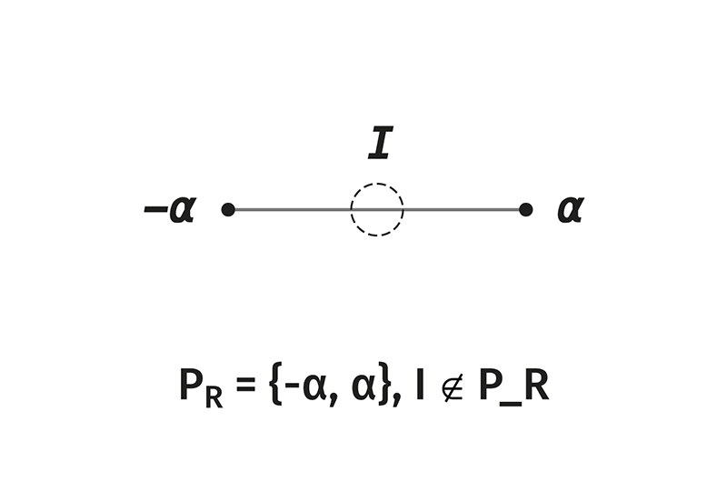
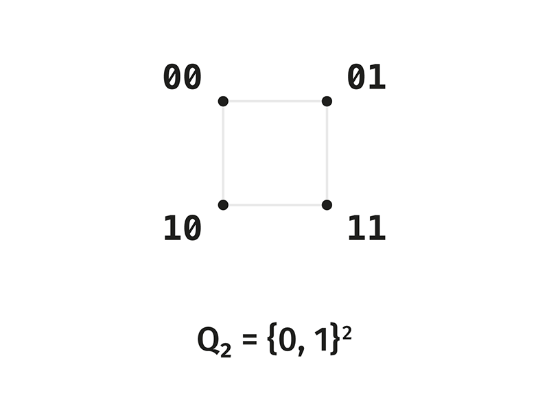

# Distinction Observable Theory

# Volume 0

---

# Section 0. What the theory is about and in what language

## §0.1. Subject

The theory studies a single question: how stable distinction on a finite carrier is structured.

To distinguish is to draw a boundary between states. In mathematics this happens constantly: an equivalence relation glues some elements together and separates others; a quotient by a subgroup identifies what differs by a subgroup element; the action of a group on a set partitions it into orbits. In all these cases there are two sides to the matter — that which is distinguished, and that relative to which the distinction is drawn and remains stable. The theory takes this second side as an independent subject and traces its minimal structure.

The theory is combinatorial. Its terms are defined rigorously; loaded words — above all "distinction" and "observer" — are separated from extraneous meanings before they are used (Section 1).

## §0.2. Language

The carrier of the theory is the finite Boolean cubes

$$
Q_n = \mathbb F_2^{\,n} = \{0,1\}^n,
$$

the sets of all binary tuples of length $n$. These are finite sets of $2^n$ elements. Combinatorial and algebraic operations act upon them: bitwise maps, involutions, factorizations, adjacency relations. The entire theory is formulated in this language. Geometry (cubes, octahedra, projective spaces) and analysis (cycles, flows) appear later as readings of the same finite structure, not as independent foundations.

## §0.3. The ladder of ranks

The theory is structured as a ladder of ranks. Rank $n$ is the number of binary features forming the carrier — the level of complexity of the scene of distinction. At each rank there is its own carrier $Q_n$, its own active part, and its own invariant. The transition $n \to n+1$ — the addition of one binary coordinate — is the sole mechanism of growth, and it binds the ranks into an ascending sequence.

The direction of this growth is as follows: the content of one rank becomes the structure of the next. What at rank $n$ is a distinguishable state becomes, at rank $n+1$, a direction along which distinction is drawn. Distinction augments itself, turning what was distinguished into an instrument of further distinction. The exact form of this connection will be given later, when concrete ranks appear; here only the direction matters.

## §0.4. Levels of reading

One and the same place in the theory is read differently depending on the level at which it is spoken of: as an invariant, as a state, as a condition of holding, as a part of the scene. This is a working distinction of levels; it is introduced rigorously where a place with a double reading first appears, and is noted thereafter as it occurs.

## §0.5. Direction: generation from the primitive

The theory proceeds in the direction opposite to the customary one. The classical course is analytic: an object is given — extract from it an invariant, classify (geometry as the invariants of a group, the homology of a space, the characters of a representation). Here the course is generative: a primitive is given — unfold a structure from it. Not "this object has such an invariant," but "what structure is forced by this primitive." The primitive here is the self-relation $\iota^2 = \operatorname{id}$ (Section 2); from it unfold the carrier, the complement, the observer, and the entire scene. The object is not an input but an output.

This direction is held by a single condition, and the condition is load-bearing: generation is rigorous only when what is generated is **forced** — when from the primitive, under the imposed requirements, a unique structure emerges. We call this condition **forcedness**; it is introduced rigorously where there is first something to force: §2.5 shows that neutrality (a symmetry singling out no coordinate) forces the complement $\kappa$ uniquely — that is, the admissible structure is unique. Without such closure, generation would be arbitrary construction — a choice of structure to fit a desired answer in advance; with it, it becomes knowledge of necessity. Therefore everywhere below the word "unfolds" (the carrier from the involution, the axes from content, the scene from the observer) carries this safeguard: precisely what is forced unfolds, and nothing beyond it.

The direction itself is not new — it is the longstanding pairing "generation plus closure": the natural numbers from zero and succession, closed by induction; free constructions, closed by a universal property (the free object is unique up to isomorphism); introduction rules in type theory, closed by elimination rules; a Dynkin diagram, unfolded into a Lie algebra and closed by the classification of admissible diagrams. What is the theory's own is not the course itself, but its consistent execution in the binary corner, where the primitive is distinction and the closure is the forcedness of the generated structure.

---

# Section 1. Three terms

Before building, let us separate three terms from their extraneous meanings. This is necessary because the words "distinction," "invariant," and especially "observer" carry, in ordinary and in interdisciplinary usage, meanings that do not work here.

## §1.1. Distinction

A **distinction** is the drawing of a boundary between states of the carrier: the indication that one state does not coincide with another, together with the structure that makes this non-coincidence stable.

Distinction in this sense is not:

an act of perception — there is no perceiver here;

a judgment — there is no one making an assertion here;

a property of a single state — distinction is always about a relation between states, not about a state in isolation.

Distinction is a structural relation on the carrier. The minimal distinction requires at least two states and an operation that relates them.

## §1.2. Invariant

The **invariant** of an operation is that which this operation does not move.

This is a standard mathematical notion. If a map $g$ acts on a set $X$, the invariant is a fixed point $x = g(x)$ or, more broadly, a substructure carried into itself under the action of $g$. The invariant is not a separate entity added to $X$; it is a characteristic of what in $X$ remains under the action of $g$.

In this theory the invariant plays a central role, because the stability of distinction is precisely invariance under the operation relating states. To distinguish stably is to draw a boundary that the operation does not erase.

## §1.3. Observer

This is the most loaded term, and it must be cut off from extraneous meanings firmly.

The **observer** in this theory is the invariant of the operation that relates the distinguished states. Nothing beyond this.

The observer here is not:

a subject or consciousness — there is no psyche here;

a measuring device or an act of measurement in the sense of quantum mechanics — there is no physics here;

a receiver of information in the sense of communication theory — there is no channel here;

an external point of view — the theory admits no position from outside.

The observer is a rigorous term for that relative to which distinction is stable, that is, the invariant of the relating operation. We use the word "observer" instead of the neutral "invariant" for the following reason: it emphasizes that this invariant is that relative to which the scene of distinction is a scene, and not a formless set. But each time one reads "observer," one should understand "the invariant of the relating operation."

## §1.4. Why mathematics needs the observer

In all basic constructions of distinction the invariant is present silently, and the distinction observable theory makes it an explicit subject.

An equivalence relation is stable exactly insofar as there is a feature invariant along the classes: a class is a set of states indistinguishable by this feature. The quotient structure $X/\sim$ exists insofar as the gluing is consistent with the invariant. The action of a group partitions a set into orbits, and the stable characteristics of a point turn out to be the invariants of the action. In all these cases "that relative to which distinction is drawn" is the invariant of the corresponding operation, and without it distinction does not hold — it falls apart at the first change of language.

The distinction observable theory takes this silent invariant and asks: what is its minimal structure, how is it connected to that which is distinguished, and how does it change as distinction is augmented. The word "observer" is the name for this subject.

---

# Section 2. Self-relation

The construction of the theory begins before the carrier — with what is there prior to any set of states.

## §2.1. The absolute invariant

Before the carrier there is one operation — the one that will unfold the carrier from itself. This is an **involution**, a nontrivial self-inverse map:

$$
\boxed{
\iota^2 = \operatorname{id}, \qquad \iota \ne \operatorname{id}.
}
$$

An involution is the minimal nontrivial structure of order: applied twice, it returns. The identity relates nothing; everything that is not the identity and is at the same time self-inverse is $\iota$. This is the **absolute invariant** of the theory — not a fixed point of an operation on a set, but the law of self-inversion itself, posited prior to the set it relates.

Usually an involution is given on an already given carrier: $\iota: X \to X$. Here the order is reversed. The carrier is not presupposed — it is recovered from $\iota$ as its orbit (§2.2). The rigorous setting for such a move, where the operation is primary and the elements of the carrier are derivative, is the categorical language: $\iota$ as an endomorphism of an abstract object, the carrier as the orbit-colimit of its action. This is the functorial reading of the theory; it is developed along a separate track and is only indicated here. Before the carrier a single thing is posited: a self-inverse operation prior to that to which it applies.

In the substantive sense $\iota$ is self-relation — a relation resting on nothing external, because there is as yet no external. This is a name-commentary alongside the rigorous "involution," not a load-bearing term.

## §2.2. The carrier as the orbit of self-relation

The self-relation $\iota$, being non-identical and self-inverse, generates that to which it applies. Acting from a position and returning, it closes a minimal orbit. Since $\iota$ is non-identical, it leads out of the position into something other; since $\iota^2 = \operatorname{id}$, the second step returns. The orbit closes through exactly two positions:

$$
\boxed{
\{x,\ \iota(x)\}, \qquad \iota(x) \ne x, \qquad \iota(\iota(x)) = x.
}
$$

Thus the first carrier appears — not as a given, but as the orbit of the absolute invariant. Let us call the two positions $0$ and $1$:

$$
Q_1 = \{0,\ 1\}.
$$

This is the **pair** — the minimal carrier on which distinction is possible: with fewer than two states there is nothing to distinguish. The pair is not posited separately; it is the shadow of self-relation, its minimal orbit. On it $\iota$ is the exchange of the two positions, $\iota(0) = 1$, $\iota(1) = 0$.

Binarity here is not a postulate but a consequence: the minimal orbit of a non-identical self-inverse relation is two-place. Self-relation manifests itself as a pair.

*Figure 0.1. The pair $Q_1 = \{0,1\}$ as the minimal orbit of self-relation: two sides and the exchange between them.*

## §2.3. The rank-$n$ carrier

Distinction is augmented by adding features. A state over $n$ binary features is a tuple of $n$ positions, each carrying one of the two values of the orbit. The full rank-$n$ carrier is

$$
\boxed{
Q_n = \mathbb F_2^{\,n} = \{0,1\}^n,
}
$$

the set of all $2^n$ binary tuples of length $n$ — a combinatorially exhaustive space of states: it represents all configurations of $n$ features and nothing beyond them. The pair $Q_1$ is its smallest case, the base of the ladder; the general construction is formulated for all $n$.

*Figure 0.2. The carrier $Q_2$: two limits and two non-limit configurations — the first step of the ladder of ranks.*

## §2.4. The complement as self-relation on the carrier

The absolute invariant is lifted to the rank-$n$ carrier, acting on all features at once. This is the bitwise complement:

$$
\boxed{
\kappa(x) = \bar x = x + 1^n \pmod 2,
}
$$

where $1^n = (1,1,\dots,1)$, and addition is coordinatewise modulo 2. The complement flips each bit and preserves the law of self-inversion:

$$
\kappa^2(x) = x + 1^n + 1^n = x, \qquad \kappa^2 = \operatorname{id},
$$

non-identical for all $n \ge 1$. On the pair $Q_1$ it coincides with $\iota$: $\kappa(0) = 1$, $\kappa(1) = 0$. At higher ranks $\kappa$ is the self-relation of the carrier — the same $\iota$, unfolded over $n$ features.

In the logical reading, where $0$ and $1$ are truth values, the complement $\kappa$ is the operation of negation $\operatorname{NOT}$. This is one of the readings of $\kappa$, which will appear rigorously later in the logical layer; here it only records that self-relation in the Boolean language is the complement, which is also negation.

Among the involutions on $Q_n$, the complement is singled out in that it acts on all coordinates alike and singles out none. Any other involution would distinguish the coordinates among themselves — that is, would already presuppose a distinction drawn between features. The complement is neutral to the choice of coordinates and is therefore the direct continuation of the absolute invariant: it relates states without invoking any distinction beyond the set of features itself.

## §2.5. Forcedness: neutrality forces the complement

The preceding remark is not an observation but the closing principle of the theory, and it should be formulated rigorously. The direction of the theory is generative (§0.5): "primitive $\to$ structure" is rigorous only when what is generated is **forced** — when from the primitive, under the imposed conditions, a unique structure emerges. Here this condition is presented for the first time and in pure form: the primitive is self-relation, and what it forces is the complement $\kappa$.

Let us impose a single requirement — **neutrality**: the relating operation must single out no coordinate and no value, that is, must commute with the entire group of symmetries of the carrier that does not distinguish features. This group is the group of all permutations of coordinates together with independent flips of values — the hyperoctahedral group

$$
\boxed{
B_n = (\mathbb Z_2)^n \rtimes S_n, \qquad |B_n| = 2^n\, n!,
}
$$

the full symmetry group of the cube $Q_n$. The requirement of neutrality is the requirement of $B_n$-invariance of the relating operation.

Then the following holds. A nontrivial involution $\sigma$ on $Q_n$, commuting with all elements of $B_n$ and free (without fixed states), is unique and is the complement:

$$
\boxed{
\sigma \in Z(\,\cdot\,),\ \sigma^2=\operatorname{id},\ \sigma\ne\operatorname{id},\ \sigma \text{ is neutral} \;\Longrightarrow\; \sigma = \kappa.
}
$$

Sketch: every $B_n$-equivariant map $Q_n\to Q_n$ is constant on the orbits of the action of $B_n$ on pairs $(x,\sigma(x))$; the orbits differ only by the Hamming distance $d_H(x,\sigma(x))$, and therefore $\sigma$ shifts each state by a fixed distance $d$. Involutivity and freeness force $d=n$ — the unique shift that carries a state into the strictly opposite one and returns in two steps without fixed points. A shift by the full distance $n$ is the flip of all bits, that is, $\kappa$. Any smaller $d$ either singles out coordinates (violating neutrality), or has fixed points, or is not involutive.

This is the **uniqueness theorem** in its original form: the symmetry is given at the input as an axiom (the neutrality $B_n$), and the structure — the complement $\kappa$ and the entire scene unfolded from it — emerges as the unique thing that admits this symmetry. The complement is neither chosen nor postulated; it is forced by neutrality.

Forcedness is the closing half of the entire corpus (§0.5). Without it, generation from the primitive would be arbitrary construction — a choice of structure to fit a desired answer in advance; with it, it becomes knowledge of necessity. Everywhere below, where structure "unfolds" from the primitive — the carrier from the involution, the axes from content, the scene from the observer — this safeguard is understood: precisely what is forced unfolds, and nothing beyond it.

**Verification.** The uniqueness theorem is checked by direct enumeration in [`01_Verification/DOT_Core_verifier.py`](../01_Verification/DOT_Core_verifier.py) (`forcedness_uniqueness_test`, ref `V0 §2.5`): for $n=2,3,4$ the free, neutral ($B_n$-equivariant) involution on $Q_n$ is unique and equals $\kappa$.

---

# Section 3. The invariant as center

The invariant of the operation $\kappa$ is the observer in the rigorous sense of §1.3, and its nature is nontrivial.

## §3.1. The freeness of the complement's action

A state $x \in Q_n$ is fixed under the action of $\kappa$ when $\kappa(x) = x$, that is,

$$
x = x + 1^n \;\Longleftrightarrow\; 1^n = 0.
$$

But $1^n \ne 0$ for all $n \ge 1$. Hence the fixity equation has no solutions:

$$
\boxed{
\kappa \text{ has no fixed states on } Q_n \text{ for } n \ge 1.
}
$$

The complement acts on $Q_n$ **freely**: every state is shifted, none remains in place. The states are partitioned into pairs $\{x, \bar x\}$ — the orbits of $\kappa$, each of two elements.

## §3.2. The invariant outside the carrier

The absence of fixed states does not mean the absence of an invariant. It means that the invariant is not a state.

Consider $Q_n$ geometrically — as the vertices of the unit cube in $\mathbb R^n$. The complement $\kappa$ is the reflection of the cube through its center: each vertex $x$ passes into the opposite one $\bar x$. This reflection has exactly one fixed point — the **center of the cube**:

$$
\boxed{
c = \tfrac12\,(0^n + 1^n) = \left(\tfrac12, \dots, \tfrac12\right).
}
$$

The center is fixed under $\kappa$ because it is the midpoint of every pair $\{x, \bar x\}$: reflection through the center leaves the center in place. But the center is not a vertex — its coordinates equal $\tfrac12$, not $0$ or $1$. It does not belong to the carrier $Q_n$.

Thus the invariant of $\kappa$ exists and is unique, but it lies **outside the set of states**:

$$
\boxed{
\text{the invariant of } \kappa \text{ is the center } c \notin Q_n.
}
$$

## §3.3. The observer as center

The observer — the invariant of the relating operation $\kappa$ — is not one of the states. It is neither $0^n$, nor $1^n$, nor any vertex. The states are not invariant: $\kappa$ permutes them. Invariant is only the midpoint, the center, relative to which all pairs $\{x, \bar x\}$ are symmetric.

$$
\boxed{
\text{observer } = \text{invariant of } \kappa \text{ } = \text{ center } c, \qquad c \notin Q_n.
}
$$

On the pair $Q_1 = \{0,1\}$ this is seen in the simplest form. The complement exchanges $0$ and $1$. Fixed is neither the point $0$ nor the point $1$, but their midpoint $\tfrac12$ — a point that is not among the two states, but relative to which both are symmetric. The observer of the pair is this midpoint: that relative to which the two sides are sides of one orbit, and not two independent points.

The observer is not introduced by a separate step and is not brought in from outside. It is the invariant of the operation $\kappa$, and therefore co-present with the structure from the very beginning: as soon as there is a carrier and a complement on it, there is also their center. The observer is born together with the structure of distinction, not after it.

*Figure 0.3. At rank 3 the observer-center is the center of the octahedron — a point outside the six vertices, relative to which all complement pairs are symmetric. In the image caption the old notation $X_{\mathrm{adm}}$ corresponds to $U_3$.*

The center $c$ is the absolute invariant of §2.1, seen from within the carrier. One invariant passes here through three levels: as the law $\iota^2 = \operatorname{id}$ before the carrier; as the orbit $\{x, \bar x\}$ unfolding the carrier; as the center $c$, fixed within the unfolded scene. The observer-center is self-relation returned into the scene it generated from itself.

## §3.4. The observer as the intersection of invariants

On the pair the involution is one — the complement $\kappa$, acting on the single coordinate. Therefore the invariant too is one: a single midpoint.

Under growth the meaning of the word "observer" broadens. When the coordinates become several, not one involution acts on the carrier but several independent ones — one for each direction of distinction that has emerged. Each has its own invariant. The common observer of the scene is then not a single midpoint, but the **intersection of the invariants of all directions** — the unique point fixed relative to all involutions at once. On the pair this intersection is trivial, because the direction is one. At higher ranks it is substantive: the observer is the common fixed point of all the axes of the scene, its center in the full sense.

The observer is not single-faceted: it is an invariant, and on a scene with several directions — an intersection of invariants, a structure, not a point-side. The unfolding of this, where the directions will become three, belongs to the next volume. The principle, however, is this: the observer is the invariant of relating, geometrically the center, and under growth — the intersection of the centers of all directions.

---

# Section 4. Poles and the active scene

The carrier $Q_n$ is not homogeneous with respect to distinction. Among its states two are singled out, and their singularity determines what the active part of the scene is.

## §4.1. Two states without internal distinction

For a state $x = (x_1, \dots, x_n)$ let us introduce the notion of internal distinction: a state carries internal distinction if among its coordinates there are some that differ among themselves, that is, there exist $i, j$ with $x_i \ne x_j$.

Exactly two states carry no internal distinction — those in which all coordinates coincide:

$$
\boxed{
0^n = (0,\dots,0), \qquad 1^n = (1,\dots,1).
}
$$

In $0^n$ all coordinates equal $0$; in $1^n$ all equal $1$. In neither does any coordinate differ from the rest. These are states of full agreement — of zero internal distinction. Let us call them **poles**.

All other states carry internal distinction: at least one coordinate in them differs from another.

## §4.2. The poles are a complement pair

The poles are connected by the complement:

$$
\boxed{
\kappa(0^n) = 1^n.
}
$$

That is, the two poles form one orbit of $\kappa$ — one pair $\{0^n, 1^n\}$. This is the unique complement pair both of whose members are states of zero internal distinction. In this sense the poles are a special, singled-out pair: a pair of two undifferentiated states passing into each other under the complement.

The poles are the **limits** of the carrier: $0^n$ — the limit of complete absence (all coordinates at zero), $1^n$ — the limit of complete presence (all at one). Between them lies everything that carries distinction.

## §4.3. The active scene

Let us remove the pair of poles from the carrier. There remains the set of states carrying internal distinction:

$$
\boxed{
U_n = Q_n \setminus \{0^n,\ 1^n\}.
}
$$

This is the **active scene** of rank $n$ — the part of the carrier where distinction is actually drawn within the state, rather than degenerating into full agreement. Its cardinality is

$$
|U_n| = 2^n - 2.
$$

On the active scene the complement $\kappa$ still acts freely (it has no fixed states anywhere), partitioning $U_n$ into pairs $\{x, \bar x\}$. The number of such pairs is

$$
|U_n| / 2 = 2^{n-1} - 1.
$$

## §4.4. The shell without poles and center

The carrier $Q_n$ contains three kinds of places:

$$
\boxed{
\begin{array}{l|l}
\text{pair of poles } \{0^n, 1^n\} & \text{limits: zero internal distinction} \\
\text{center } c \notin Q_n & \text{observer: invariant of the complement} \\
\text{active scene } U_n & \text{distinction drawn within the state}
\end{array}
}
$$

The active scene $U_n$ is deprived of both: the poles are removed from it explicitly, and the center never lay in it — it is not a state. Therefore everything that happens on the active scene happens between the limits and around the absent center. The scene is a shell: it surrounds a center that is not in it, and lies between poles that are removed from it.

Here for the first time a place with a double reading appears, and on it the distinction of levels is introduced. The center is read in two ways. As an **invariant** it is fixed under the complement — it is the observer; at this level it is present. As a part of the **scene** it is that which is not in the scene — an empty place around which the scene is unfolded; at this level it is absent. One place, two readings: a fixed invariant and an absent point. This is not a contradiction but two levels of speech about one thing, and henceforth the theory marks such places explicitly. The duality of the center works at all ranks.

---

# Section 5. Growth

Until now the rank $n$ has been fixed. That which binds the ranks is growth: without it the theory is a collection of separate carriers, with it — a ladder.

## §5.1. The lift

Distinction is augmented by adding a new feature. One new binary feature is one new coordinate. Adding a coordinate to the carrier $Q_n$ gives the carrier $Q_{n+1}$:

$$
\boxed{
Q_{n+1} = (0 \,|\, Q_n)\ \sqcup\ (1 \,|\, Q_n),
}
$$

where $(\varepsilon \,|\, x)$ means prepending the new leading bit $\varepsilon$ to the tuple $x$. Each rank-$n$ state generates two rank-$(n+1)$ states: one with the new bit $0$, the other with the new bit $1$. The cardinality doubles: $2^{n+1} = 2 \cdot 2^n$. This is the **lift** — the sole operation of growth in the theory.

The lift is directly motivated: the active scene is the space of all states over the available features; adding a feature is adding a coordinate; the new carrier is the full space of states over the extended set of features. The lift does nothing beyond adding one independent binary coordinate.

## §5.2. The lifting of the complement and the observer

The complement is lifted together with the carrier. The new leading bit is also flipped:

$$
\boxed{
\kappa_{n+1}(\varepsilon \,|\, x) = (1+\varepsilon)\,|\,\kappa_n(x).
}
$$

That is, the rank-$(n+1)$ complement complements the new bit and applies the rank-$n$ complement to the remainder. The poles lift into poles: $0^{n+1} = 0\,|\,0^n$ and $1^{n+1} = 1\,|\,1^n$. Their pair is preserved as a pair. The center of $Q_{n+1}$ is the midpoint of the new poles — the observer lifts into the observer.

Under the lift a new direction is added to the directions of distinction — the one introduced by the new bit. The observer, being the intersection of the invariants of all directions (§3.4), is recomputed accounting for the new one and remains the center of the extended scene. The observer grows together with the scene.

## §5.3. The growth vector: content becomes axis

Growth connects the content of one rank with the axes of the next.

Let us factor the active scene $U_{n+1}$ of rank $n+1$ by the complement, identifying each pair $\{x, \bar x\}$ into one point:

$$
U_{n+1}/\kappa.
$$

This quotient structure is the set of **axes** of rank $n+1$ — directions of distinction, each given by a pair "a state and its complement." On the other hand, the nonzero configurations of rank $n$ (denote them $Q_n^{*}$) are the content of rank $n$ — that which is distinguishable on it. The connection between them is

$$
\boxed{
Q_n^{*} \;\cong\; U_{n+1}/\kappa.
}
$$

The content of rank $n$ (the distinguishable configurations) is isomorphic to the axes of rank $n+1$ (the directions of distinction). What was distinguished at one rank becomes a direction along which one distinguishes at the next. Distinction augments itself, turning the result into an instrument.

This relation we here only formulate; its rigorous proof and unfolding belong to the volumes where concrete ranks appear. For rank 3 the right-hand side is the projective line, for rank 4 the Fano plane; this will be shown in place. For now the form of the vector matters, not its realization.

## §5.4. The absent center as the entrance to the next rank

At rank $n$ the active scene is a shell around the absent center. The center is not a state of rank $n$ — within the scene of rank $n$ there is nowhere to go toward it. But under the lift the center of rank $n$ is exactly the place where the new direction of rank $n+1$ stands: to ascend by a rank is to enter the center which at the previous rank was only an absent invariant.

$$
\boxed{
\text{the absent center of the scene of rank } n \text{ is the entrance to rank } n+1.
}
$$

This gives the full meaning of the level-duality of the center declared in §4.4. At the level of the scene of rank $n$ the center is that which is not present — movement toward it is impossible within the scene. At the level of growth the same center is the direction of exit — the sole path of augmenting distinction leads through it. The prohibition and the direction are two projections of one place: the center is prohibited as a state and leads as an entrance. Therefore every movement that remains at the rank is movement along the shell; movement toward the center is exit beyond the limit of the rank, the lift.

---

# Section 6. The threshold

The volume reaches the threshold and stops at it.

## §6.1. The connected boundary of prime ranks

The active scenes of the first ranks possess a special property distinguishing them from all higher ones, and it is visible at the level of the internal structure of states.

A state of rank $n$ can be characterized by its weight — the number of unit coordinates, from $0$ to $n$. The poles are the states of weight $0$ and $n$. The active scene $U_n$ consists of states of weight from $1$ to $n-1$. These weights split into layers: the layer of weight $1$, the layer of weight $2$, and so on.

At small ranks the active scene is only the outer layers — those adjacent to the poles — without a separated interior:

at rank $1$: $U_1 = \varnothing$, there is as yet no active scene (between weights $0$ and $1$ there are no intermediate ones);

at rank $2$: $U_2$ is the layer of weight $1$ — two points, $\{01, 10\}$; there are no interior layers;

at rank $3$: $U_3$ is the layers of weights $1$ and $2$ — six points; and this is the last rank at which the entire active scene is only these adjacent layers, without a separated middle.

Ranks $1, 2, 3$ form a connected boundary: their active scenes are a pure shell, adjacent to the poles, without a separated interior. Between the "skin" and the "core" there is no gap, because there is as yet no core — everything is skin.

## §6.2. The first break: $2 \times 2 = 4$

The break occurs at rank $4$ — at the first composite number.

At rank $4$ the weights of the active scene are $1, 2, 3$. The layer of weight $2$ is for the first time **separated** from the poles by the layers of weights $1$ and $3$: it is adjacent neither to $0^4$ nor to $1^4$ — between it and each pole lies a layer. An interior appears, separated from the surface. The active scene ceases to be a simple shell; the whole splits into adjacent layers and a separated middle.

The number $4 = 2 \times 2$ is the first composite number — the first that decomposes into factors, the first where the whole ceases to be indecomposable. The connected boundary of prime ranks $1, 2, 3$ breaks off at it. Up to four the boundary is connected; at four it breaks.

## §6.3. Where the triad matures

These two facts determine the place of threeness, which unfolds in the next volume. Here it is fixed as a threshold, without unfolding.

The holding distinction — the structure through which the active scene holds as a scene — matures along the connected boundary of ranks $1 \to 2 \to 3$. On the pair it is fused with the operation $\kappa$ itself. At rank $2$, as will be shown at the beginning of the next volume, it is for the first time separated from the operation and becomes a separate place of the scene, but does not yet triple: the active scene $U_2$ is two points, and the direction on it is one. Fullness — three irreducible directions of distinction on a single connected scene — is reached at rank $3$, the last point of the connected boundary, where the active scene is still a shell but already carries three directions. At rank $4$ the triad loses connectedness: with the appearance of a separated interior the three directions cease to lie on a single shell.

Therefore:

$$
\boxed{
\text{threeness is not the first-beginning; it matures along the connected boundary } 1 \to 2 \to 3,
}
$$

$$
\boxed{
\text{reaches fullness at rank } 3 \text{ and loses connectedness at the first break } 2 \times 2 = 4.
}
$$

The form of connectedness of this triad — that the three directions hold only together, without pairwise links, and all fall apart upon the removal of one — is **Borromean connectivity**. Its rigorous introduction, the three directions of rank 3 and their joint holding, are the content of the next volume. Here only the threshold is fixed: where the triad matures, where it reaches fullness, and where it breaks off.

---

# §7. Summary of Volume 0

The distinction observable theory studies stable distinction on finite Boolean carriers $Q_n = \mathbb F_2^{\,n}$. Its terms are rigorous: distinction is the structural relating of states; the invariant is that which the relating operation does not move; the observer is the invariant of the relating operation — and nothing from the domain of consciousness, physics, or communication.

The source of the theory is the absolute invariant: self-relation prior to any carrier,

$$
\iota^2 = \operatorname{id}, \qquad \iota \ne \operatorname{id}.
$$

The carrier is not posited separately — it is the orbit of self-relation. The minimal orbit is two-place, $Q_1 = \{0,1\}$; the full rank-$n$ carrier is $Q_n = \mathbb F_2^{\,n}$. Self-relation lifts to the carrier as the complement

$$
\kappa(x) = x + 1^n, \qquad \kappa^2 = \operatorname{id},
$$

the unique involution not distinguishing the coordinates among themselves; in the logical reading — negation.

The observer — the invariant of $\kappa$ — is not a state. $\kappa$ has no fixed vertices; its unique invariant is the center of the carrier

$$
c = \tfrac12(0^n + 1^n) \notin Q_n.
$$

The center is the absolute invariant seen from within the carrier: one invariant at three levels — the law $\iota^2=\operatorname{id}$, the orbit $\{x,\bar x\}$, the center $c$. The observer is the center, not a side; it is co-present with the structure from the very beginning; on a scene with several directions it is the intersection of their invariants.

The poles $\{0^n, 1^n\}$ are a pair of undifferentiated states — the limits of the carrier, removed in passing to the active scene

$$
U_n = Q_n \setminus \{0^n, 1^n\}.
$$

The active scene is a shell: it is deprived of both the poles and the center. The center is read in two ways — as an invariant it is present (it is fixed), as a part of the scene it is absent (it is an empty place), and under growth it is the direction of exit — the entrance to the next rank.

Growth is the lift — the addition of one coordinate,

$$
Q_{n+1} = (0\,|\,Q_n) \sqcup (1\,|\,Q_n),
$$

along which the complement and the observer are lifted, and the content of a rank becomes the axes of the next:

$$
Q_n^{*} \cong U_{n+1}/\kappa.
$$

The absent center of rank $n$ is the entrance to rank $n+1$: movement along the scene is movement along the shell, movement toward the center is the lift.

Threeness is not the first-beginning. It matures along the connected boundary of prime ranks $1 \to 2 \to 3$, reaches fullness at rank $3$, and loses connectedness at the first break $2 \times 2 = 4$; the form of its connectivity is Borromean. This is the threshold at which the volume stops.

$$
\boxed{
\text{the source is self-relation } \iota^2=\operatorname{id}; \text{ the carrier is its orbit; the observer-center is it from within; growth turns content into axes.}
}
$$

The next volume unfolds rank 3 as the place where the triad reaches fullness — the meeting of growth, coming from below from the pair, with the Borromean structure of three directions.
