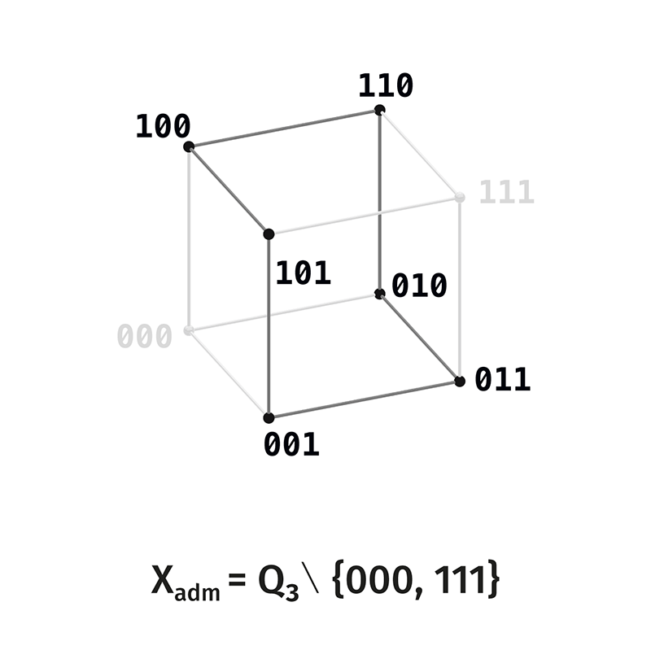

# Distinction Observable Theory

# Volume 1. Rank 3: the home of threeness

The subject of the volume is the rigorous structure of rank 3. At this rank the threeness of distinction reaches fullness, while remaining a connected shell, and for the first time the Borromean connectivity of three directions arises.

The exposition continues the rigorous backbone (Volume 0). The cycle is introduced here only as a symmetry of the scene; movement along it — flow, rotation, helicoid — is the subject of Volume 4.

---

# Section 0. The starting point

On the pair $Q_1$ the holding distinction, the third place, coincides with the law $\iota^2 = \operatorname{id}$: the two sides and the law that holds them are inseparable. At rank 2 the third place separates from the law and becomes the seam of the scene, but remains single: the active scene $U_2 = \{01, 10\}$ is two points, and the direction of distinction on it is one.

The fullness of threeness — three irreducible directions of distinction on a single connected scene — arrives at rank 3. Ranks $1, 2, 3$ form a connected boundary, where the active scene is a shell without a separated interior; the first break occurs at rank $4 = 2 \times 2$, where the interior separates. Rank 3 is the last point of the connected boundary: the only rank where the triad is at once full and connected.

---

# Section 1. The active scene of rank 3

## §1.1. The carrier and its limits

The lift, applied twice to the pair, gives the rank-3 carrier:

$$
Q_3 = \mathbb F_2^3 = \{000, 001, 010, 011, 100, 101, 110, 111\}.
$$

The notation $x_1x_2x_3$ is a triple of bits. Eight states.

*Figure 1.1. The full carrier $Q_3$: eight configurations; the two limits $000$ and $111$ are removed in passing to the active scene $U_3$.*

Two states are homogeneous — all their coordinates coincide:

$$
0^3 = 000, \qquad 1^3 = 111.
$$

These are the limits of the carrier: $000$ — the limit of complete absence, $111$ — the limit of complete presence. They are a complement pair, $\kappa(000) = 111$, and carry zero internal distinction.

## §1.2. The active scene

Removing the pair of limits gives the active scene:

$$
\boxed{
U_3 = Q_3 \setminus \{000, 111\} = \{001, 010, 011, 100, 101, 110\}.
}
$$

Six states, $|U_3| = 2^3 - 2 = 6$. Each carries internal distinction: at least one coordinate in it differs from another.

*Figure 1.2. The active scene $U_3$ — six states between the limits. In the image caption the old notation $X_{\mathrm{adm}}$ corresponds to $U_3$.*

## §1.3. Two layers

The states differ by weight — the number of unit coordinates. On the active scene the weight takes the values $1$ and $2$, giving two layers:

$$
S_1 = \{001, 010, 100\}, \qquad S_2 = \{011, 101, 110\}.
$$

So that

$$
\boxed{
U_3 = S_1 \sqcup S_2.
}
$$

The layer of weight $1$ is adjacent to the limit $000$; the layer of weight $2$ is adjacent to the limit $111$. Between the two layers there is no intermediate one — this is essential and determines the status of rank 3 (Section 6).

*Figure 1.3. The two layers of the active scene: $S_1$ (weight 1) and $S_2$ (weight 2), without an intermediate layer — a pure shell.*

## §1.4. The complement and three pairs

The complement $\kappa(x) = x + 111$ flips all bits. On the active scene it carries the layer of weight $1$ into the layer of weight $2$ and back:

$$
\kappa(S_1) = S_2, \qquad \kappa(S_2) = S_1,
$$

partitioning the six states into three pairs — the orbits of $\kappa$:

$$
\boxed{
\{001, 110\}, \qquad \{010, 101\}, \qquad \{100, 011\}.
}
$$

Each pair joins a state of weight $1$ with its complement of weight $2$. These three pairs will play the role of the three axes of the scene.

## §1.5. The simplicial reading: the scene is a shell

Let us associate to a state its support — the set of coordinates equal to one. Then $U_3$ is the set of nonempty proper subsets of the three-element set $J = \{1,2,3\}$:

$$
\boxed{
U_3 \cong \mathcal P(J) \setminus \{\varnothing, J\}.
}
$$

The three singleton subsets (the layer $S_1$) are the vertices of a triangle, the three two-element subsets (the layer $S_2$) are its edges. These are the nonempty proper faces of the triangle:

$$
U_3 = \mathcal F(\partial \Delta^2).
$$

The active scene of rank 3 is the boundary of a triangle — a pure shell, without an interior face. Vertices and edges, and nothing between them. This is the geometric form of the fact that $U_3 = S_1 \sqcup S_2$ without an intermediate layer.

---

# Section 2. Three directions of distinction

The three directions of distinction, not separated at rank 2, diverge at rank 3 and turn out to be Borromean.

## §2.1. A direction is a coordinate

A direction of distinction is an independent binary feature — a coordinate. At rank 3 there are exactly three coordinates: $x_1, x_2, x_3$. Each divides the carrier in two by its value and is a separate direction along which a boundary is drawn.

The three coordinates are three directions. They are exactly three, because the rank is the number of features, and at rank 3 there are three features. This is neither a choice nor a postulate — it is the very meaning of rank 3.

## §2.2. The three directions are pairwise independent

Take any two directions, say $x_1$ and $x_2$. Knowledge of the values of these two coordinates does not determine the third: with $x_1, x_2$ fixed, the coordinate $x_3$ takes both values freely. The same holds for any pair.

$$
\boxed{
\text{no pair of directions determines the third.}
}
$$

The three directions are pairwise independent. Between any two there is no connection that would yield the third.

## §2.3. The three directions are jointly necessary

A state of the carrier is a triple $(x_1, x_2, x_3)$. To specify a state, all three coordinates are needed: none is superfluous, none is derived from the rest. To remove one direction is to cease distinguishing states that differ only by it.

Formally, forgetting one coordinate is a map

$$
Q_3 \longrightarrow Q_2,
$$

the lift in reverse: the rank falls from 3 to 2. The scene of rank 3 as a scene of rank 3 falls apart — there remains a scene of rank 2 with a single direction.

## §2.4. Borromean connectivity

The three directions possess three properties.

the first — pairwise independence: no pair determines the third (§2.2);

the second — joint necessity: the state requires all three (§2.3);

the third — collapse upon removal: remove one direction and the scene of rank 3 falls to rank 2 (§2.3).

These three properties together are **Borromean connectivity** — in the structural sense. The Borromean rings are three of which no two are linked, but all three hold together, and the removal of one scatters the link. The three directions of distinction of rank 3 are arranged in the same way: pairwise unlinked (independent), but as a threesome they make up one scene, and the removal of any one scatters it to the lower rank.

$$
\boxed{
\text{the three directions of rank 3 are Borromean: pairwise independent, jointly necessary, inseparable as a triad.}
}
$$

This is the form in which threeness holds: it is proved as a property of three independent coordinates.

The active scene is exactly the region where the three directions are distinguishable among themselves: the removed limits $000$ and $111$ are the two states in which all three coordinates agree (all zeros or all ones), that is, where the directions are indistinguishable. After the removal of the limits there remains exactly that where the three directions diverge.

---

# Section 3. The relational anatomy of the scene

The three directions, interacting, produce on the scene three relations — three layers of difference by distance. This is the anatomy of the scene: what it manifests once the three directions are already acting.

## §3.1. Distance and three relations

The Hamming distance between states is the number of coordinates in which they differ:

$$
d_H(x, y) = |x + y|.
$$

On the six points of $U_3$, between distinct states the distance takes exactly three values — $1, 2, 3$ — because the coordinates are three and the states are pairwise distinct. This gives three relations:

$$
R_k = \{\{x, y\} : d_H(x, y) = k\}, \qquad k = 1, 2, 3.
$$

## §3.2. $R_1$: the cycle

The relation $R_1$ joins states differing in one coordinate. On the six points it gives a hexagonal cycle:

$$
001 - 011 - 010 - 110 - 100 - 101 - 001,
$$

$$
\boxed{
R_1 \cong C_6.
}
$$

The cycle alternates layers: a vertex of weight $1$, an edge of weight $2$, a vertex of weight $1$, and so on around. Six edges.

*Figure 1.4. The relation $R_1$ (Hamming distance 1): the hexagonal cycle $C_6$ over all six states.*

## §3.3. $R_2$: two triads

The relation $R_2$ joins states differing in two coordinates. It splits into two triangles — one per layer:

$$
\{001, 010, 100\}, \qquad \{011, 101, 110\},
$$

$$
\boxed{
R_2 \cong K_3 \sqcup K_3.
}
$$

Within the layer of weight $1$ any two states differ in two coordinates — this is the first triad; the same for the layer of weight $2$ — the second triad. Six edges.

*Figure 1.5. The relation $R_2$ (distance 2): two triangles $K_3 \sqcup K_3$ — one per layer.*

## §3.4. $R_3$: three pairs

The relation $R_3$ joins states differing in all three coordinates. Difference in all three is the complement, and therefore $R_3$ is exactly the complement pairs of §1.4:

$$
\boxed{
R_3 \cong 3K_2, \qquad R_3 = \{\{x, \kappa(x)\}\}.
}
$$

Three edges — three axial pairs. The relation $R_3$ coincides with the action of $\kappa$ on the scene.

*Figure 1.6. The relation $R_3$ (distance 3): three complement pairs $3K_2$ — the three axes of the scene.*

## §3.5. Relations and directions — different triads

The three relations $R_1, R_2, R_3$ are a triadic structure, but not the one that the three directions are. Between them there is a precise distinction, and it must be held so as not to confuse the two triads.

The three relations partition the complete graph on six vertices:

$$
\boxed{
K_6 = R_1 \sqcup R_2 \sqcup R_3, \qquad 6 + 6 + 3 = 15 = \binom{6}{2}.
}
$$

Since this is a partition, any two relations determine the third: the third is the complement of their union in $K_6$. Therefore the relations are **not** Borromean — they are not pairwise independent. The Borromean triad is the three directions (§2), which are independent; the three relations are the anatomy the directions produce, and they are connected by partition.

$$
\boxed{
\text{the three directions are independent (Borromean); the three relations are complementary (partition } K_6\text{).}
}
$$

These two triads — the generating one and the anatomical one — are both the threeness of rank 3, but at different levels: the directions generate, the relations manifest.

---

# Section 4. The octahedron and the observer

## §4.1. The shell and the axes

The union of the two relations of smaller distance gives the octahedron:

$$
R_1 \cup R_2 \cong K_{2,2,2},
$$

the complete tripartite graph on three pairs — the skeleton of the octahedron. Twelve edges. The three parts are the three complement pairs; within a pair there is no edge, between different pairs there is.

The remaining relation $R_3 = 3K_2$ joins the points within the pairs — these are the three axes of the octahedron, its antipodal diagonals. Thus the six points are the vertices of the octahedron, the three complement pairs are three axes through the center, and $R_1 \cup R_2$ is the surface skeleton.

*Figure 1.7. The octahedron $R_1 \cup R_2 \cong K_{2,2,2}$: six vertices, three complement pairs as axes through the absent center-observer.*

## §4.2. The observer as center

The observer of rank 3 is the common invariant of the scene — that which is fixed relative to all three axes at once. Each axis (complement pair) is symmetric relative to its midpoint; the common midpoint of all three axes is the center of the octahedron:

$$
\boxed{
O_3 = \text{center of the octahedron} = \tfrac12(0^3 + 1^3) \notin U_3.
}
$$

This is the intersection of the invariants of the three directions (Volume 0). Each direction $i$ carries a reflection $\kappa_i$ — the flip of coordinate $i$ — fixed on the hyperplane $x_i = \tfrac12$. The observer is the common point of the three hyperplanes: the unique point fixed relative to all three reflections at once. It is not a state — it is not among the six points. The scene is a shell around the absent center.

All three directions are necessary for the center to be determined as a point: one hyperplane leaves a plane, two intersect in a line, and only three converge in a point. This accords with the Borromean nature of the directions (§2): the observer is determined by the triad of directions and is not determined by any pair. The three axes of the octahedron — the three complement pairs — are the diagonals crossing at this center; the global complement $\kappa = \kappa_1\kappa_2\kappa_3$ is the product of the three reflections, and the center is its unique fixed point.

## §4.3. The center as the entrance to rank 4

The center is absent from the scene of rank 3, but it is the place where, under the lift, the new direction of rank 4 stands. To ascend to rank 4 is to enter this center. At rank 4 the absent center opens into an interior layer — the empty neighborhood of the center is filled, although the centroid itself is still not a vertex; this unfolds in Volume 2. Here only the connection is fixed: the absent center of the scene of rank 3 is the entrance to the next rank.

---

# Section 5. The cycle operator

The cycle $R_1 = C_6$ has a natural generator — the traversal operator. It is introduced here as a symmetry of the scene; movement along the cycle is the subject of Volume 4.

## §5.1. The generator of traversal

Let $T$ be the operator shifting each point by one position along the cycle $C_6$:

$$
001 \xrightarrow{T} 011 \xrightarrow{T} 010 \xrightarrow{T} 110 \xrightarrow{T} 100 \xrightarrow{T} 101 \xrightarrow{T} 001.
$$

Six shifts return to the starting point:

$$
\boxed{
T^6 = \operatorname{id}.
}
$$

## §5.2. The half-turn is the complement

Three shifts — half the cycle — carry each point into its complement:

$$
001 \xrightarrow{T^3} 110, \qquad 010 \xrightarrow{T^3} 101, \qquad 100 \xrightarrow{T^3} 011,
$$

$$
\boxed{
T^3 = \kappa.
}
$$

This is the algebraic identity of the rank-3 scene: the half-turn of the cycle coincides with the limit complement. The complement, which on the pair was the generator $\iota$ itself, here turns out to be a power of the cycle operator.

## §5.3. The three relations as powers of the cycle

The three relations are three powers of the generator:

$$
\boxed{
R_1 = T^{\pm 1}, \qquad R_2 = T^{\pm 2}, \qquad R_3 = T^3.
}
$$

A shift by one position gives the adjacency $R_1$; by two — $R_2$; by three — $R_3 = \kappa$. Thus the three relations, introduced by distance, turn out to be read through a single operator at different scales.

This is a static statement: $T$ is a symmetry of the scene, and the three relations are its powers. Movement along $T$ — traversal in time, the rotation number, continuous smoothing — is developed in Volume 4.

---

# Section 6. Rank 3 as a threshold

The status of rank 3 requires a precise formulation, because in it two movements converge and the prior inconsistency is resolved.

## §6.1. The last connected rank

The active scene of rank 3 is a shell without an interior: $U_3 = S_1 \sqcup S_2$, two layers adjacent to the limits, without an intermediate one. In the simplicial reading this is the boundary of a triangle — vertices and edges, without an interior face.

This is the last rank with such a property. At rank 4 a middle layer appears, separated from the limits: the shell splits into skin and core (Volume 2). Ranks $1, 2, 3$ are the connected boundary; rank 4 is the first break $2 \times 2 = 4$.

## §6.2. Fullness at the threshold

At rank 3 the three directions of distinction for the first time diverge fully and turn out to be Borromean, while remaining on a single connected shell. This coincidence of fullness and connectedness is the distinctive trait of rank 3: the triad reaches fullness exactly where the scene has not yet split into layers.

## §6.3. Neither degeneration nor telos

Rank 3 is not a degenerate case. In the reading of directions it may appear poor — a single direction of transition, no rich algebra of directions of the higher ranks yet. But this is the poverty of one reading only; as the place of full Borromean threeness rank 3 is not degenerate.

Rank 3 is not a telos. It is not the summit or the goal of the theory; beyond it comes the break and the birth of the interior, and the ladder continues.

$$
\boxed{
\text{rank 3 is a threshold: the last connected rank, where threeness is full, before the first break.}
}
$$

## §6.4. Prohibitions as the reverse side of relations

The historical foundations placed three prohibitions at the beginning and derived the scene from them. In the reorganization the order is reversed: the three directions and the three relations are primary, and a prohibition is the reverse side of a relation — that which the relation does not admit.

Each of the three relations is an assertion of difference of a certain distance; to it corresponds a prohibition on coincidence at that distance. The three prohibitions are the three negative sides of the three relations, not a separate foundation. Thus the threeness of prohibitions, which in the old corpus was the root, turns out to be derived from the threeness of directions — in accord with Volume 0, where threeness is derived, not posited.

---

# Section 7. The projective reading

The quotient of the active scene by the complement identifies each pair $\{x, \kappa(x)\}$ into one point:

$$
\boxed{
U_3 / \kappa \cong PG(1, 2).
}
$$

The three pairs give three points — this is the projective line over the binary field, the smallest projective space. At rank 3 the three axes and the three directions coincide: each complement pair contains exactly one state of weight 1, the state $e_i$, and therefore answers to the coordinate $i$. The three axes are the three directions, read as points of the geometry of directions.

This coincidence is special to rank 3 and holds because the scene is a pure shell without an interior layer: all three complement pairs are pairs of the form weight-1 — weight-2, that is, coordinate directions. At rank 4 the directions and the axes diverge. There are four directions there (four coordinates) and seven axes (the points of the Fano plane). Four coordinate axes (pairs weight-1 — weight-3) answer to directions; the three remaining ones (pairs of the self-dual layer of weight 2) do not answer to directions — this is the distinguished line $L_\infty$ born at the break (Volume 2). The divergence of the number of axes and the number of directions is the axial side of the phase transition at rank 4.

This is the first instance of the inter-rank vector $Q_n^* \cong U_{n+1}/\kappa$ from Volume 0: the three axes of rank 3 are the content that at rank 4 will become the axial skeleton. Here the right-hand side of the vector is the projective line; at rank 4 it will become the Fano plane (Volume 2).

The three axes carry a canonical cyclic rotation. The operator $T$ (§5) on the six states has order 6 and $T^3 = \kappa$; on the axes (the quotient by $\kappa$) it acts with order 3, cyclically permuting the three axes. This is the Singer cycle of the projective line $PG(1,2)$ — the smallest case of the rotation of axes, which at higher ranks becomes the Singer cycle $PG(n-2,2)$ (Volume 4).

---

# §8. Summary of Volume 1

The active scene of rank 3 is six states between the limits,

$$
U_3 = Q_3 \setminus \{000, 111\} = S_1 \sqcup S_2,
$$

a shell without an interior — the boundary of a triangle $\mathcal F(\partial\Delta^2)$.

Threeness is full as three directions of distinction — three coordinates — and they are Borromean: pairwise independent, jointly necessary, inseparable as a triad.

The three directions produce the relational anatomy of the scene — three relations by distance:

$$
R_1 \cong C_6, \qquad R_2 \cong K_3 \sqcup K_3, \qquad R_3 \cong 3K_2, \qquad K_6 = R_1 \sqcup R_2 \sqcup R_3.
$$

The relations are complementary (they partition $K_6$), not Borromean; the Borromean triad is the generating directions, the relations are the produced anatomy.

The shell and the axes give the octahedron:

$$
R_1 \cup R_2 \cong K_{2,2,2}, \qquad R_3 = \text{three axes}.
$$

The observer of rank 3 is the center of the octahedron — the intersection of the invariants of the three directions (the three hyperplanes of the coordinate reflections), absent from the scene and determined only by all three directions together; it is the entrance to rank 4.

The cycle has a generator $T$ — a symmetry of the scene:

$$
T^6 = \operatorname{id}, \qquad T^3 = \kappa, \qquad R_1 = T^{\pm1}, \; R_2 = T^{\pm2}, \; R_3 = T^3.
$$

Movement along $T$ is deferred to Volume 4.

Rank 3 is a threshold: the last connected rank, where threeness is full, before the first break $2 \times 2 = 4$ — neither degeneration nor goal. The three prohibitions of the old corpus are the reverse side of the three relations, not a foundation.

The projective reading gives the first projective line:

$$
U_3 / \kappa \cong PG(1, 2),
$$

three axes as three points — the content of rank 3, which at rank 4 will become the axial skeleton.

$$
\boxed{
\text{rank 3: three Borromean directions on a single shell, their relational anatomy, the observer-center, and the threshold before the break.}
}
$$

The next volume passes the first break $2 \times 2 = 4$: the birth of the separated interior, the Fano plane as $U_4/\kappa$, the divergence of four directions with seven axes.

**Verification.** The six states of $U_3$, the relations $R_1\cong C_6$, $R_2\cong K_3\sqcup K_3$, $R_3\cong 3K_2$, the octahedron $K_{2,2,2}$ and their spectra are checked in [`01_Verification/DOT_Core_verifier.py`](../01_Verification/DOT_Core_verifier.py) (the "combinatorial core", "relation scheme", and "base-carrier spectra" sections; catalog `CORE_CHECK_CATALOG`, refs `V1 §1-4`).
