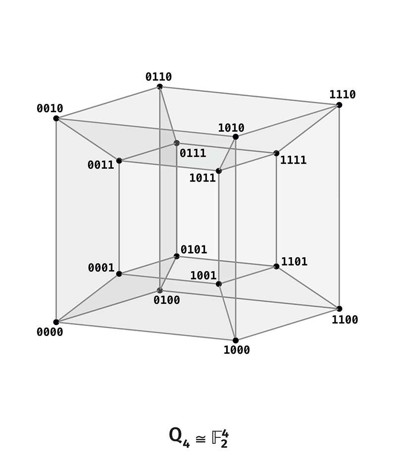
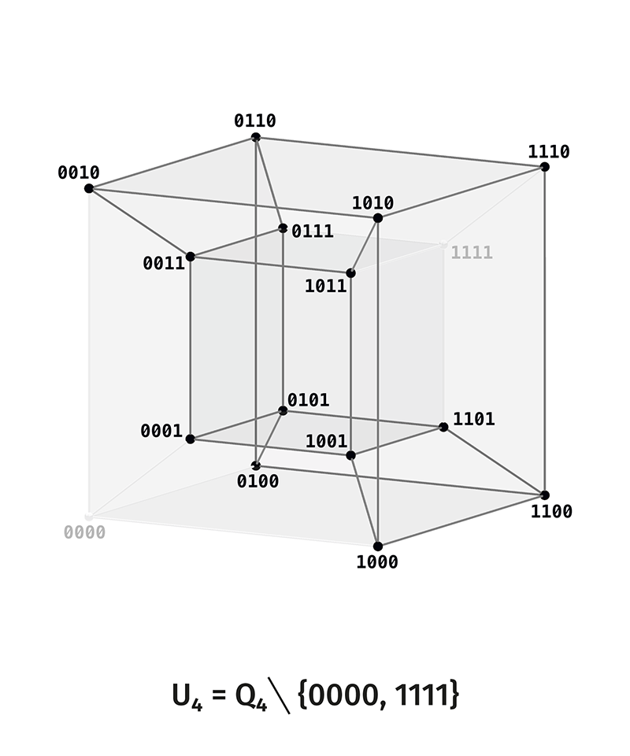
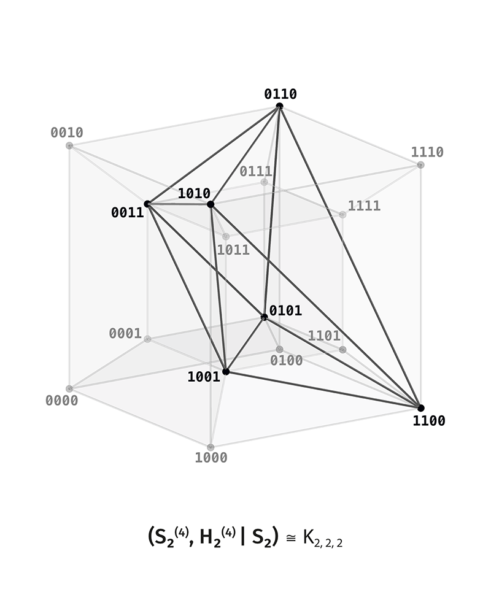
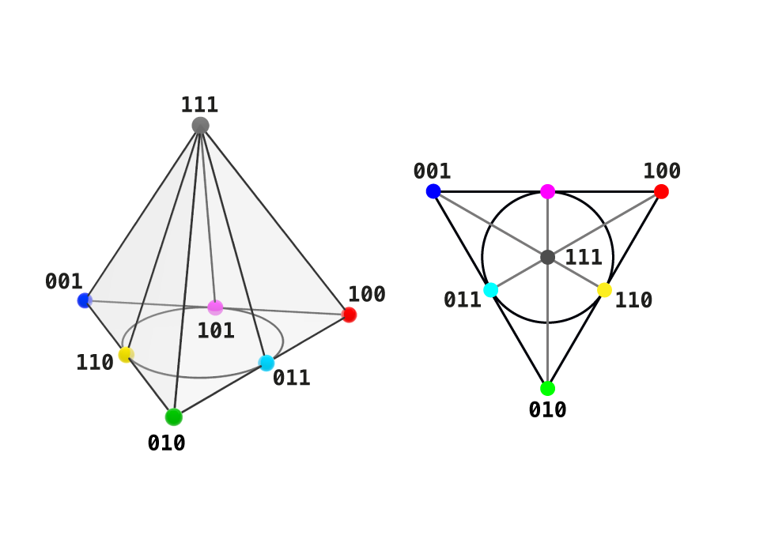

# Distinction Observable Theory

# Volume 2. The Break 2×2=4

The subject of this volume is rank 4, the first rank at which the active scene ceases to be a pure shell. On it an interior appears, separated from the limits; the connected boundary of ranks $1, 2, 3$ is severed; and the projective reading yields the Fano plane. Beyond the break the volume takes one step further — to rank 5, where the interior doubles and on the middle layer the classical combinatorial graphs emerge (Petersen, Johnson) together with the projective space $PG(3,2)$; this is the first test of the general law of active ranks.

---

# Section 0. Starting Point

Rank 3 is closed by the projective line $U_3/\kappa \cong PG(1,2)$: the three axes of the scene as three points. By the growth vector $Q_n^* \cong U_{n+1}/\kappa$ this content becomes the axial skeleton of the next rank. The lift carries rank 3 into rank 4, and the active scene of rank 4 bears a feature present at none of the ranks $1, 2, 3$.

---

# Section 1. Carrier and Active Scene of Rank 4

## §1.1. Carrier and Limits

The lift gives the rank-4 carrier:

$$
Q_4 = \mathbb F_2^4, \qquad |Q_4| = 16.
$$

*Figure 2.1. The full carrier $Q_4$ as a tesseract: sixteen configurations, two limits $0000$ and $1111$.*

The limits are the two homogeneous states:

$$
0^4 = 0000, \qquad 1^4 = 1111, \qquad \kappa(0000) = 1111.
$$

## §1.2. Active Scene

Removal of the pair of limits gives the active scene:

$$
\boxed{
U_4 = Q_4 \setminus \{0000, 1111\}, \qquad |U_4| = 2^4 - 2 = 14.
}
$$

## §1.3. Three Layers

On the active scene the weight takes the values $1, 2, 3$, giving three layers:

$$
\boxed{
U_4 = S_1 \sqcup S_2 \sqcup S_3,
}
$$

$$
|S_1| = \binom{4}{1} = 4, \qquad |S_2| = \binom{4}{2} = 6, \qquad |S_3| = \binom{4}{3} = 4.
$$

In the simplicial reading (the support of a state is the set of its unit coordinates, $J = \{1,2,3,4\}$): $S_1$ are the four vertices of the tetrahedron, $S_2$ its six edges, $S_3$ its four faces. The active scene is the boundary of the tetrahedron $\mathcal F(\partial\Delta^3)$.

*Figure 2.2. The active scene $U_4$ — fourteen non-limit states, splitting into three layers $S_1 \sqcup S_2 \sqcup S_3$.*

## §1.4. Complement on the Layers

The complement $\kappa(x) = x + 1111$ carries the weight-$k$ layer into the weight-$(4-k)$ layer:

$$
\kappa : S_1 \leftrightarrow S_3, \qquad \kappa : S_2 \leftrightarrow S_2.
$$

The layers $S_1$ and $S_3$ are exchanged. The layer $S_2$ maps into itself: weight 2 goes to weight $4-2 = 2$. This is the first distinction of rank 4 from the lower ranks and the subject of the next section.

---

# Section 2. The First Break: The Birth of the Interior

## §2.1. A Layer Not Touching the Limits

A weight-$k$ layer adjoins a limit if its states are neighbors (in a single coordinate) of a homogeneous state. The weight-$1$ layer is adjacent to $0^n$; the weight-$(n-1)$ layer is adjacent to $1^n$. A layer adjoins a limit if and only if its weight equals $1$ or $n-1$.

A layer is called **interior** if it adjoins no limit, that is, if its weight $k$ satisfies $2 \le k \le n-2$. Interior layers exist if and only if

$$
n - 2 \ge 2 \quad\Longleftrightarrow\quad n \ge 4.
$$

$$
\boxed{
\text{rank 4 is the first rank with an interior layer.}
}
$$

At ranks $1, 2, 3$ there are no interior layers: the entire active scene consists of the weight-$1$ and weight-$(n-1)$ layers adjoining the limits — a pure shell. At rank 4 the layer $S_2$ of weight 2 appears for the first time; at $n=4$ it adjoins neither $0^4$ nor $1^4$: its states are neighbors of weights $1$ and $3$, but not of weights $0$ and $4$.

## §2.2. Self-Duality of the Interior Layer

The interior layer of rank 4 is self-dual: $\kappa$ carries $S_2$ into itself. On the lower layers, exchanged pairwise ($S_1 \leftrightarrow S_3$), the complement acts between distinct layers; on $S_2$ it acts within a single layer, splitting it into three pairs:

$$
S_2 = \{1100, 1010, 1001, 0110, 0101, 0011\},
$$

$$
\kappa : 1100 \leftrightarrow 0011, \quad 1010 \leftrightarrow 0101, \quad 1001 \leftrightarrow 0110.
$$

A self-dual layer, closed under the complement and separated from the limits, is the interior of the scene, absent on the shell.

## §2.3. The Number 4 as the First Composite

The boundary of the connected ranks is $1, 2, 3$ — the ranks without interior. The break occurs at $4$. This accords with arithmetic: $4 = 2 \times 2$ is the first composite number — the first to decompose into factors. The appearance of the interior layer at rank 4 is precisely the structural meaning of this compositeness: the whole decomposes for the first time into separated parts — a skin (the layers adjoining the limits) and a core (the interior layer).

$$
\boxed{
\text{before } 4 \text{ — a connected shell; at } 4 = 2\times2 \text{ — the skin separates from the core.}
}
$$

---

# Section 3. The Interior as the Opened Center

## §3.1. The Absent Center of Rank 3

At rank 3 the active scene is a shell around an absent center: the center of the octahedron was not a state. There was no interior — the center point is empty.

## §3.2. Opening of the Center under the Lift

Geometrically, the layer $S_2$ of rank 4 is the equator of the four-dimensional cube — the layer equidistant from both limits. This is the place separated from the limits, absent at rank 3.

The absent center of the rank-3 scene opens under the lift into the interior layer of rank 4. The empty center point of the octahedron becomes the equatorial layer — six states filling the place that at rank 3 was empty. To rise to rank 4 is to enter this center; and the center, which was an absent invariant, opens at rank 4 as the interior.

$$
\boxed{
\text{the absent center of rank 3 opens into the interior layer of rank 4.}
}
$$

This is the geometric form of the lift at the threshold: on the connected boundary the center is empty, beyond the break it opens into a core. The geometric center of the carrier $\tfrac12(0^4 + 1^4)$ itself is still not a vertex; what opens is not the centroid point but the region around it — the interior layer.

---

# Section 4. The Rank-3 Scene inside Rank 4

The interior layer of rank 4 bears the structure of the rank-3 scene: the rank-3 scene enters rank 4 as its interior. This is a concrete case of the growth vector.

## §4.1. Relations on the Interior Layer

On the six states of $S_2$ the Hamming distance takes the values $2$ and $4$. The adjacency relation at distance $2$:

$$
(S_2, d_H = 2) \cong L(K_4),
$$

the line graph of the complete graph on four vertices. The line graph of $K_4$ is the octahedron:

$$
\boxed{
(S_2, d_H = 2) \cong K_{2,2,2}.
}
$$

The relation at distance $4$ (total mismatch, complement) gives three pairs:

$$
(S_2, d_H = 4) \cong 3K_2.
$$

*Figure 2.3. The self-dual middle layer $S_2$ of rank 4: six states with the octahedral skeleton $K_{2,2,2}$ — the structure of the rank-3 scene, returned as the interior.*

## §4.2. The Return of the Rank-3 Scene

The six states of the interior layer, the relation $K_{2,2,2}$, and the three complement pairs $3K_2$ — these are exactly the structure of the active scene of rank 3: six points, an octahedral skeleton, three axes. The rank-3 scene returns as the interior layer of rank 4.

$$
\boxed{
S_2^{(4)} \text{ bears the structure of the rank-3 scene.}
}
$$

By the vector $Q_n^* \cong U_{n+1}/\kappa$ the content of a rank becomes the axial skeleton of the next. At rank 4 not only the axial skeleton but the entire relational structure of rank 3 enters the core: what at rank 3 was a whole scene is at rank 4 the interior layer.

---

# Section 5. Four Directions and the Fate of the Borromean Triple

## §5.1. Four Directions

At rank 4 there are four directions of distinction — the four coordinates $x_1, x_2, x_3, x_4$. As at rank 3, they are pairwise independent and jointly necessary: no pair determines the rest, and a state requires all four. Removal of one direction drops the scene to rank 3.

## §5.2. What Is Severed at the Break

At rank 3 the three directions held together in a unique way: they lay on one connected shell, and there was no interior between them to separate them. This was precisely the Borromean connectivity — three directions, inseparable because they share one shell without a gap.

At rank 4 this form of holding is severed. The appearance of the interior layer means that the scene is no longer a single shell: it has decomposed into skin and core. The directions are now distinguished by how they pass through the skin and the interior; a gap between them has appeared. Borromean holding — inseparability on a single shell without a gap — is a property of rank 3 and is not repeated at rank 4.

$$
\boxed{
\text{what is severed is not the independence of the directions, but their holding on a single shell.}
}
$$

Three is the last rank of the pure shell, and therefore the last rank of Borromean holding in this exact sense: at $4 = 2 \times 2$ the shell decomposes, and the holding ceases to be Borromean.

## §5.3. The Observer after the Break

The observer is the intersection of the invariants of all directions — the common fixed point of the axes, the center of the carrier. At rank 4 it is still the center $\tfrac12(0^4 + 1^4)$, not a vertex. But the region around it is no longer empty: the interior layer fills the neighborhood of the center. The connection of the observer-center with the interior that appeared at the break, and the dual reading of the center as a vertex, are developed in the volume on the observer as a through-line; here we record only that the interior of rank 4 is the first filling of the neighborhood of the center.

---

# Section 6. The Projective Reading: The Fano Plane

## §6.1. Seven Axes

The quotient of the active scene by the complement identifies each pair $\{x, \kappa(x)\}$ into a single point:

$$
\boxed{
U_4 / \kappa \cong PG(2, 2).
}
$$

The number of points: $|U_4|/2 = 14/2 = 7$. These are the seven points of the Fano plane — the smallest projective plane, the $2\text{-}(7,3,1)$ design with seven points and seven lines of three points each.

*Figure 2.4. The Fano plane $PG(2,2)$: the seven axes of rank 4 as seven points, seven lines of three points each. The distinguished line $L_\infty$ comes from the self-dual layer $S_2$.*

The seven axes split by their origin from the layers. The pairs $S_1 \leftrightarrow S_3$ give four points (the four vertex–face pairs of the tetrahedron). The self-dual layer $S_2$ gives three points (the three edge-complement pairs). In all $4 + 3 = 7$.

## §6.2. The Distinguished Line

The three points from the self-dual layer $S_2$ form a line in the Fano plane. This gives the decomposition

$$
\boxed{
PG(2,2) = AG(2,2) \cup L_\infty,
}
$$

where the four points from $S_1 \leftrightarrow S_3$ are the affine part $AG(2,2)$, and the three points from the interior layer $S_2$ are the distinguished line $L_\infty$. The interior of rank 4 (the self-dual layer) is projectively the distinguished line; the skin (the layers at the limits) is the affine part.

Thus the break at rank 4 manifests also in the projective reading: the appearance of the interior layer is the appearance of the distinguished line separating the affine part from the part at infinity.

## §6.3. The Distinction of the Line Is Shell-Borne, Not Projective

The distinction of the line $L_\infty$ comes from the shell structure — from the self-dual layer $S_2$ — and not from the projective plane itself. In $PG(2,2)$ all seven lines are equal in standing: the projective plane has no distinguished line. This is seen from the rotation of the axes. The canonical rotation of rank 4 is the Singer cycle $\mathbb Z_7$ (Volume 4), acting transitively on the seven points. The transitive action does not preserve the $4 + 3$ partition: the stabilizer of a three-point subset in $\mathbb Z_7$ is trivial, so $L_\infty$ passes under rotation through each of the seven lines in turn.

$$
\boxed{
\text{the decomposition } AG(2,2) \cup L_\infty \text{ is shell-borne; the Singer cycle } \mathbb Z_7 \text{ does not preserve it.}
}
$$

The Fano plane of rank 4 bears two unaligned canonical structures: the shell decomposition $AG(2,2) \cup L_\infty$ (vertical, from the layers) and the Singer cycle $\mathbb Z_7$ (rotational, from the projective symmetry). The vertical distinguishes the line $L_\infty$; the rotation mixes the affine and the part at infinity, distinguishing no line. This is the rank-4 manifestation of the same divergence between rotation and static geometry that at rank 3 separated the cycle and the octahedron: the vertical structure and the rotation are not aligned.

---

# Section 7. The General Law of Active Ranks

## §7.1. The Projective Quotient

For all ranks $n \ge 3$ the quotient of the active scene by the complement is a projective space:

$$
\boxed{
U_n / \kappa \cong PG(n-2, 2).
}
$$

The number of axes $|U_n|/2 = 2^{n-1} - 1$ is the number of points of $PG(n-2,2)$. Rank 3 gives the line $PG(1,2)$ (three points), rank 4 the plane $PG(2,2)$ (seven points), rank 5 the space $PG(3,2)$ (fifteen points), and so on.

## §7.2. The Growth of the Interior

The number of interior layers (weights $k$ with $2 \le k \le n-2$) equals $n-3$ for $n \ge 3$:

$$
n = 3: \ 0, \qquad n = 4: \ 1, \qquad n = 5: \ 2, \qquad n = 6: \ 3, \ \dots
$$

At rank 3 there are no interior layers; beginning at rank 4 their number grows by one with each rank. The break at rank 4 is the first step of this growth: the transition from zero interior to nonzero.

## §7.3. Rank 4 as a Phase Transition

The ladder of ranks is not homogeneous. Ranks $1, 2, 3$ are a connected boundary without interior; beginning at rank 4 the active scene has a core separated from the surface, and this core grows. Rank 4 is a phase transition — the place where the qualitative type of the scene changes, not just the next term of a smooth sequence.

$$
\boxed{
\text{rank 4 is a phase transition: the transition from a pure shell to a scene with an interior.}
}
$$

---

# Section 8. Rank 5: The Second Interior and the Classical Graphs

Rank 4 exhibited the break in its smallest form — a single interior layer. Rank 5 exhibits what happens immediately beyond the break: the interior doubles, and on it the classical combinatorial graphs emerge. This is not a new principle but the first test of the general law at the next step.

## §8.1. Carrier and Four Layers

The lift gives the rank-5 carrier:

$$
Q_5 = \mathbb F_2^5, \qquad |Q_5| = 32, \qquad U_5 = Q_5 \setminus \{0^5, 1^5\}, \qquad |U_5| = 30.
$$

On the active scene the weight takes the values $1,2,3,4$ — **four** layers:

$$
\boxed{
|S_1| = 5, \quad |S_2| = 10, \quad |S_3| = 10, \quad |S_4| = 5, \qquad 5+10+10+5 = 30.
}
$$

In the simplicial reading $U_5 = \mathcal F(\partial\Delta^4)$ — the boundary of the 4-simplex: $S_1$ the five vertices, $S_2$ the ten edges, $S_3$ the ten two-dimensional faces, $S_4$ the five tetrahedral faces.

## §8.2. Odd Rank: Pairs without a Self-Dual Layer

Rank 5 is odd, so there is no self-dual middle layer (there is no integer $k = 5/2$). The complement splits the layers into two complementary pairs:

$$
\boxed{
\kappa : S_1 \leftrightarrow S_4, \qquad \kappa : S_2 \leftrightarrow S_3.
}
$$

This accords with the parity fork of Volume 7: at an even rank the zero weight bears an equator layer, at an odd rank only a centroid. Rank 5 continues the pairwise scheme of rank 3 (also odd), but now with a separated interior: the pair $S_2 \leftrightarrow S_3$ is interior, not adjoining the limits.

## §8.3. Two Types of Axes

The quotient by the complement gives axes of two types:

$$
\text{axes } (1,4):\ \{\{i\}, J_5\setminus\{i\}\},\ \text{there are } 5; \qquad \text{axes } (2,3):\ \{\{i,j\}, J_5\setminus\{i,j\}\},\ \text{there are } \tbinom{5}{2}=10.
$$

In all $5 + 10 = 15 = 2^{5-1}-1$ axes — in accordance with the general law §7.1. At rank 5 all axes are asymmetric (sides of different cardinality): there are no self-dual axes of type $(k,k)$; these appear only at even ranks (rank 4: type $(2,2)$; rank 6: $(3,3)$; rank 8: $(4,4)$). The growth of rank multiplies the types of axes: rank 3 — one type, rank 4 — two, rank 5 — two, rank 6 — three, and the diversity grows from there.

## §8.4. The Petersen Graph and the Johnson Graph

The middle layer $S_2$ of rank 5 is the set of ten pairs (the edges of $K_5$). On it the Hamming distance takes the values $2$ and $4$, which gives two relations by intersection:

The relation "exactly one common vertex" ($|\{i,j\}\cap\{k,l\}|=1$, distance 2) is the **Johnson graph**:

$$
\boxed{
(S_2, R_2) \cong J(5,2).
}
$$

The relation "no common vertices" ($|\{i,j\}\cap\{k,l\}|=0$, distance 4) is the **Kneser graph**, also the **Petersen graph**:

$$
\boxed{
(S_2, R_4) \cong KG(5,2) = \text{the Petersen graph}.
}
$$

The Petersen graph — 10 vertices, 15 edges, $3$-regular, girth $5$, no Hamiltonian cycle, automorphism group $S_5$. The two graphs are complementary: $J(5,2) \cup KG(5,2) = K_{10}$. Thus one of the best-known structures of combinatorics comes to light not as an imported example but as the disjointness relation on the interior layer of rank 5 — a consequence of the same relational anatomy that at rank 3 gave $C_6$ and two triads.

## §8.5. The Projective Quotient $PG(3,2)$

The quotient of the active scene by the complement is, by the general law §7.1,

$$
\boxed{
U_5/\kappa \cong PG(3,2), \qquad |PG(3,2)| = 15.
}
$$

This is the three-dimensional projective space over $\mathbb F_2$: 15 points (the 15 axes of rank 5), 35 lines of 3 points, 15 planes, each of which is a Fano plane $PG(2,2)$. Thus the Fano plane of rank 4 embeds into the space of rank 5 in fifteen ways — the direct continuation of the ladder $PG(1,2) \to PG(2,2) \to PG(3,2)$.

## §8.6. Kneser and Johnson Graphs in General Form

Rank 5 is the first substantive case of the general construction. At any rank $n$ the layer $S_k$ bears two classical graphs by the distance relations:

$$
\boxed{
J(n,k) = (S_k, R_2) \quad (\text{intersection } k-1), \qquad KG(n,k) = (S_k, R_{2k}) \quad (\text{intersection } 0).
}
$$

These include the Petersen graph $KG(5,2)$, the Coxeter graph in the neighborhood of $KG(7,3)$, and the entire series of Johnson graphs — the foundation of algebraic graph theory. In DOT they are relations on the layers, not imported objects.

## §8.7. The Fermat Ladder

The number of axes of rank $n$ is $2^{n-1}-1$. The divisibility of this number by the Fermat primes $F_k = 2^{2^k}+1$ distinguishes special ranks. The prime $F_k$ first divides $2^{n-1}-1$ at rank $n = 2^{k+1}+1$, which gives the ladder

$$
\boxed{
3,\ 5,\ 9,\ 17,\ 33,
}
$$

$$
2^2{-}1 = 3 = F_0, \quad 2^4{-}1 = 15 = F_0 F_1, \quad 2^8{-}1 = 255 = F_0 F_1 F_2, \quad \dots
$$

By the Gauss–Wantzel theorem these are exactly the ranks at which the number of axes is connected with the constructibility of regular polygons by compass and straightedge. In DOT the Fermat ladder is an arithmetic pointer to the distinguished levels of cyclic and projective reading; its continuation would require a new Fermat prime. Status: a verified arithmetic connection, not a load-bearing principle.

---

# Section 9. The Spectral Reading of the Complement

The higher ranks bear a natural spectral reading on the full Boolean carrier $Q_n = \mathbb F_2^n$, where functions on $Q_n$ take values in $\{\pm1\}$. The Walsh–Hadamard characters are

$$
\chi_a(x) = (-1)^{a\cdot x}, \qquad a \in \mathbb F_2^n,
$$

and form an orthogonal basis of the space of functions on $Q_n$. The complement acts diagonally on this basis:

$$
\boxed{
\kappa\,\chi_a = (-1)^{|a|}\,\chi_a,
}
$$

where $|a|$ is the weight of $a$. That is, the complement splits the spectrum by the parity of the character weight: the $\kappa$-even modes ($|a|$ even) are preserved and descend to the quotient $U_n/\kappa$, the $\kappa$-odd ones ($|a|$ odd) change sign and give a twisted polar reading. This is the spectral form of the same law seen at rank 3 as the antipodal layer $R_3 = 3K_2$, and in the $\mathfrak{sl}_2$-language (Volume 7) as the Weyl involution $\kappa H \kappa = -H$. The detailed development is the appendix [`DOT_Spectral_Antipodal_Grammar_EN.md`](../03_Appendix/DOT_Spectral_Antipodal_Grammar_EN.md).

---

# §10. Summary of Volume 2

The active scene of rank 4 is fourteen states between the limits,

$$
U_4 = Q_4 \setminus \{0000, 1111\} = S_1 \sqcup S_2 \sqcup S_3,
$$

the boundary of the tetrahedron $\mathcal F(\partial\Delta^3)$, with layers of cardinalities $4, 6, 4$.

The complement exchanges the layers $S_1 \leftrightarrow S_3$ and leaves $S_2$ self-dual. The layer $S_2$ of weight 2 does not adjoin the limits — it is the first interior layer; it exists because $n \ge 4$. Rank 4 is the first rank with an interior, and this accords with the fact that $4 = 2 \times 2$ is the first composite number: the whole decomposes into skin and core.

The absent center of rank 3 opens under the lift into the interior layer of rank 4 — the equator of the four-dimensional cube. The interior layer bears the structure of the rank-3 scene:

$$
(S_2, d_H = 2) \cong K_{2,2,2}, \qquad (S_2, d_H = 4) \cong 3K_2,
$$

that is, the entire relational structure of rank 3 enters the core, not only the axial skeleton of the vector $Q_n^* \cong U_{n+1}/\kappa$.

The four directions are pairwise independent and jointly necessary, but Borromean holding — inseparability on a single shell without a gap — is severed: with the appearance of the interior the scene decomposes into skin and core. Three is the last rank of Borromean holding.

The projective reading gives the Fano plane,

$$
U_4 / \kappa \cong PG(2,2) = AG(2,2) \cup L_\infty,
$$

where the affine part comes from the layers at the limits, and the distinguished line $L_\infty$ from the interior layer.

The general law: $U_n/\kappa \cong PG(n-2,2)$; the number of interior layers is $n-3$ and grows with the rank. Rank 4 is a phase transition — the transition from a pure shell to a scene with an interior.

Rank 5 tests the law at the next step: four layers $5+10+10+5$ without a self-dual one (odd rank — only the complementary pairs $S_1\leftrightarrow S_4$, $S_2\leftrightarrow S_3$), two interior halves, and on the middle layer the classical graphs: the Johnson graph $J(5,2)$ and the Kneser graph $KG(5,2) = $ the Petersen graph, complementary on $K_{10}$. The projective quotient is $U_5/\kappa \cong PG(3,2)$ (15 points, 15 Fano planes). The Fermat ladder $3,5,9,17,33$ distinguishes the ranks where the number of axes $2^{n-1}-1$ is connected with the constructibility of polygons. Spectrally the complement is diagonal on the Walsh–Hadamard characters, $\kappa\chi_a = (-1)^{|a|}\chi_a$, splitting the spectrum by the parity of the weight.

$$
\boxed{
\text{rank 4: the birth of the interior, the return of the rank-3 scene as a core, the end of Borromean holding, the Fano plane; rank 5: the second interior, the Petersen graph, } PG(3,2).
}
$$

The next layer of reorganization brings the vertical together: the lift and the boundary as one vertical and the descent adjoint to it.

**Verification.** The higher-rank shell laws, the Petersen graph $KG(5,2)$ and Johnson graph $J(5,2)$ on the rank-5 middle layer, their complementarity on $K_{10}$, and the axis count $|U_n/\kappa| = |PG(n-2,2)|$ are checked in [`01_Verification/DOT_Core_verifier.py`](../01_Verification/DOT_Core_verifier.py) (`rank5_petersen_johnson_test`, `projective_axis_count_test`, plus the 4D/n-dimensional shell tests; refs `V2 §7-8`).
