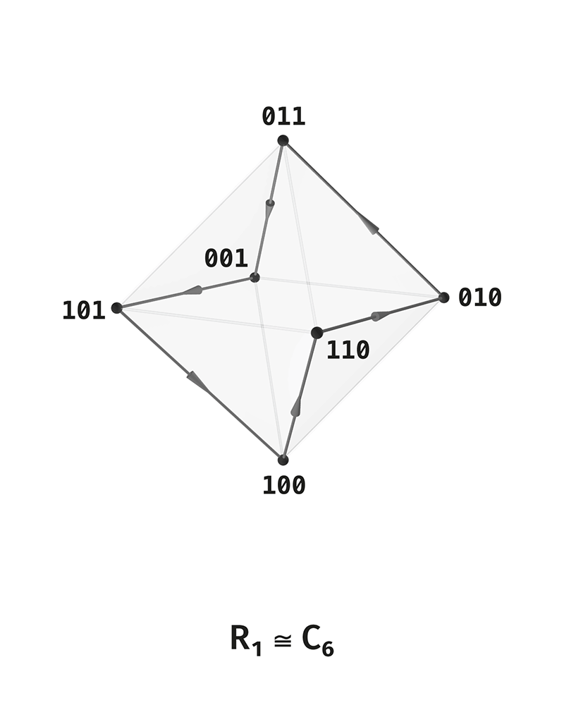

# Distinction Observable Theory

# Volume 4. Helicoid

The subject of this volume is the addition of the theory's two movements into one. Until now they have run separately: rotation within a rank (the scene cycle) and ascent between ranks (the lift). Here intra-scene rotation is introduced as the continuous shadow of the cycle, its canonical form under the lift is established — the Singer cycle of the projective space of axes — and the two movements are added into a screw on the tower of ranks.

The status of statements is marked explicitly: what follows rigorously from the structure, what is a justified hypothesis, what remains open. Dynamics is introduced as an analytic reading of a finite structure, not as an assertion about physics.

---

# Section 0. Starting point

The lift (Volume 3) moves upward through the ranks; the cycle of rank 3 (Volume 1) moves across the scene in place. These two movements are orthogonal and have not yet been combined: the cycle was considered only on rank 3, the lift only between ranks. Their addition is a screw, and its construction closes the picture of movement.

---

# Section 1. Intra-scene rotation

## §1.1. The cycle of rank 3

On the active scene of rank 3 the adjacency relation $R_1$ (Hamming distance 1) is the unique hexagonal cycle $C_6$:

$$
001 - 011 - 010 - 110 - 100 - 101 - 001.
$$

This is the rotation of the scene — a traversal of all six states around a circle. The cycle is unique and covers the entire scene: six points, each of degree 2. This is possible only on rank 3, where the scene is six points and the relation $R_1$ is two-regular (§2.1 will show that on higher ranks this is not so).

*Figure 4.1. The cycle $R_1 = C_6$ as a traversal of the active scene of rank 3: the generator $T$ shifts by one position, $T^6 = \operatorname{id}$, $T^3 = \kappa$.*

## §1.2. The rotation operator

The cycle is generated by the shift operator $T$ (Volume 1), now read as a rotation:

$$
\boxed{
T^6 = \operatorname{id}, \qquad T^3 = \kappa.
}
$$

Six shifts return to the starting point; three shifts — a half-turn — give the limit complement. Rotation and complement are linked: the half-turn of the cycle is $\kappa$.

## §1.3. The continuous shadow

To discrete rotation there corresponds a continuous shadow — a flow on the torus with two phases $\alpha(t), \beta(t)$. On the Poincaré section $\beta = 0 \pmod{2\pi}$ returns occur at intervals $\Delta t = 2\pi$, and the rotation number is the ratio of frequencies:

$$
\boxed{
\rho = \frac{\omega_\alpha}{\omega_\beta}.
}
$$

The grammar of rank 3 — one cycle, a half-period complement, two triadic chambers — is compatible with the minimal rotation number

$$
\boxed{
\rho = \frac16.
}
$$

Six sectors of the section give the hexagonal cycle; $1/6$ is the continuous shadow of $C_6$. This number does not follow from a single antisymmetric S-loop: it requires a carrier phase winding with rotation number $1/6$, and the S-loop is only its local modulation.

The continuous shadow is an analytic reading of the finite scene, not a physical dynamics: the flow on the torus smooths the discrete traversal, adding nothing beyond a continuous parameter.

---

# Section 2. Rotation under the lift

A question not resolved in the earlier exposition: what becomes of the cycle upon ascending the rank. The cycle of rank 3 in its literal form is not preserved, but a canonical rotation exists — at the level of axes.

## §2.1. The literal cycle is not preserved

On rank 4 the adjacency relation $R_1$ on the active scene $U_4$ is not a cycle. A weight-1 state is adjacent to three weight-2 states (after removing the lower pole), a weight-2 state to two weight-1 and two weight-3 states, a weight-3 state to three weight-2 states (after removing the upper pole). The degrees are 3 and 4, not 2.

$$
\boxed{
\text{on rank 4 the relation } R_1 \text{ is not two-regular — not a cycle.}
}
$$

The unique covering cycle $C_6$ is a peculiarity of rank 3, where the scene is six points. On higher ranks the literal scene cycle is not preserved.

## §2.2. The canonical rotation on axes

The canonical rotation lives not on states, but on axes. The axes of a rank are $U_n/\kappa \cong PG(n-2,2)$ — the points of the projective space over the binary field. The projective space $PG(n-2,2)$ carries a Singer cycle — a cyclic action permuting all its points regularly, of order equal to the number of points:

$$
\boxed{
\text{the Singer cycle on } PG(n-2,2) \text{ has order } 2^{n-1} - 1.
}
$$

This is the canonical rotation of axes: one cyclic generator traversing all the axes of a rank. It exists for every rank $n \ge 3$ and is the standard structure of a projective space.

## §2.3. Agreement across ranks

The Singer cycle gives a canonical rotation on each rank, and it agrees with the cycle of rank 3.

On rank 3 the axes are $PG(1,2)$ — three points; the Singer cycle has order $2^{2} - 1 = 3$. The operator $T$ on six states has order 6 and satisfies $T^3 = \kappa$; hence on the axes (the quotient by $\kappa$) it acts with order 3 — this is precisely the Singer cycle of $PG(1,2)$. The cycle $C_6$ on states covers the Singer cycle of order 3 on axes.

On rank 4 the axes are $PG(2,2)$ — the Fano plane, seven points; the Singer cycle has order $2^{3} - 1 = 7$. This is the well-known cyclic symmetry of the Fano plane: seven points as $\mathbb Z_7$, seven lines as shifts of the difference set $\{1, 2, 4\}$. The canonical rotation of rank 4 is the Singer cycle of the Fano plane of order 7.

On rank 5 the axes are $PG(3,2)$ — fifteen points; the Singer cycle has order $2^4 - 1 = 15$. And so on.

## §2.4. The rotation number across ranks

The canonical rotation gives a rotation number on each rank. On the axes it is one divided by the number of axes:

$$
\rho_{\text{axes}} = \frac{1}{2^{n-1} - 1}.
$$

On states, when the rotation is covered by a cycle on states, the number is twice as fine — one over the number of states $|U_n| = 2^n - 2$:

$$
\rho_{\text{states}} = \frac{1}{2^{n} - 2}.
$$

On rank 3 this gives $\rho_{\text{axes}} = 1/3$ and $\rho_{\text{states}} = 1/6$. The rotation number $1/6$ is the rotation number on states of rank 3.

That on rank 3 the canonical rotation of axes (order 3) is covered by a unique cycle on states (order 6, $C_6$) is a peculiarity of rank 3. Whether the Singer cycle of axes is covered by a unique cycle on states on higher ranks is a finer question: the canonical rotation reliably exists at the level of axes, while its lift to a unique cycle on states for $n > 3$ remains open.

---

# Section 3. Helicoid

## §3.1. Two movements

The theory moves in two orthogonal directions. Ascent — the lift $\Lambda$, discrete, rank by rank. Rotation — the Singer cycle on the axes of a rank, traversing the axes in place. Ascent changes the rank; rotation leaves the rank and traverses its axes.

## §3.2. Addition into a screw

The addition of the two movements is a screw. Rotation on the floor of a rank plus ascent to the floor above: in one turn around the axes the movement does not return to the starting point but rises to the next rank.

$$
\boxed{
\text{helicoid} = \text{rotation around the axes of a rank} + \text{ascent between ranks.}
}
$$

This is the complete vector of the theory's movement — not rotation alone nor ascent alone, but their addition into a screw on the tower of ranks.

## §3.3. The rigorous core and the continuous avatar

The rigorous core of the screw is discrete: the tower of ranks (Volume 3), on each floor of which the Singer cycle of axes acts (§2.2). This is a finite structure — a sequence of projective spaces with a cyclic action on each, linked by the lift.

The continuous avatar of the screw is its smoothing: on rank 3 — a flow on the torus with rotation number $1/6$ (§1.3), moving across the scene and raised by the lift. The helicoid as a continuous curve is the smoothing of the discrete tower with rotation; an analytic reading adding nothing to the structure beyond a continuous parameter.

## §3.4. Why a screw

The screw is the unique form holding both movements. A circle would close — return to the starting point, losing the ascent. A straight line would be indifferent to rotation — it would rise without traversing the axes. The screw holds both: a rotation that, over a turn, does not close but rises. The complete vector of distinction is a screw: passing through a turn around the axes and not returning, it rises one rank higher.

## §3.5. Incommensurability of the step

The orders of the Singer cycle on adjacent ranks are coprime:

$$
\gcd(2^{n-1} - 1,\ 2^{n} - 1) = 1,
$$

since $2^n - 1 = 2(2^{n-1} - 1) + 1$. The floor of rank $n$ traverses $2^{n-1}-1$ axes, the floor of rank $n+1$ traverses $2^n - 1$ axes, and these numbers have no common divisor. The step of the screw between floors is incommensurable: the rotation of the lower floor does not fit a whole number of times into the rotation of the upper. This agrees with the continuous avatar, where incommensurability of frequencies gives a non-closing winding: the screw has no common period across floors.

---

# Section 4. The helicoid and the octahedron

The screw and the octahedron of the rank-3 scene are linked but not identical. This difference must be held so as not to conflate rotation with the geometry of the scene.

## §4.1. Different symmetries

The rotation of rank 3 has cyclic symmetry $C_6$ — generated by a turn of $60°$. The group of proper rotations of the octahedron is $O \cong S_4$ of order 24, with rotation axes of orders 4, 3, and 2 — the octahedron has no axis of order 6. The orders of elements of $S_4$ are $1, 2, 3, 4$; there is no element of order 6 in the rotation group. Hence $C_6$ does not embed into the rotation group of the octahedron as a subgroup.

$$
\boxed{
C_6 \text{ is not a subgroup of the rotation group of the octahedron } O \cong S_4.
}
$$

(The full octahedral group with reflections $O_h \cong S_4 \times \mathbb Z_2$ does contain elements of order 6 — rotoreflections about the 3-axes; but these are not rotations. The octahedron has no rotational symmetry of order 6, and it is precisely this that would correspond to the cycle $C_6$.)

## §4.2. The cycle as a traversal, not a symmetry

On the octahedron the cycle $C_6$ is a Hamiltonian traversal of the vertices — a path passing through all six vertices around a circle — and not a symmetry of the octahedron. The rotation traverses the vertices; the symmetry of the octahedron permutes them otherwise. The cycle and the octahedron are two structures on the same six points: rotation and the geometry of the scene.

## §4.3. The link is graph-theoretic, not geometric

The screw and the octahedron are linked at the level of the graph — six points, the adjacency relation, a cycle through them — but are not one geometric object. The screw lives on the tower as rotation of axes with ascent; the octahedron lives on a single rank as the geometry of the scene. Their commonality is the six points of rank 3 and the cycle through them; their difference is that the screw is an inter-rank movement, the octahedron an intra-rank geometry. They must not be conflated as identical geometric objects.

---

# §5. Summary of Volume 4

The theory moves in two orthogonal directions: rotation within a rank and ascent between ranks. Their addition is a screw.

Intra-scene rotation on rank 3 is the cycle $C_6$ — the unique covering cycle of the scene, a peculiarity of rank 3 (six points, $R_1$ two-regular). Its operator:

$$
T^6 = \operatorname{id}, \qquad T^3 = \kappa.
$$

The continuous shadow is a flow on the torus with rotation number $\rho = 1/6$ — the minimal one compatible with the grammar of rank 3; an analytic reading, not physics.

Under the lift the literal cycle is not preserved (on rank 4 the relation $R_1$ is not two-regular). The canonical rotation lives on the axes $U_n/\kappa \cong PG(n-2,2)$ as the Singer cycle of order $2^{n-1} - 1$:

$$
\text{rank 3: order 3 } (PG(1,2)), \quad \text{rank 4: order 7 (Fano)}, \quad \text{rank 5: order 15}.
$$

The cycle $C_6$ of rank 3 covers the Singer cycle of order 3 on axes through $T^3 = \kappa$. The rotation number on axes is $1/(2^{n-1}-1)$, on states $1/(2^n - 2)$; on rank 3 this is $1/3$ and $1/6$. The lift of the Singer cycle to a unique cycle on states for $n > 3$ remains open; the canonical rotation is reliable at the level of axes.

The helicoid is the addition of rotation around the axes of a rank and ascent between ranks: over a turn around the axes the movement does not close but rises one rank higher. The rigorous core is discrete — a tower of projective spaces with a Singer cycle on each; the continuous avatar is the smoothing (a flow with $\rho = 1/6$ on rank 3). The screw holds both movements where a circle would close and a straight line would be indifferent to rotation.

The screw and the octahedron of the scene are linked graph-theoretically (six points, a cycle through them) but are not identical: $C_6$ is not a subgroup of the rotation group of the octahedron $O \cong S_4$ (the octahedron has no rotation axis of order 6); the cycle is a Hamiltonian traversal of the octahedron, not its symmetry; the screw is an inter-rank movement, the octahedron an intra-rank geometry.

$$
\boxed{
\text{the complete vector of distinction is a screw: rotation of the axes of a rank, not closing over a turn but rising one rank higher.}
}
$$

The next layer of reorganization reduces the observer as a through-thread: one through three guises and the seed of the lift.
