# Appendix B. RGB/CMY/Kuhn/HSV Colour Bridge

Status: bridge document / exact realised reference model.

This document defines a colour realisation of the rank-3 finite core inside the colour cube $[0,1]^3$. The strict source is the binary carrier $Q_3$. The colour layer appears after choosing a convention that assigns the three cube coordinates to three colour axes. In the convention used here, the coordinate axes are denoted $R,G,B$, while the complementary vertices give $C,M,Y$. The six nonzero nonsaturated vertices form the colour layer

$$
RGB\sqcup CMY =
\{R,G,B,C,M,Y\}.
$$

The Kuhn decomposition gives six tetrahedral sectors inside the cube. HSV/HSB coordinates are used as local reading formulas inside these sectors.

The strict core has its own finite carriers and relations. The colour layer realises part of the already constructed finite structure in the standard colour body $[0,1]^3$.

The source strict layer:

$$
Q_3=\mathbb{F}_2^3,
\qquad
X_{\mathrm{adm}}=Q_3\setminus\{000,111\},
$$

$$
R_1,\quad R_2,\quad R_3.
$$

The target bridge layer:

$$
[0,1]^3
$$

with a chosen RGB coordinate convention, binary vertices, Kuhn sectors, and local HSV formulas.

Here $RGB$ and $CMY$ have the same status inside the six-vertex colour layer. $RGB$ is the chosen coordinate notation for the colour cube; under complement $x\mapsto 111-x$, the triple $RGB$ passes to the triple $CMY$. HSV/HSB supplies sector coordinates for the subsequent colour reading.

---

## B.1. Layer Status

The colour bridge has three levels.

**Finite strict frame.**

$$
Q_3,\quad X_{\mathrm{adm}},\quad R_1, R_2, R_3,\quad R_{12}=R_1\cup R_2
$$

are native objects of the strict core.

**Realised colour layer.**

$$
[0,1]^3
$$

with the chosen coordinate convention $(R,G,B)$, eight vertices, six chromatic vertices $RGB\sqcup CMY$, and the Kuhn decomposition into six tetrahedra is a realised bridge-carrier.

**Bridge-reading.**

$$
X_{\mathrm{adm}}
\longleftrightarrow
\text{six chromatic vertices }RGB\sqcup CMY\text{ of the colour cube}.
$$

This is a reading of an already constructed finite structure. The colour layer has the status of a realised reference model. The source layer of the theory remains the strict finite core.

---

## B.2. Binary RGB/CMY Carrier

Use the binary cube:

$$
Q_3=\{0,1\}^3.
$$

  <a href="../../assets/figures/B1_color_cube_Q3.png">
    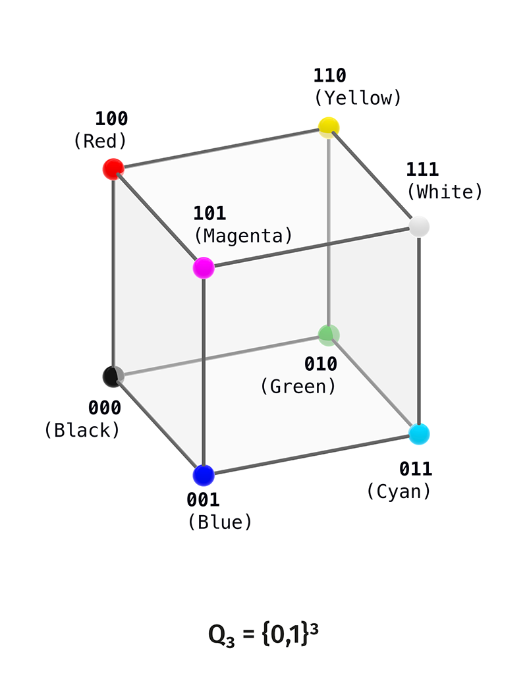
  </a>

Fix the standard RGB convention:

$$
100=R,
\qquad
010=G,
\qquad
001=B.
$$

Then:

$$
110=Y=R+G,
$$

$$
101=M=R+B,
$$

$$
011=C=G+B.
$$

Total poles:

$$
000=\text{black},
\qquad
111=\text{white}.
$$

Chromatic shell:

$$ X_{\mathrm{adm}} = \{100, 010, 001, 110, 101, 011\}.$$

Decomposition:

$$
Q_3=\{000\}
\sqcup
X_{\mathrm{adm}}
\sqcup
\{111\}.
$$

This is the bridge form of the strict rank-3 puncture:

$$
Q_3\setminus\{000,111\}.
$$

  <a href="../../assets/figures/B2_chromatic_carrier_Xadm.png">
    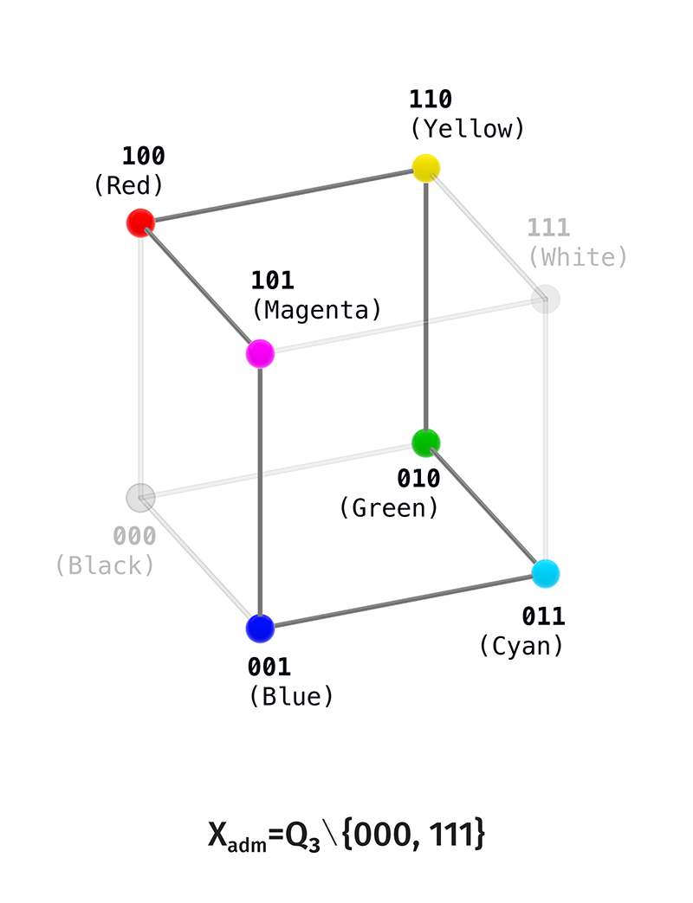
  </a>

---

## B.3. Relation-Layers as Colour Readings

On the strict carrier $X_{\mathrm{adm}}$:

$$
R_k=\{(x,y)\in X_{\mathrm{adm}}\times X_{\mathrm{adm}}:x\neq y,\ d_H(x,y)=k\},
\qquad
k=1,2,3.
$$

### B.3.1. $R_1=C_6$

$$
(X_{\mathrm{adm}},R_1)\cong C_6.
$$

One standard order:

$$
100\to110\to010\to011\to001\to101\to100.
$$

In colour names:

$$
R\to Y\to G\to C\to B\to M\to R.
$$

Bridge-reading:

$$
R_1=\text{adjacent chromatic transitions}.
$$

Strict status:

$$
R_1=C_6
$$

is a finite graph fact on $X_{\mathrm{adm}}$.

  <a href="../../assets/figures/B3_R1_hamming_cycle_C6.png">
    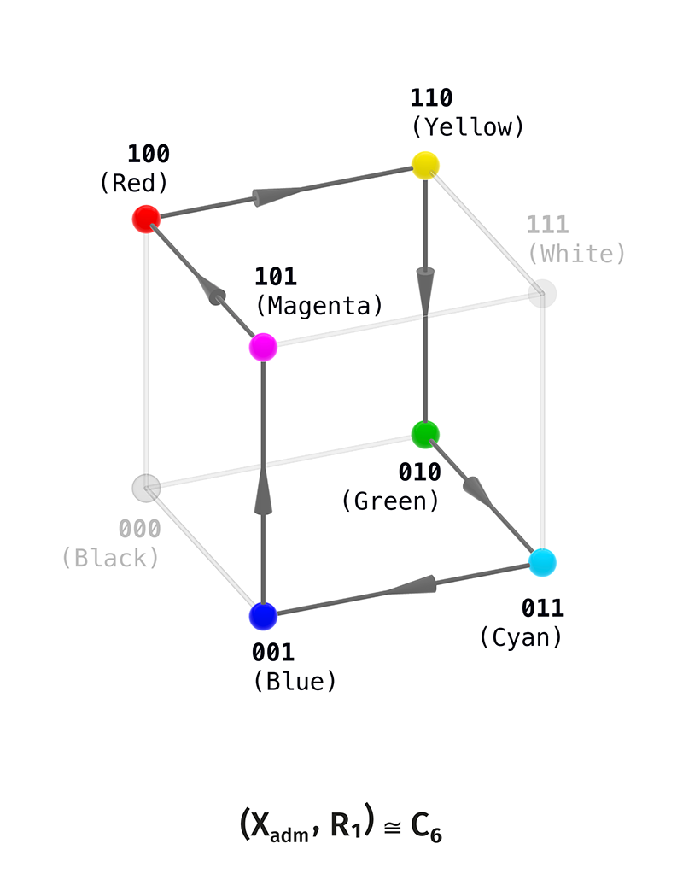
  </a>

### B.3.2. $R_2=K_3\sqcup K_3$

$$
(X_{\mathrm{adm}},R_2)\cong K_3\sqcup K_3.
$$

Two triads:

$$
\{100,010,001\}=\{R,G,B\},
$$

$$
\{110,101,011\}=\{Y,M,C\}.
$$

Bridge-reading:

$$
R_2=\text{RGB/CMY split}.
$$

Strict status:

$$
R_2=K_3\sqcup K_3.
$$

  <a href="../../assets/figures/B4_R2_two_triads_K3sqcupK3.png">
    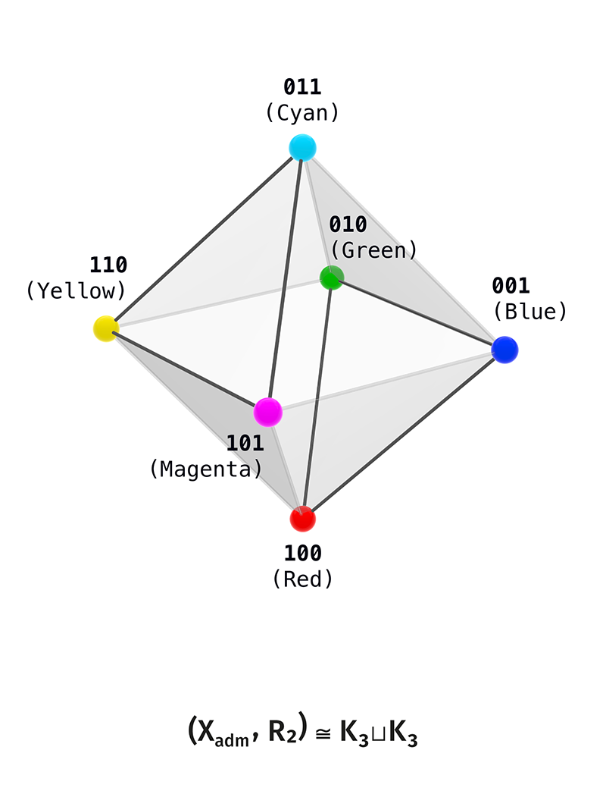
  </a>

### B.3.3. $R_3=3K_2$

$$
(X_{\mathrm{adm}},R_3)\cong 3K_2.
$$

Complement pairs:

$$
100\leftrightarrow011,
$$

$$
010\leftrightarrow101,
$$

$$
001\leftrightarrow110.
$$

In colour names:

$$
R\leftrightarrow C,
\qquad
G\leftrightarrow M,
\qquad
B\leftrightarrow Y.
$$

Bridge-reading:

$$
R_3=\text{colour complementarity}.
$$

Strict status:

$$
R_3=3K_2.
$$

  <a href="../../assets/figures/B5_R3_complementary_axes_3K2.png">
    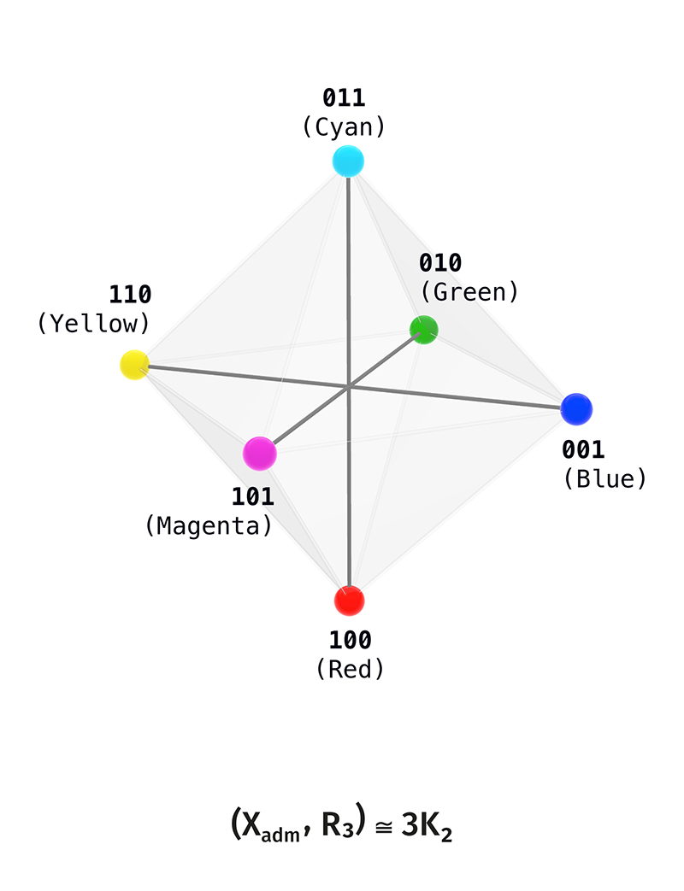
  </a>

---

## B.4. Octahedral Colour Shell

Union relation:

$$
R_{12}=R_1\cup R_2.
$$

Strict graph-reading:

$$
(X_{\mathrm{adm}},R_{12})
\cong
K_{2,2,2}.
$$

This is the $1$-skeleton, or shell, of the octahedron. The complementary
pairs form the internal axial layer of the full rank-3 scene.

In the colour bridge:

$$
000
\quad
\longleftrightarrow
\quad
X_{\mathrm{adm}}
\quad
\longleftrightarrow
\quad
111.
$$

Bridge-reading:

$$
X_{\mathrm{adm}} =
\text{six-vertex chromatic shell}.
$$

Strict object:

$$
(X_{\mathrm{adm}},R_{12}).
$$

The octahedral colour shell is a realised geometric view of this finite graph.

  <a href="../../assets/figures/B6_octahedral_shell_R12_K222.png">
    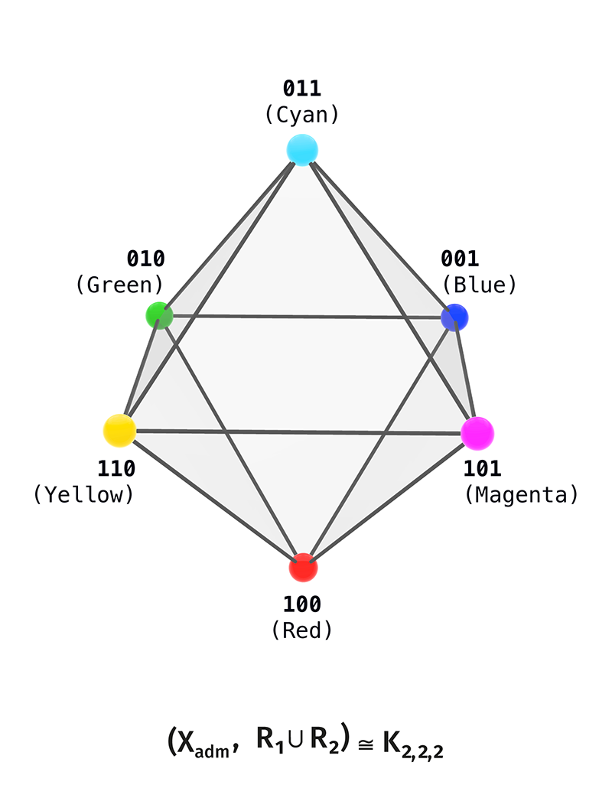
  </a>

The chamber-reading of this shell gives eight chamber states:

  <a href="../../assets/figures/B7a_DOT_chambers_RGB_CMY_side_A.png">
    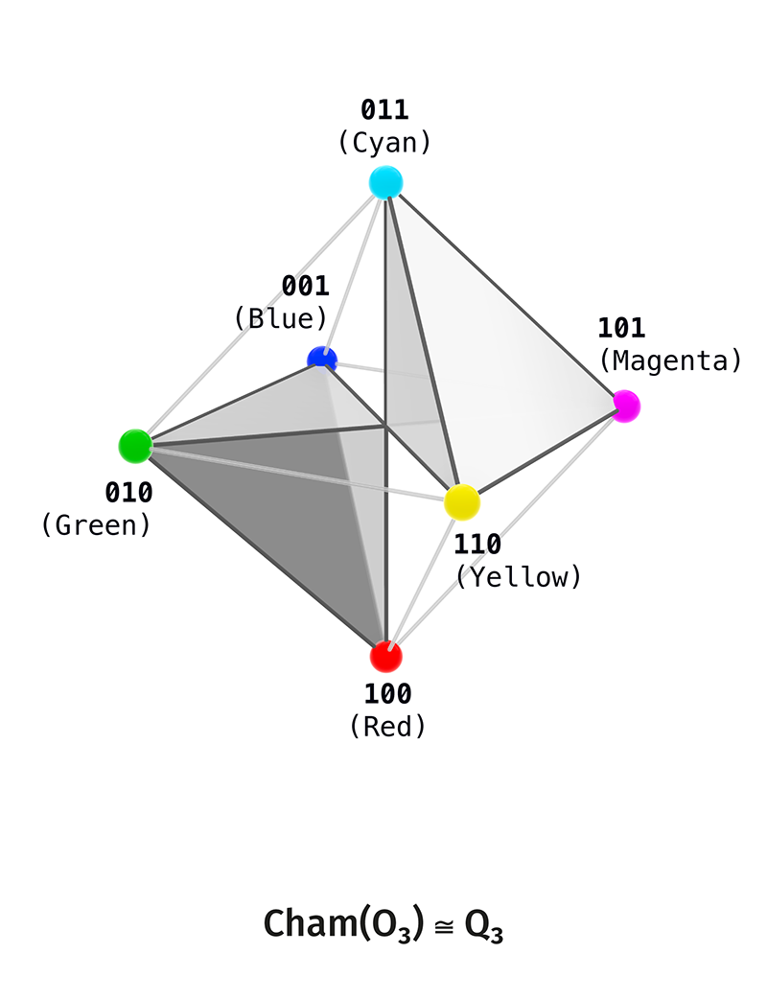
  </a>

  <a href="../../assets/figures/B7b_DOT_chambers_RGB_CMY_side_B.png">
    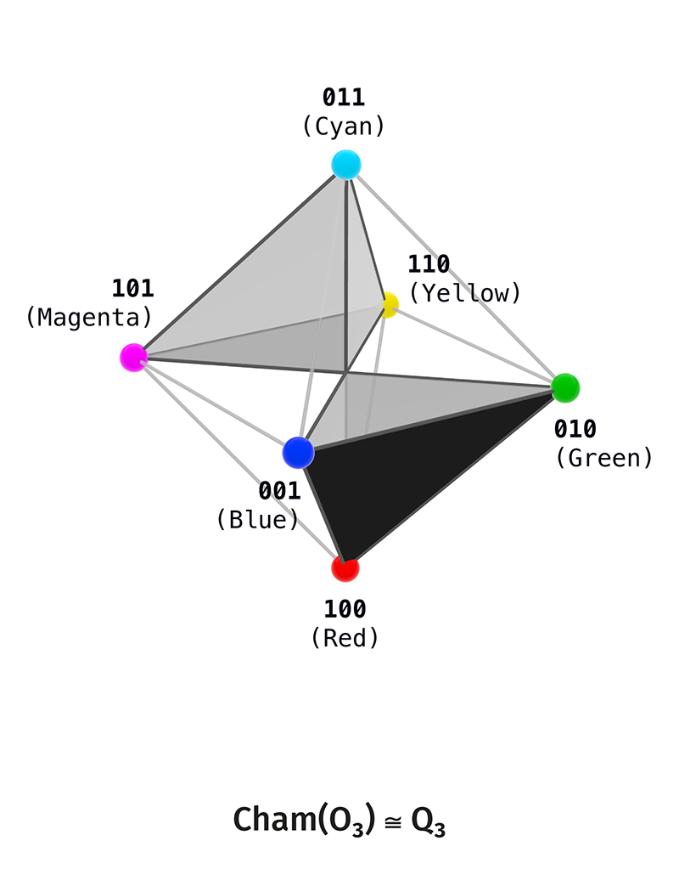
  </a>

  <a href="../../assets/figures/B7c_DOT_chambers_two_octahedron_views.png">
    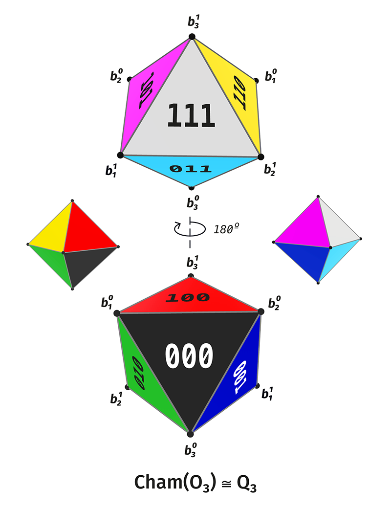
  </a>

  <a href="../../assets/figures/B7d_chamber_code_projection_overview.png">
    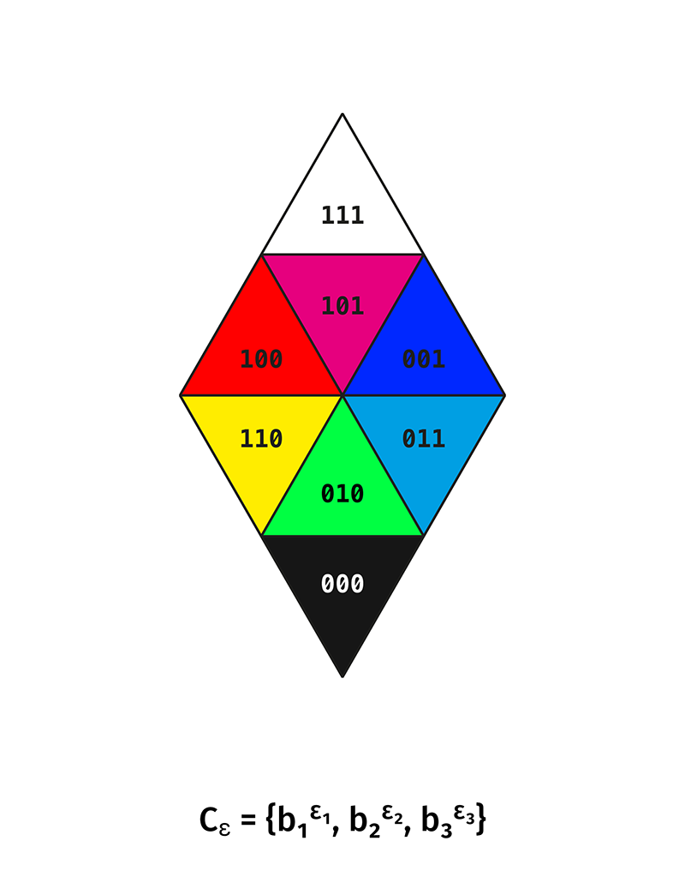
  </a>

  <a href="../../assets/figures/B7e_chamber_pair_projection_tiles.png">
    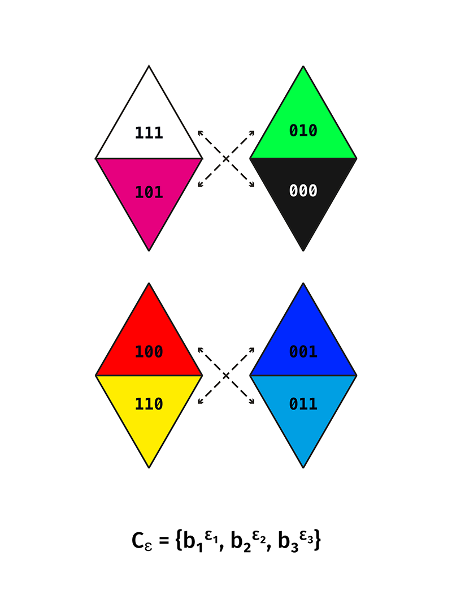
  </a>

---

## B.5. Kuhn Decomposition

Continuous RGB cube:

$$
[0,1]^3.
$$

It decomposes into $6$ Kuhn tetrahedra, one for each coordinate order.

In the sector

$$
R\geq G\geq B
$$

put:

$$
u=B,
\qquad
a=R-B,
\qquad
b=G-B.
$$

Then:

$$
(R,G,B)=u(1,1,1)+(a,b,0).
$$

Equivalently:

$$
R=u+a,
\qquad
G=u+b,
\qquad
B=u,
$$

where:

$$
0\leq b\leq a,
\qquad
0\leq u\leq 1-a.
$$

HSV quantities in this sector:

$$
V=R=u+a,
$$

$$
C=R-B=a,
$$

$$
f_{\mathrm{hue}}=\frac{G-B}{R-B}=\frac{b}{a},
\qquad
a>0.
$$

Status:

$$
\text{Kuhn/HSV formula} =
\text{exact realised colour layer}.
$$

This layer is a subsequent realisation of the strict finite core.

  <a href="../../assets/figures/B8_RGB_cube_Kuhn_HSV_sectors.png">
    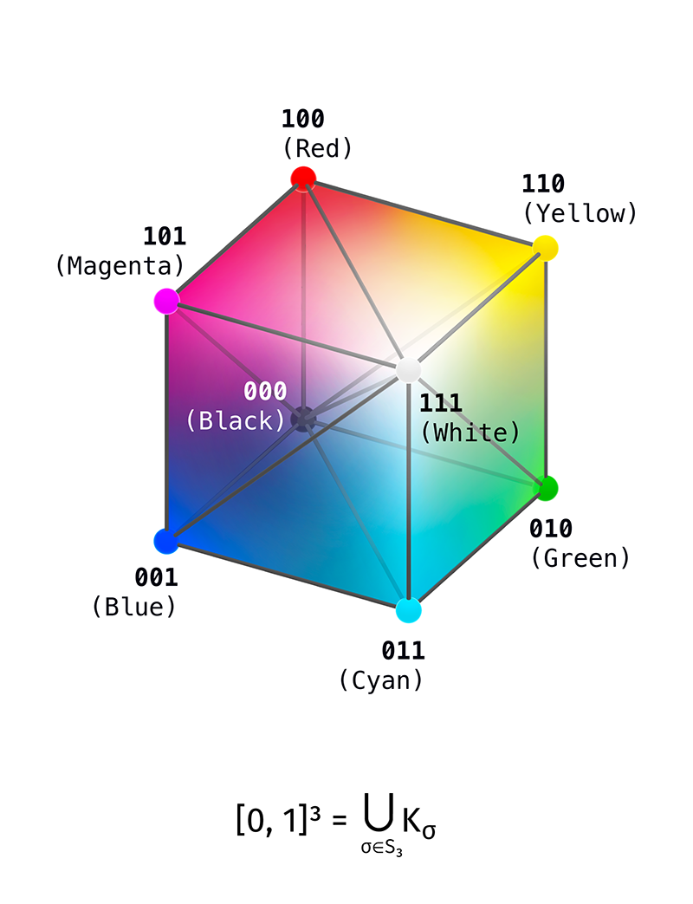
  </a>

---

## B.6. What Is Imported into the Main Text

The main text may cite:

$$
Q_3=\{0,1\}^3
$$

as a finite carrier;

$$
X_{\mathrm{adm}}=Q_3\setminus\{000,111\}
$$

as the six-state admissible shell;

$$
R_1=C_6,
\qquad
R_2=K_3\sqcup K_3,
\qquad
R_3=3K_2,
$$

as exact Hamming relation-readings;

$$
R_1\cup R_2=K_{2,2,2}
$$

as the octahedral shell;

$$
[0,1]^3=\bigcup_{\sigma\in S_3}K_\sigma
$$

as the realised colour body of Kuhn sectors.

The bridge/dossier layer keeps:

$$
\text{HSV/HSL/Lab/LCh},
$$

$$
\text{perceptual colour theory},
$$

$$
\text{AMR colour correspondences},
$$

$$
t=0.5\ \text{as realised threshold},
$$

$$
\text{continuous transport across sectors}.
$$

---

## B.7. Status Table

| Object / Claim | Strict Core Status | Colour Bridge Status |
|---|---:|---:|
| $Q_3=\mathbb{F}_2^3$ | native | realised as binary RGB vertices |
| $X_{\mathrm{adm}}$ | native | chromatic shell |
| $R_1=C_6$ | native | hue-cycle reading |
| $R_2=K_3\sqcup K_3$ | native | RGB/secondary split |
| $R_3=3K_2$ | native | complementary pairs |
| $R_1\cup $R_2$=K_{2,2,2}$ | native | octahedral colour shell |
| $[0,1]^3$ RGB cube | outside strict finite core | native in the bridge |
| Kuhn sectors | outside strict finite core | native in the bridge |
| HSV formulas | outside strict finite core | exact subsequent formulas |
| Lab/LCh | outside strict finite core | compatibility layer |
| AMR colour identification | not-yet in strict core | bridge hypothesis |
| physical perception of colour | outside strict core | subsequent interpretation |

---

## B.8. Figure Atlas of the Colour Bridge

The module uses the following figure files:

| File | Object |
|---|---|
| `B1_color_cube_Q3.png` | full RGB cube $Q_3=\{0,1\}^3$ |
| `B2_chromatic_carrier_Xadm.png` | punctured carrier $X_{\mathrm{adm}}=Q_3\setminus\{000,111\}$ |
| `B3_R1_hamming_cycle_C6.png` | $(X_{\mathrm{adm}},R_1)\cong C_6$ |
| `B4_R2_two_triads_K3sqcupK3.png` | $(X_{\mathrm{adm}},R_2)\cong K_3\sqcup K_3$ |
| `B5_R3_complementary_axes_3K2.png` | $(X_{\mathrm{adm}},R_3)\cong 3K_2$ |
| `B6_octahedral_shell_R12_K222.png` | $(X_{\mathrm{adm}},R_1\cup R_2)\cong K_{2,2,2}$ |
| `B7a_DOT_chambers_RGB_CMY_side_A.png` | chamber-layer, first side |
| `B7b_DOT_chambers_RGB_CMY_side_B.png` | chamber-layer, second side |
| `B7c_DOT_chambers_two_octahedron_views.png` | two octahedral projections of the chamber-layer |
| `B7d_chamber_code_projection_overview.png` | chamber-code projection |
| `B7e_chamber_pair_projection_tiles.png` | paired chamber projections |
| `B8_RGB_cube_Kuhn_HSV_sectors.png` | RGB cube with Kuhn/HSV sectors |
