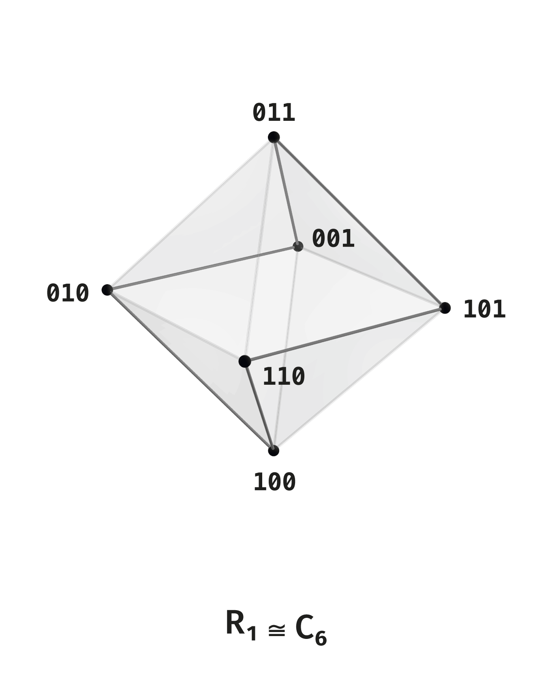
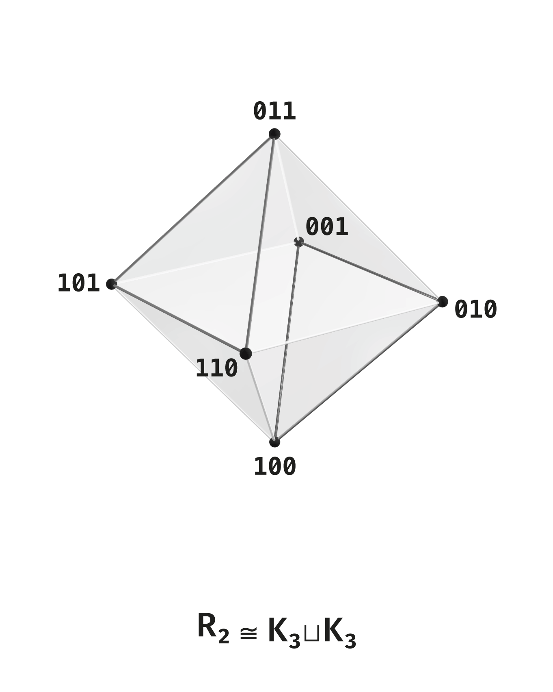
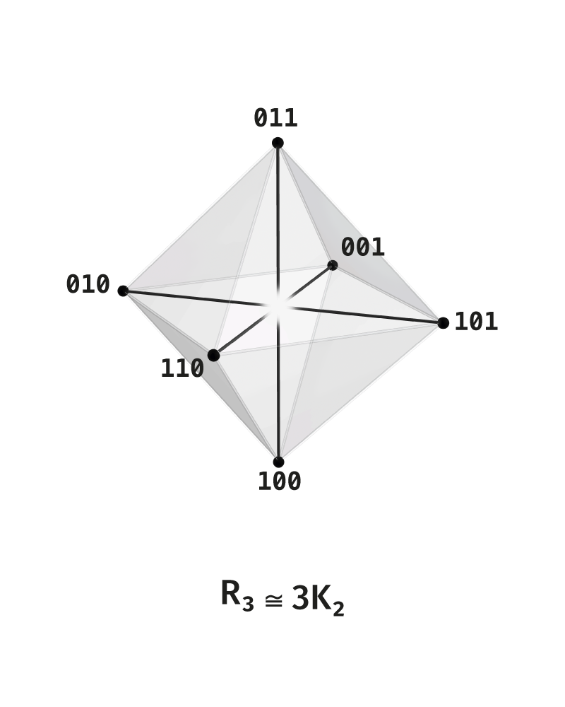

# Observer as a Structure of Distinction on a Finite Carrier

## 1. Where the Question Came From

I have long been interested in AI, mathematics, and physics — mostly at a popular-science level, but with a steady wish to understand what ideas stand behind the formulas. In parallel there was an older interest in meditation, Eastern philosophy, and especially Advaita. So one of the main themes that always kept returning was the observer. In the "popular" interpretation of quantum mechanics there is a persistent image of consciousness that "observes" a particle and thereby changes reality. But in physics, observation in the strict sense means registration of an interaction: it is enough that a system enters an interaction and leaves a distinguishable result.

This led to the first idea: if observation can be understood without an initial conscious subject, perhaps the observer should also be sought deeper than the subject — as a structure in which distinction becomes stable.

Then came the thought of threefoldness. Many basic structures in different domains have a threefold form: three dimensions of space, three color charges of quarks, three quarks in a nucleon, stable triadic schemes in philosophy and religion. Each example by itself proves nothing, but three elements often form a closed whole.

Thinking about what is needed for a process of distinction to persist, I arrived at three short conditions. Distinction must not collapse into complete coincidence, otherwise distance itself disappears. It must not be traceless, otherwise one cannot even say that distinction occurred. And it must not depend on something external, otherwise it has no ground of its own.

Somewhere here the Theory of Observable Distinction began.

This article is an introductory route into the earlier DOT formulation. The current Russian TNR corpus is located in [00_Core](../00_Core); the earlier English DOT documents are preserved in the external repository backup as historical sources.


## 2. From Idea to Theory

The usual intuition places the observer at the beginning: first there is someone who distinguishes, and only then there is what is distinguished.

DOT tries to reverse the order: distinction becomes primary. Then the observer is understood as an invariant arising where distinction is held, leaves a trace, and can be recovered when the description changes.

In this setting, the observer is understood as a structure in which distinction:

1. does not collapse into identity;
2. does not disappear without a trace;
3. does not require an external ground.

In minimal form this can be written as:

> observation = interaction + stable distinction + trace.

An attempt to begin from positive notions — object, subject, process, state, system — immediately runs into the fact that these notions already presuppose distinction. An object already requires a boundary. A subject already requires a distinction between self and not-self. A process already requires trace and time. A system already requires internal connectedness.

The search returned to the initial idea — to limiting conditions. If distinction is primary, the first question is not "what is an observer?", but "under what conditions does distinction break down?". This is how the negative form of the beginning of DOT was formed: prohibitions come first, and positive objects appear after them.

## 3. Negative-first. Three Primary Prohibitions as a Borromean Link

This is how the negative form of the beginning arose. Instead of immediately defining an object, a subject, or a system, one first considers three cases in which distinction breaks down: coincidence of the distinguisher and the distinguished, absence of trace, and dependence on an external measure.

These three cases are linked in a Borromean way. Borromean linkage shows a special type of wholeness: three elements form one whole even though there are no stable pairwise links between them. In knot theory this is the standard example of a link where the whole is linked while no pair is linked by itself. In three-body physics, a similar principle appears in Efimov states: the triple is bound, not the separate pairs. In DOT this form of linkage is transferred to the conditions of distinction: each prohibition closes one way of breakdown, and removing any one of them destroys the whole construction.

**P^D — prohibition of coincidence.**

> A position of distinction in which the distinguisher and the distinguished coincide is impossible.

The sense of the prohibition is that one cannot simultaneously assert distinction and occupy a position where difference is absent. If the logical distance between the distinguisher and the distinguished is zero, the direction of distinction disappears: one cannot indicate from where and toward what the act is directed. Distinction becomes indistinguishable from its absence. Therefore `P^D` prohibits the reduction of distinction to nominal designation without real difference.

**P^F — prohibition of tracelessness.**

> A position of distinction in which the act of distinction leaves no distinguishable trace is impossible.

This prohibition fixes the need for a minimal structural remainder: distinction must be distinguishable as having occurred. If distinction leaves no trace, it cannot be recognized, held, repeated, or included in a structure; such an act is equivalent to the absence of distinction. Therefore `P^F` prohibits the reduction of distinction to an act without distinguishability.

**P^C — prohibition of external closure.**

> A position of distinction in which distinction requires an external measure, external center, or external completion is impossible.

This prohibition fixes the internal autonomy of distinction. External measures, rules, and observers may appear later, but the ground of primary distinction must be held inside the position of distinction itself. If distinction is considered to have occurred only thanks to an external criterion, its ground has been moved outside. Then a regress appears: observer for observer, measure for measure, ground for ground. Therefore `P^C` prohibits the reduction of distinction to an external rule, external scale, or transcendent center.

Removing any prohibition gives collapse:

```text
removal of P^D -> distinguisher = distinguished -> identity
removal of P^F -> distinction without trace -> invisibility
removal of P^C -> external ground -> regress
```

## 4. Resolutions

A prohibition cuts off a position of collapse. A resolution gives a form of distinction that withstands all three constraints.

> a resolution is a form of distinction that survives under invariant prohibitions.

In the shortest notation:

$$
\begin{aligned}
R &\equiv (P^a \circ P^a\ ;\ P^\ell).
\end{aligned}
$$

Here two prohibitions are in active status and form the regime, while the third is in limiting status and holds the boundary.

The three basic resolutions:

$$
\begin{aligned}
R^D &\equiv (P^F_a \circ P^C_a\ ;\ P^D_\ell),\\
R^F &\equiv (P^D_a \circ P^C_a\ ;\ P^F_\ell),\\
R^C &\equiv (P^D_a \circ P^F_a\ ;\ P^C_\ell).
\end{aligned}
$$

In the first case a regime of distance arises: trace and internal autonomy are active, while the prohibition of coincidence holds the boundary.

In the second case a regime of fixation arises: distance and internal autonomy are active, while the prohibition of tracelessness holds the boundary.

In the third case a regime of connectedness arises: distance and trace are active, while the prohibition of external closure holds the boundary.

Intuitively:

```text
P^D prohibits collapse          -> distance is held
P^F prohibits tracelessness     -> trace is held
P^C prohibits external ground   -> internal autonomy is held
```

Thus the prohibitions become not only negative conditions, but also sources of positive regimes.

## 5. Boundary as the Third Participant

The simplest principle of difference appears binary. There is "this" and "not this". There is zero and one. There is plus and minus. At first glance distinction requires only two sides.

But even in such a picture a third participant is already present — the boundary. It separates white from black and at the same time makes them sides of one distinction. Without a boundary, two regions do not form one distinguished scene; without two sides, the boundary loses its sense.

In Spencer-Brown, the initial gesture is to draw a distinction. In it there are already a marked side, an unmarked side, and the mark as a sign-boundary. But then this triple is folded into the calculus of the mark: repetition, nesting, crossing the boundary. DOT uses a close initial intuition, but shifts the emphasis from drawing a distinction to holding it: where the distinction is given, by what it is connected, how it is read, and what can be recovered after the reading.

In DOT, the earliest form of distinction turns out to be an equally threefold structure: one side, another side, and a mediator between them.

The sides can be read as discrete: white and black, zero and one, plus and minus. The boundary is extended: it is the line where one side passes into the other. In a simple image with two regions and a shared boundary, one already sees that distinction joins the discrete and the extended. In DOT they are not chosen instead of one another, but alternate as different roles in one structure of distinction.

In the terms of the theory itself, the first formal object arises from here — the polar invariant. We take two sides as a pair of opposites and ask what is held in them as one.

## 6. Polar Invariant

The minimal form of distinction in DOT is two polarities held as manifestations of one invariant. In one reading they are distinguishable as different sides; in another they are gathered into one.

If the polar pair is denoted by $P=\{a,-a\}$, then the minimal reading of this pair sends both of its sides to one common invariant:

$$
\begin{aligned}
\pi &: P \to I,\\
\pi(a) &= \pi(-a) = I.
\end{aligned}
$$

Here $I$ is what both polarities manifest as different sides of one. Inside $P$ the sides are distinguishable. In the reading $\pi$ they are held as one.

Recoverability means that after reading $I$ one can return the polar layer $\{a,-a\}$. The knowledge that the invariant is manifested precisely through two opposites is not lost when passing to the invariant reading.

The first distinction in DOT contains two levels: polarity and invariant. They are connected by a reading that glues the opposites into one, and by recovery that returns the layer of polarities as data.

Without reading, there would be only a pair. Without recovery, there would be only gluing, and the pair would disappear. The polar invariant is the minimal form in which the pair and its holding coexist as structurally different layers.

The polar invariant gives the minimal cell of distinction. The next step is to understand how several such distinctions are held together. For this, DOT introduces rank: a finite carrier on which several binary distinctions receive a common form.

## 7. Rank as a Form of Growth

The polar invariant describes one act of distinction. Real systems — physical, cognitive, computational — contain many distinctions at once, and these distinctions are connected with one another. The structure that holds their complexity is called rank in DOT.

Rank is a measure of the complexity of distinction, expressed by the number of independent binary coordinates that the system holds simultaneously.

The carrier of rank $n$ is written as the set of all possible configurations of $n$ binary coordinates:

$$
\begin{aligned}
Q_n &= \{0,1\}^n.
\end{aligned}
$$

Each coordinate by itself is one minimal distinction, the same polar pair.

The law of rank growth is written as adding a new binary digit to the old carrier:

$$
\begin{aligned}
\Lambda_n &: \{0,1\}\times Q_n \to Q_{n+1},\\
\Lambda_n(\varepsilon,x) &= \varepsilon\,|\,x.
\end{aligned}
$$

Each old state $x\in Q_n$ receives two new positions in $Q_{n+1}$: one with prefix zero, the other with prefix one. The old space is doubled, and in each copy the previous structure remains, but now relative to the new distinction.

Already constructed distinctions receive a new place inside a wider carrier. The point that at rank $3$ was full saturation $111$, after lifting to rank $4$ becomes one of the points of weight $3$: $0111$. Full saturation now belongs to another point, $1111$. One and the same bit pattern receives a new structural role.

Here, as in the case of the polar invariant, the alternation of the discrete and the extended appears. Each rank by itself is discrete: a finite set of states with a finite set of relations. But the ladder of ranks is a process of growth in which, at every step, the discrete is extended by adding a new coordinate.

## 8. Puncture of the Carrier

The carrier $Q_n$ by itself is only an enumeration of possible states. Before passing to connections between them, one must decide which states participate in the active scene of distinction.

At any rank $n$, among all states of $Q_n$ there are two special ones: $0^n$, where no coordinate is active, and $1^n$, where all are active. The first is the state of complete absence of distinctions. The second is the state of full saturation of all coordinates at once.

Both states are limiting. In $0^n$ there is nothing by which to distinguish: nothing is expressed. In $1^n$ everything is expressed at once, and no coordinate can play the role of distinguishing. These two states exist in the full carrier, but are removed from the active scene.

> In the color intuition the same move looks almost obvious. Basic color models contain black and white poles: they set the limits of brightness, but do not themselves give saturated chromatic distinction. Chromatic states are located between them, and color transformations occur inside the region bounded by the achromatic transition from black to white. Therefore active chromatics begins not in the poles themselves, but between them.

The active admissible scene of rank $n$:

$$
\begin{aligned}
X_{\mathrm{adm}}^{(n)} &= Q_n\setminus\{0^n,1^n\}.
\end{aligned}
$$

Puncture moves the poles into boundary status. The full carrier $Q_n$ remains as the containing space; the poles remain in it as limiting states toward which the active scene can tend, but it does not include them in its own grammar.

At rank $1$ the full carrier has two points, and both are poles. After puncture the active scene is empty. At rank $2$ after puncture two points remain, forming one complementary pair. At rank $3$ a qualitative shift occurs: the full carrier has eight points, and after puncture six remain.

Six is the first structure in which three levels of closure exist simultaneously: pair, cycle, and three-axis wholeness. The central figure of DOT appears precisely here.

## 9. Octahedron as the First Complete Figure

For the six points

$$
\begin{aligned}
X_{\mathrm{adm}} &= Q_3\setminus\{000,111\}
\end{aligned}
$$

the Hamming relations give three different graph readings at once.

The relation $R_1$ connects states that differ in exactly one bit. On six points this gives a cycle:

$$
\begin{aligned}
100 \to 110 \to 010 \to 011 \to 001 \to 101 \to 100.
\end{aligned}
$$

<p align="center">
  
</p>

The first cycle of the theory appears precisely here: there is no cycle on two points, and after puncture there is no cycle on four points either. Only on six points do one-step transitions first close into a finite law of return.

The relation $R_2$ connects states that differ in two bits. The six points split into two triples: states of weight one $\{100,010,001\}$ and states of weight two $\{011,101,110\}$. Inside each triple all points are pairwise connected; between the triples there are no connections of this type. The result is $K_3\sqcup K_3$.

<p align="center">
  
</p>

The relation $R_3$ connects states that differ in all three bits. Each point is connected with its full complement. This gives three complementary pairs:

$$
\begin{aligned}
\{100,011\},\qquad \{010,101\},\qquad \{001,110\}.
\end{aligned}
$$

In graph notation this is $3K_2$.

<p align="center">
  
</p>

The first two relations can be united. The graph $R_1\cup R_2$ connects all pairs except complementary pairs. Structurally this is the complete tripartite graph:

$$
\begin{aligned}
(X_{\mathrm{adm}},R_1\cup R_2) &\cong K_{2,2,2}.
\end{aligned}
$$

The resulting graph is the one-dimensional skeleton of the octahedron. The six points of the active scene of rank $3$, equipped with the union of $R_1$ and $R_2$, form the vertices of the octahedron.

<p align="center">
  
</p>

At this level the cube $Q_3$, after puncture, gives a six-point scene; the same scene gathers into an octahedron; the eight chambers of the octahedron — the eight ways of choosing one point from each complementary pair — again form a copy of the full cube $Q_3$, now as a chamber layer.

The cube after puncture produces the octahedron; the chambers of the octahedron return the cube. Rank $3$ closes back on itself for the first time as a geometric structure.

## 10. Mobius Strip and Closed Transport

The cycle $C_6$, which appears at rank $3$, opens the structure of closed transport. Before the cycle appears, the question of transport has no sense: there is nowhere to transport. Now it becomes strict.

Assign a $\mathbb{Z}_2$-connection on the cycle: each edge receives a sign, plus or minus, fixing how polarity changes during the transition. The product of signs around the whole cycle is the monodromy of the circuit.

If the monodromy is positive, transport is trivial: after a full circuit we return to the initial polarity. If the monodromy is negative, after a full circuit the polarity is flipped. Locally we always see two sides, plus and minus. Globally the closed circuit returns us to the opposite side.

This gives the Mobius strip in strict form: locally a binary structure, globally one body with nontrivial gluing.

At the level of DOT this is an associated bundle over a nontrivial $\mathbb{Z}_2$-connected cycle. The local fiber is the polar pair $K_2=\{+,-\}$. The carrier of transport is the cycle $C_6$. Monodromy after a full circuit acts as a flip of polarities.

In the Mobius strip the discrete and the extended enter one construction. The discrete is given as local polarity. The extended is given as the closed carrier of transport. A distinction that locally seems purely binary becomes, when transport is included, one body with nontrivial topology.

## 11. Multiprojectivity

In mathematics, one and the same structure is often revealed through different representations. A geometric figure can be given by coordinates, a graph of connections, a matrix, a symmetry group, a coloring, an algorithm of construction, or a set of invariants. Usually these are different languages for an already given object.

In DOT this move enters the construction itself. The stability of distinction is connected not with one "correct" description, but with the ability of one carrier to withstand several coordinated readings. Each reading holds its own aspect of distinction and has its own loss.

The six-point scene of rank $3$ gives a compact example. One and the same carrier is read as a color body, as arithmetic of divisors, as topological transport, and as a bridge to the root system $A_2$. These readings remain different and converge on one finite structure.

### 11.1. Color Projection

The color reading places the six vertices of the active scene in the $RGB$ cube as saturated chromatic vertices. The total poles $000$ and $111$ become black and white: the limits of brightness between which the chromatic body unfolds.

<p align="center">
  
</p>

The full version of this projection is developed in the [RGB / CMY / Kuhn / HSV color bridge](../02_Bridges/01_Color_RGB_Kuhn/DOT_RGB_Kuhn_Color_Bridge_EN.md).

The triple of weight-one states corresponds to primary colors $R,G,B$. The triple of weight-two states corresponds to secondary colors $C,M,Y$. The cycle $R_1$ becomes the hue cycle:

```text
red -> yellow -> green -> cyan -> blue -> magenta -> red
```

The relation $R_2$ gives the $RGB/CMY$ split. The relation $R_3$ gives complementary pairs: red/cyan, green/magenta, blue/yellow.

The color reading has two aspects. The first is colors on vertices: each vertex corresponds to one saturated color. The second is colors on the chambers of the octahedron: the eight chambers correspond to eight regions of the color cube. In ordinary presentations the color wheel is often introduced almost informally; here it appears as a reading of the six-point scene.

### 11.2. Arithmetic Projection

The arithmetic reading begins with divisors.

The strict divisor branch of this construction was developed in the earlier AMR materials. In the current repository AMR is preserved as a future arithmetic branch outside the main Volumes 0–6.

If a natural number $N$ is decomposed into a product of distinct prime factors, then each of its divisors corresponds to the choice of some subset of primes. For square-free $N$ with $n$ prime factors, the divisor lattice is Boolean:

$$
\begin{aligned}
D(N) &\cong Q_n.
\end{aligned}
$$

At rank $3$ the minimal example is:

$$
\begin{aligned}
30 &= 2\cdot3\cdot5.
\end{aligned}
$$

Proper divisors:

$$
\begin{aligned}
D^\circ(30) &= \{2,3,5,6,10,15\}.
\end{aligned}
$$

Single primes $\{2,3,5\}$ correspond to states of weight one. Double products $\{6,10,15\}$ correspond to states of weight two. Complement pairs:

$$
\begin{aligned}
2 &\leftrightarrow 15 = 3\cdot5,\\
3 &\leftrightarrow 10 = 2\cdot5,\\
5 &\leftrightarrow 6 = 2\cdot3.
\end{aligned}
$$

In this notation the principle is:

```text
one prime coordinate is manifested;
the other two hold it as the complementary divisor.
```

That is, the axes of the octahedron can be read as:

$$
\begin{aligned}
(2,3\cdot5) &\to \pm e_1,\\
(3,2\cdot5) &\to \pm e_2,\\
(5,2\cdot3) &\to \pm e_3.
\end{aligned}
$$

This notation echoes the triple of prohibitions and resolutions. In the resolutions, two prohibitions are active while the third holds the limit. In the divisor notation one sees a similar permutation of roles: one prime factor is selected as a coordinate, while the product of the other two gives its complementary side. Thus an axis $(p_i,\prod_{j\ne i}p_j)$ can be read as an arithmetic form of three-part holding.

The ordinary divisor lattice by itself gives the divisibility order. The octahedral graph arises under another reading: all distinct vertices are connected except the pairs $d\leftrightarrow30/d$. Then one obtains $K_{2,2,2}$.

<p align="center">
  
</p>

At rank $4$ the same law continues, but no longer on the whole proper carrier. For

$$
\begin{aligned}
210 &= 2\cdot3\cdot5\cdot7
\end{aligned}
$$

the full divisor carrier is isomorphic to $Q_4$, while the proper carrier $D^\circ(210)$ has $14$ vertices:

$$
\begin{aligned}
D^\circ(210) &\cong Q_4\setminus\{0000,1111\}.
\end{aligned}
$$

The proper carrier of rank four is wider than the next cross-polytope figure. The figure itself arises on the outer layer:

$$
\begin{aligned}
V_4 &= S_1^{(4)}\sqcup S_3^{(4)}.
\end{aligned}
$$

In arithmetic notation:

$$
\begin{aligned}
V_4 &= \{2,3,5,7,105,70,42,30\}.
\end{aligned}
$$

And again each axis has the form "one is manifested, the others hold":

$$
\begin{aligned}
2 &\mid 3\cdot5\cdot7 = 105,\\
3 &\mid 2\cdot5\cdot7 = 70,\\
5 &\mid 2\cdot3\cdot7 = 42,\\
7 &\mid 2\cdot3\cdot5 = 30.
\end{aligned}
$$

These four pairs give $K_{2,2,2,2}$, the graph of the four-dimensional cross-polytope, or $16$-cell. The name $16$-cell refers to cells; it has eight vertices.

This is where it becomes clear why rank three is special:

$$
\begin{aligned}
U_3 &= V_3,
\end{aligned}
$$

but for $n\geq4$:

$$
\begin{aligned}
V_n &\subset U_n.
\end{aligned}
$$

At rank three the whole proper carrier already is the outer octahedral layer. At rank four and above the outer cross-polytope layer becomes only part of a wider punctured carrier.

### 11.3. Topological Projection

The topological reading returns the Borromean motive not as an initial intuition, but as a structure of axes.

This line is developed in the [Hopf / Borromean bridge](../02_Bridges/04_Hopf_Borromean/DOT_Principles_Hopf_2x3_Full_2026-04-24_EN.md).

The three complementary pairs of the six-point scene become three axial blocks. Each block can be read as a pair of circles with Hopf linking. The three blocks together form a Borromean triad: no pair gives the whole, but the whole triple holds the structure.

The half-return of transport, which in the previous section gave the Mobius strip, here becomes the monodromy holding the axial triple.

The strict topological layer adds embedding space, curves, and invariants. The finite scene gives its initial data: three pairs, a cycle, half-return, and axial connectedness.

### 11.4. Lie-Algebraic Bridge

The six-point carrier of rank three also has a bridge to the root system of type $A_2$. The two triples of the relation $R_2$ are read as weight diagrams of the fundamental and dual representations $\mathbf{3}$ and $\overline{\mathbf{3}}$ of the algebra $\mathfrak{sl}_3(\mathbb{C})$. The complement $R_3$ gives their involutive exchange.

The full version is given in the [$A_2/\mathfrak{sl}_3/\mathfrak{su}(3)$ bridge](../02_Bridges/03_A2_sl3_su3/DOT_Six_State_A2_sl3_su3_EN.md). In physical language, the same $\mathfrak{su}(3)$ symmetry stands behind quark color; in DOT it enters as a bridge reading of the six-point carrier, not as an initial physical hypothesis.

To pass to the root system one chooses a linear realization of one triangle in the Euclidean plane. Because of this, the Lie-algebraic layer has the status of a bridge. After such a choice, the finite combinatorics of the six-point scene coincides with root data of type $A_2$.

Multiprojectivity depends on this discipline of boundaries. The color projection places the carrier in a continuous color body. The arithmetic projection uses the order of primes. The topological projection adds an embedding space. The Lie-algebraic bridge introduces a linear realization. In all cases one and the same six-point grammar returns: pairs, cycle, two triples, three axes, and octahedral shell.

Color, arithmetic, topology, and Lie algebra remain different languages. What becomes common is the finite node on which they are compared without dissolving into one another: one small carrier withstands several independent ways of reading.

## 12. Observer as Recoverable Distinction

Distinction begins as polarity, but becomes observation only when polarity is held, leaves a trace, and is recoverable when the reading changes.

DOT studies the minimal conditions of such stability. Binarity gives poles. Threefoldness gives their holding. Ranks give growth of the carrier. Projections fix the preservation of one invariant when the language of description changes.

In this architecture the observer arises as a structure of recoverable distinction.

When we say that a system "observes" something, we usually mean one of four things: it has a carrier on which distinctions are fixed; it has relations between distinctions; it has a reading that sends the structure to another form; and it has recoverability, that is, memory of what exactly was distinguished.

All four roles are gathered in one record:

$$
\begin{aligned}
\Pi &= (X,R,q,\mathrm{rec}).
\end{aligned}
$$

Here $X$ is the carrier, $R$ is the relation, $q$ is the reading, and $\mathrm{rec}$ is the recoverable part after reading. Observerhood is given by the completeness of these four roles. A system becomes observational when distinction in it arises, is held on a carrier, is connected by relations, is read, and remains recoverable.

This architecture can then unfold in different directions: color, arithmetic of divisors, topology, spectrum, Lie algebras, neural-network representations. But all these branches descend from one common place: the moment when distinction ceased to be an instantaneous act and became a recoverable structure.

## 13. Where to Read Next

The main entry of the current repository is the [Russian TNR corpus, Volumes 0–6](../00_Core). It builds the finite core from the polar pair and active boundary to the six-point octahedral scene, then to higher ranks, boundary operators, the operator tower, Fano-tetrahedral reading, and cyclic-topological avatars.

The [00_Core](../00_Core) folder contains the current main corpus. Volume 0 gives the beginning of the theory, Volume 1 unfolds the strict rank-3 core, and Volume 2 develops higher ranks and projective architecture.

AMR is preserved as a future arithmetic branch. Its earlier materials remain in the backup of the old corpus; the current bridge map is given in [02_Bridges](../02_Bridges).

The [Bridge Notes](../02_Bridges) folder gathers external readings of the already constructed core: the color cube and chambers, binary growth, the bridge to $A_2/\mathfrak{sl}_3/\mathfrak{su}(3)$, the Hopf/Borromean layer, and the cryptographic spectral block. The [Appendix](../03_Appendix/DOT_Appendix_AF_Atlas_And_Glossary_EN.md) serves as an atlas of objects, notation, and figures.
