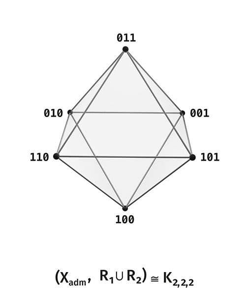
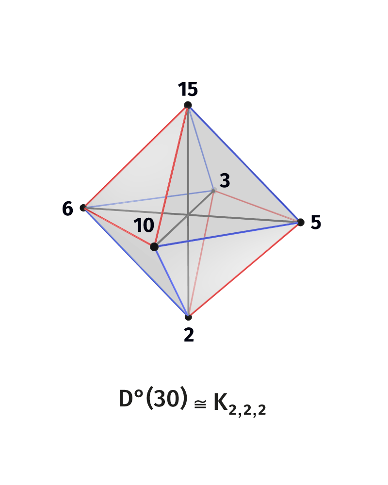

# DOT: Distinction Observable Theory

[](LICENSE-THEORY.md)
[](LICENSE)
[](https://doi.org/10.5281/zenodo.20257220)

DOI: [10.5281/zenodo.20257220](https://doi.org/10.5281/zenodo.20257220)

**Distinction Observable Theory (DOT)** studies one question: what is the
minimal structure of stable distinction on a finite carrier. "To
distinguish" here means to draw a boundary between states; the question is
**relative to what** that boundary holds stably.

This is strict finite combinatorics. The carrier is the finite Boolean
cubes \(\mathbb F_2^{\,n}\); the relating operation is the bitwise
complement \(\kappa\); everything else (relations, cycles, projective
quotients) consists of graphs and finite structures on them that can be
computed and checked by code (see [Verification](#verification)). The
loaded words — "distinction" and especially "observer" — are given a
narrow structural definition below, in terms of the carrier and operations
on it.

## What this theory is

DOT is a fundamental structural theory of one invariant, with a generative
method and a unifying reach. The three pillars of this characterization:

**One invariant.** The subject of the theory is that relative to which
distinction is stable, taken in its minimal form (in the theory this is
the **observer** — the invariant of the relating operation). From it
unfold the carrier, its relations, and the entire scene of distinction.

**Generative method.** The theory is built from the bottom up: a primitive
is posited — the self-relation \(\iota^2=\operatorname{id}\) — and the
structure is derived as **forced** by it, unique under the condition of
neutrality (see the [Method](#method-generation-from-the-primitive)
section).

**Unifying reach.** One and the same finite object — the rank-\(n\) scene
— appears in Boolean logic (negation is the complement \(\kappa\)), in
graph theory (the cycle \(C_6\), the octahedron, the Petersen, Kneser, and
Johnson graphs), in finite projective geometry (\(PG(n-2,2)\), the Fano
plane), in representation theory
(\(\mathfrak{sl}_2,\mathfrak{sl}_3,A_2\)), and in divisor lattices (the
number \(30\), squarefree numbers). DOT makes this common skeleton an
explicit subject and presents these areas as different **readings of one
object**.

The status of the statements is marked explicitly: a rigorous, provable
core (Volumes 0–4, 7) and bridge readings tagged "realization / bridge /
horizon" (Volumes 6, 8, 9). The provable part is accompanied by
verification code (see [Verification](#verification)).

## Three terms

We separate the three principal terms of the theory from their extraneous
meanings.

**Distinction** — the drawing of a boundary between states of the carrier:
the indication that one state does not coincide with another, together
with the structure that makes this non-coincidence stable. It is a
structural relation on the carrier: it is about a relation between states
and about what holds them distinguished.

**Invariant** of an operation — that which the operation does not move: a
fixed point \(x=g(x)\) or a substructure carried into itself. A standard
notion.

**Observer** — the invariant of the operation that relates the
distinguished states, and nothing beyond that. Geometrically it is the
center of the carrier — the point relative to which the states are
symmetric. The closest analogies are a frame of reference, a standard, an
invariant: that relative to which a description stays consistent.

## A minimal example: rank 3

The smallest substantive case of the theory is visible in full.

Take \(\mathbb F_2^3\) — eight three-bit states. Two of them are
homogeneous (\(000\) and \(111\)) — these are the **limits**; remove them.
Six states remain — the **active scene** \(U_3\). The complement
\(\kappa(x)=x+111\) flips all bits and splits the six into three **pairs
of opposites**: \(\{001,110\},\{010,101\},\{100,011\}\).

The distance between states (the number of differing bits) gives exactly
three relations, each a well-known graph:

- \(R_1\) (difference in one bit) — the hexagonal cycle \(C_6\);
- \(R_2\) (in two) — two triangles \(K_3\sqcup K_3\);
- \(R_3\) (in all three) — three pairs \(3K_2\), the very axes of
  opposition.

Together \(R_1\cup R_2\) give the **octahedron** \(K_{2,2,2}\): six
vertices, three axes through the center. The **observer** here is the
center of the octahedron: a point outside the six vertices, relative to
which all three axes are symmetric.

<p align="center">
  <a href="assets/figures/4.1-R_12-octahedron.png">
    
  </a>
</p>

The same scene arises in arithmetic independently: the proper divisors of
the number \(30=2\cdot3\cdot5\) are \(\{2,3,5,6,10,15\}\) — the same six
points, and the complement \(d\mapsto 30/d\) — the same three axial pairs
(\(2\leftrightarrow15,\ 3\leftrightarrow10,\ 5\leftrightarrow6\)).

<p align="center">
  <a href="assets/figures/365.png">
    
  </a>
</p>

Rank 3 is the place where distinction first holds in three irreducible
ways at once (opposition, triadic partition, cycle) while remaining one
connected shell. It is the starting point of the whole corpus.

## Carrier and growth

The full carrier of rank \(n\) is the cube \(\mathbb F_2^{\,n}\) of
\(2^n\) states. The two homogeneous states \(0^n,1^n\) are the limits;
their removal gives the **active scene**

\[
U_n=\mathbb F_2^{\,n}\setminus\{0^n,1^n\},\qquad |U_n|=2^n-2.
\]

The rank grows by the **lift** — the addition of one binary coordinate,
\(n\to n+1\). Under it, the content of one rank becomes the axes of the
next:

\[
\boxed{\,Q_n^{*}\cong U_{n+1}/\kappa\,}
\]

— the distinguishable configurations of rank \(n\) are isomorphic to the
directions of distinction of rank \(n+1\). And the quotient of the active
scene by the complement, at every rank \(n\ge3\), is a projective space
over the binary field:

\[
U_n/\kappa\cong PG(n-2,2).
\]

Thus rank 3 gives the projective line, rank 4 the Fano plane, rank 5
\(PG(3,2)\), and so on. The ladder of ranks ties the separate scenes into
one ascending structure.

## Method: generation from the primitive

The distinctive feature of DOT is the direction in which it is built.
Where the analytic course takes a ready object and extracts an invariant
from it, DOT proceeds **generatively**: a primitive is posited — the
self-relation \(\iota^2=\operatorname{id}\) — and from it unfold the
carrier, the complement, the observer, and the entire scene. The guiding
question is "what structure is **forced** by this primitive."

The rigor of this course rests on a single condition — **forcedness**:
what is generated must be the unique structure the primitive admits under
the requirement of neutrality (a symmetry singling out no coordinate).
Then generation becomes knowledge of necessity. This condition is
introduced rigorously in Volume 0 (§0.5 — the direction; §2.5 — the
uniqueness theorem: neutrality forces the complement \(\kappa\)
uniquely). By the same move DOT joins the long tradition of "generation
plus closure" — induction, universal properties, type theory, the Lie
classification.

## The corpus: ten volumes

The main text is ten volumes in the [`00_Core`](00_Core) folder, read in
order: from the source to the arithmetic realization.

### Volume 0. The First Beginning

[Open volume](00_Core/DOT_Volume_0_Pervonachalo_EN.md)

Entry into the theory. The self-relation \(\iota^2=\operatorname{id}\),
from which the carrier is recovered as an orbit; the complement
\(\kappa(x)=x+1^n\); the observer as its invariant-center
\(c=\tfrac12(0^n+1^n)\); the poles and the active scene; the lift as the
single operation of growth; the threshold of threeness on the boundary of
ranks \(1\to2\to3\).

### Volume 1. Rank 3: the home of threeness

[Open volume](00_Core/DOT_Volume_1_Rang_3_EN.md)

The first complete scene in strict form: six states \(U_3\), three
Borromean directions, the relational anatomy
\(R_1\cong C_6,\ R_2\cong K_3\sqcup K_3,\ R_3\cong 3K_2\), the octahedron
\(K_{2,2,2}\), the observer-center, and the cycle operator
(\(T^6=\operatorname{id},\ T^3=\kappa\)). Projective reading
\(U_3/\kappa\cong PG(1,2)\).

### Volume 2. The break 2×2=4

[Open volume](00_Core/DOT_Volume_2_Razryv_4_EN.md)

The first break at rank \(4\): an interior layer appears, the scene splits
into skin and core, the Fano plane \(U_4/\kappa\cong PG(2,2)\). The step
to rank 5 gives the Petersen graph \(KG(5,2)\) and the Johnson graph
\(J(5,2)\) on the middle layer, \(PG(3,2)\), the Fermat ladder
\(3,5,9,17,33\), and the spectral reading via Walsh–Hadamard characters.

### Volume 3. Verticality

[Open volume](00_Core/DOT_Volume_3_Vertikal_EN.md)

The boundary \(\partial\) and coboundary \(\delta\) with the laws
\(\partial^2=\delta^2=0\), the cone as the link between the boundaries of
neighboring ranks, the ladder as a tower of chain complexes, the adjoint
pair \(\Lambda\dashv\pi\); reductions are recognized as the descent of the
scene.

### Volume 4. The Helicoid

[Open volume](00_Core/DOT_Volume_4_Gelikoid_EN.md)

The addition of two movements into one. The rotation of the scene under
the lift becomes the Singer cycle \(PG(n-2,2)\) of order \(2^{n-1}-1\);
rotation along the axes plus ascent between ranks is a screw with an
incommensurable step (\(\gcd(2^{n-1}-1,2^n-1)=1\)).

### Volume 5. The Observer as a Through-Thread

[Open volume](00_Core/DOT_Volume_5_Nablyudatel_EN.md)

The three guises of the observer — the intersection of the invariants of
the directions, the absent center-entrance, the common invariant of the
operator grammar — are reduced to one point, fixed under the relating
\(\kappa\), the rotation \(T\), and the vertical \(\partial\). The
observer is the axis of the helicoid.

### Volume 6. External Readings as Projections

[Open volume](00_Core/DOT_Volume_6_Chteniya_EN.md)

The external readings of the scene are gathered into an atlas: logical,
color, spectral, semantic, arithmetic. A reading is introduced strictly as
a structure-preserving projection; the transitions between readings
commute with the carrying skeleton. The scene is primary — the readings
are its projections.

### Volume 7. The Structure of the Observer

[Open volume](00_Core/DOT_Volume_7_Struktura_Nablyudatelya_EN.md)

The observer turns from a point into a structure. The vertical is an
\(\mathfrak{sl}_2\) representation (boundary, coboundary, grading \(H\)),
the complement is the Weyl involution, the observer is the zero weight. By
the same law the operator tower unfolds: \(\mathcal B_m\cong Q_{2^m}\),
the Klein four-group \(\langle C_{\text{out}},C_{\text{in}}\rangle\), the
affine subcarrier \(\operatorname{Aff}_3\cong Q_4\).

### Volume 8. Arithmetic Realization

[Open volume](00_Core/DOT_Volume_8_Arifmeticheskaya_Realizaciya_EN.md)

The abstract carrier is given a concrete instance — the divisor lattice. A
squarefree number realizes the cube \(D(p_1\cdots p_n)\cong Q_n\), the
complement is \(d\mapsto N/d\); the number \(30\) gives the rank-3 scene
verbatim. Multiplicity opens a second axis of growth, on which the center
becomes the vertex \(\sqrt N\) for perfect squares.

### Volume 9. Arithmetic Structure Behind the Cube

[Open volume](00_Core/DOT_Volume_9_Arifmeticheskaya_Struktura_EN.md)

The structure the abstract carrier does not carry: the multiplicative
monoid of divisors, the recovery discipline (exactness of a reading
\(\Leftrightarrow\) squarefreeness), the residue bridge to the residues
\(\mathbb Z/N\mathbb Z\) with fiber \(\varphi(N/d)\), and the horizontal
algebra \(\mathfrak{sl}_3\) alongside the observer's vertical
\(\mathfrak{sl}_2\).

## Bridges

The [`02_Bridges`](02_Bridges) folder shows how the built scene reads in
other languages. Each reading is an external projection of the
already-built scene into its own domain.

- **Color (RGB/CMY/HSV).** The active six of rank 3 are the six vertices
  of the color layer: three channels and three complements; the cycle is a
  traversal of hues, the pairs of opposites are the opponent axes, the
  center is the gray point.
- **\(A_2/\mathfrak{sl}_3/\mathfrak{su}(3)\).** The two triads of \(R_2\)
  read as the weight diagrams \(\mathbf 3\) and \(\overline{\mathbf 3}\);
  the complement \(R_3\) gives their involutive exchange.
- **Hopf/Borromean.** The three pairs of opposites are Hopf pairs, their
  joint holding is a Borromean link.
- **Cryptographic spectral block.** The spectral-graph reading of Boolean
  functions: balancedness, resiliency, correlation immunity through
  spectral sectors (a self-contained theorem package).
- **Boundary operator, Fano-tetrahedron, logic-operator reading, binary
  growth** — working lines that entered Volumes 2–5.
- **AMR arithmetic.** The divisor branch gives a strict arithmetic avatar
  \(Q_n,U_n\); the scale-residue branch is an external frontier
  diagnostic. Main formula:
  \(D(N_n)\setminus\{1\}\cong D^\circ(N_{n+1})/\kappa\).

Detailed map: [`02_Bridges/README.md`](02_Bridges/README.md).

## Appendices

The [`03_Appendix`](03_Appendix) folder holds research notes and reference
material in support of the corpus:

- [inter-rank lift of relations and operators](03_Appendix/DOT_Interrank_Lift_Relations_Operators_EN.md)
  — the law by which configurations of rank \(n\) become the axes of rank
  \(n+1\);
- [spectral antipodal grammar](03_Appendix/DOT_Spectral_Antipodal_Grammar_EN.md)
  — the spectral reading of the complement and its Walsh–Hadamard
  generalization.

Detailed map: [`03_Appendix/README.md`](03_Appendix/README.md).

## Articles

The [`04_Articles`](04_Articles) folder keeps self-contained texts and
publication versions of individual ideas — for separate reading alongside
the main corpus. Map: [`04_Articles/README.md`](04_Articles/README.md).

## Verification

The finite part of the theory is accompanied by verification scripts in
the [`01_Verification`](01_Verification) folder. They check graphs,
relations, cycles, spectra, shell laws, and individual bridge packages — a
regression check of computable statements.

```bash
python3 -m pip install -r requirements.txt   # dependencies (NumPy)

python3 01_Verification/DOT_Core_verifier.py
python3 01_Verification/DOT_AMR_verifier.py self-test
python3 01_Verification/DOT_AMR_verifier.py core-check
python3 01_Verification/DOT_AMR_verifier.py amr-check
python3 01_Verification/verify_six_state_a2_sl3_su3.py
python3 01_Verification/verify_cryptographic_spectral_block.py
```

Each check in `DOT_Core_verifier.py` carries a reference to a volume and
section (the `CORE_CHECK_CATALOG`, in the format `V<volume> §<section>`),
so that code and volumes cross-check directly — for example, the
uniqueness theorem (Volume 0 §2.5), the Petersen graph and \(PG(3,2)\) of
rank 5 (Volume 2 §8), the operator tower (Volume 7 §7). From the other
side, the corresponding chapters of the volumes carry a **Verification**
block pointing to the function.

Detailed map: [`01_Verification/README.md`](01_Verification/README.md).

## Repository structure

```text
00_Core/          the main corpus, Volumes 0–9
01_Verification/  verification scripts
02_Bridges/       external readings of the scene (color, algebra, topology, arithmetic)
03_Appendix/      reference notes and atlases
04_Articles/      articles and publication versions
assets/figures/   figures for the volumes and bridges
```

## Licenses

Texts, theory, figures, and documentation are under the
[CC BY-NC-SA 4.0](LICENSE-THEORY.md) license unless a specific file states
otherwise. Executable code is under the [Apache License 2.0](LICENSE).

---

© 2026 Igor M. Zhuk. Theory and documentation are distributed under the
licenses listed above.
