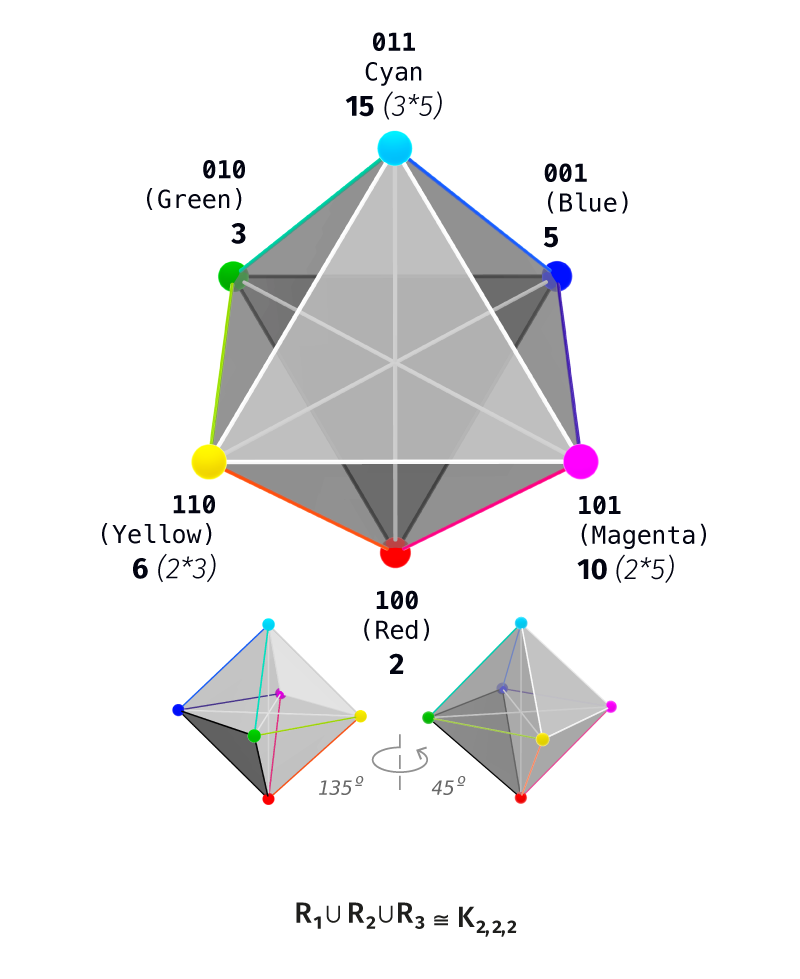

# ТНР: Теория Наблюдаемого Различения
 
[English version](../README.md)
 
[](../LICENSE-THEORY.md)
[](../LICENSE)
[](https://doi.org/10.5281/zenodo.20257220)

## О теории

Теория Наблюдаемого Различения представляет собой математически строгий концептуальный аппарат, ориентированный на исследование фундаментальной природы стабильных границ и различений. Аппарат дистанцируется от классических онтологических вопросов («что существует в мире?») и от традиционных эпистемологических проблем когнитивных наук («как агент воспринимает реальность?»). Вместо этого теория фокусируется на предельно сжатом, очищенном от эмпирического шума структурном вопросе: **«Как именно устроено стабильное различение?»**

Если в какой-либо среде, физической или концептуальной, проводится граница между двумя состояниями, и эта граница успешно удерживается, предотвращая коллапс системы в неразличимое единство, — ТНР исследует минимальную структурную конфигурацию, которая с математической неизбежностью порождается самим фактом этого удержания. Иными словами, теория изучает не то, что различается, а анатомию самого акта различения.

Традиционная академическая математика и теоретическая физика тяготеют к аналитическому подходу: задаётся некий объект — множество, топологическое пространство, алгебраическая группа, физическое поле, — из которого затем аналитически извлекаются инварианты, симметрии и законы сохранения. ТНР предлагает методологический сдвиг на генеративные позиции. Здесь исходным пунктом объект не является. Весь аппарат теории разворачивается из одного первичного примитива — акта, который возвращается к самому себе за один шаг:

```
ι² = id
```

(инволюция: тождественное преобразование при двукратном применении). Из этого сингулярного начала теория шаг за шагом, подчиняясь строгой внутренней логике, порождает вынужденные структуры. В этой парадигме объект — геометрическая фигура, алгебраический закон, числовая закономерность — становится не исходной данностью, а неизбежным математическим выходом генеративного процесса.

## Принцип вынужденности и статусы утверждений

Теория управляется жёстким методологическим принципом **вынужденности**. На каждом этапе развёртывания системы не допускается произвольного конструирования: каждый последующий шаг строго вынужден — при заданном требовании может возникнуть только одна, математически безальтернативная структура.

Это отражается в явных статусах утверждений, размечающих весь корпус по трём уровням:

- **Вынуждено `[●]`** — выводы, которые математически неизбежны: доказаны, подтверждены верификатором или являются классическими фактами.
- **Прочтение `[◐]`** — концептуальная линза, через которую известные математические объекты сворачиваются в единую связную фигуру; посылка каждого такого узнавания называется явно.
- **Открыто `[○]`** — зона нерешённых гипотез и открытых вопросов, где теория сталкивается с пределами своего текущего аппарата.

## Вторая сторона различения

Различать — значит проводить границу, указывать, что одно состояние не тождественно другому. В классической математике практически во всех фундаментальных операциях присутствуют две стороны. Первая — то, **что** различается: объекты, точки пространства, элементы множеств. Вторая — то, **относительно чего** проводится различение.

Классическая наука концентрирует внимание на первой стороне: данный объект классифицируют, измеряют, извлекают из него наблюдаемые величины. Вторая сторона почти всегда невидима, принимаясь за тривиальную данность. Однако любой класс эквивалентности существует ровно постольку, поскольку существует признак, остающийся неизменным вдоль этого класса; фактор-множество корректно определено только потому, что процедура склейки согласована с этим признаком. «То, относительно чего различают» есть **инвариант соотносящей операции** — структурный якорь согласованности. Классические дисциплины оставляют этот инвариант в тени; ТНР делает минимальную структуру этого якоря своим прямым и единственным предметом.

Этот инвариант теория называет **наблюдателем** — и употребляет слово строго в структурном смысле, без психологической нагрузки: наблюдатель есть центр симметрии, относительно которого состояния соотнесены, — отношение, а не элемент. Среди самих различаемых состояний его нет; ниже это видно буквально.

## От акта к пространству

Пространство в теории вырастает из самих различений. Одно различение имеет два исхода — «эта» сторона границы и «та». Добавление второго различения, независимого от первого, удваивает набор возможностей: четыре комбинации исходов — квадрат. Добавление третьего — восемь комбинаций — куб. Каждое независимое различение добавляет самостоятельную **ось**; **состояние** — одна комбинация исходов всех проведённых различений, вершина куба; совокупность всех состояний — **носитель** различения, булев куб `Q_n = 𝔽₂ⁿ` из `2ⁿ` вершин. Носитель вырастает из актов различения как их совокупный след. Число проведённых различений — число осей куба — называется **рангом**.

Соотносящая операция на носителе определена однозначно: единственное преобразование, которое соотносит каждую сторону с противоположной и сохраняет равноправие всех осей, — побитовое **дополнение** `κ(x) = x + 1ⁿ`, переворот всех исходов сразу. Два состояния при этом стоят особняком: `0ⁿ` и `1ⁿ` — точки, где взяты все различения либо ни одного; это **полюса**. Их изъятие оставляет состояния со смешанным содержанием — **активную сцену** `U_n`: собственно поле различения.

Рост заложен в самом предмете: различения добавляются — носитель растёт. Добавление одной оси, переход `Q_n → Q_{n+1}`, называется **лифтом**; последовательность носителей, связанных лифтами, образует **башню рангов**. У роста есть точный закон: конфигурации, различимые на ранге `n`, становятся осями сцены ранга `n+1` — содержание одного этажа превращается в направления следующего. Формально фактор активной сцены по дополнению есть проективное пространство над `𝔽₂`:

```
U_n / κ ≅ PG(n−2, 2)      [●]
```

— сцена ранга 3 даёт проективную прямую, ранга 4 — плоскость Фано, ранга 5 — `PG(3,2)`. Категорная форма этого закона (лифт как сопряжённая тройка функторов, наблюдатель как терминальный объект) доказана в документе 02.

В этих трёх абзацах — генеративный тезис теории в действии, и в этом их смысл. Из одного акта `ι² = id` последовательно определяются пространство (носитель), операция (дополнение), центр (наблюдатель) и рост (лифт) — без единого дополнительного постулата: каждый объект появился потому, что предыдущий не оставил ему альтернативы. А закон роста замыкает процесс на самого себя: различённое на одном этаже становится осями следующего — структура порождает собственные направления дальнейшего различения. Башня рангов и есть главный объект теории: самопорождающееся пространство различения, каждый этаж которого вынужден предыдущим.

## Минимальный пример: ранг 3

Самый маленький содержательный случай теории обозрим целиком — и он же показывает, зачем всё это.

Возьмём три различения: восемь состояний `𝔽₂³`. Полюса `000` и `111` изымаются; остаётся активная сцена `U₃` из шести состояний. Дополнение `κ(x) = x + 111` разбивает шестёрку на три пары противоположностей: `{001,110}, {010,101}, {100,011}`.

Расстояние между состояниями (число различающихся битов) даёт ровно три отношения, и каждое — известный граф: `R₁` (один бит) — шестиугольный цикл `C₆`; `R₂` (два бита) — два треугольника `K₃ ⊔ K₃`; `R₃` (все три) — три пары `3K₂`, оси противоположности. Вместе `R₁ ∪ R₂ ∪ R₃` дают **октаэдр** `K_{2,2,2}`: шесть вершин, три оси через общий центр.

<p align="center">
  <a href="assets/figures/555.png">
    
  </a>
</p>

Рисунок показывает одну и ту же сцену, прочитанную на трёх разных материалах.

**Биты.** Шесть трёхбитных состояний по кругу; рёбра шестиугольника — `R₁` (один шаг), диагонали через центр — `R₃ = κ`. Наблюдатель виден буквально: центр октаэдра — точка, относительно которой все три оси симметричны, — **среди шести вершин отсутствует**. Инвариант соотнесения существует, но состоянием не является.

**Числа.** Собственные делители числа `30 = 2·3·5` — `{2,3,5,6,10,15}` — те же шесть точек (на рисунке — числа при вершинах); дополнение `d ↦ 30/d` — те же три осевые пары (`2↔15, 3↔10, 5↔6`); неподвижная точка дополнения `√30 ≈ 5.48` делителем не является — наблюдатель снова вне носителя. `[●]` — для бесквадратного `N` решётка делителей изоморфна булеву кубу.

**Цвет.** Три канала `{R, G, B}` — три оси; шесть вершин — цветовой круг (на рисунке — окраска вершин). Шаг по кругу — смена одного канала (`C₆`, круг оттенков); дополнительный цвет — переворот всех каналов (`R↔C, G↔M, B↔Y` — то же `κ`); серая точка — центр, кругу не принадлежащий. Тем же каркасом читается и звуковая сцена — статус обоих прочтений `[◐]`: узнавание структуры в перцептивном материале, его посылки и мера разобраны в документе 01 (глава III); развёрнутый документ о цвете и звуке готовится к добавлению в пакет.

**Вывод примера.** Биты, делители и цвета здесь — **один объект**, а рисунок — его портрет. Общее у трёх реализаций — сам тип связи: шесть элементов, соединённых одними и теми же тремя отношениями (шаг — смена одной компоненты, триадное разбиение, противоположность — переворот всех компонент), с одним общим отсутствующим центром. Между любыми двумя реализациями существует взаимно-однозначное соответствие, сохраняющее все три отношения, — изоморфизм; изоморфные структуры математика считает одной структурой на разном материале. Один источник — акт различения, взятый трижды, — и три его независимые проекции. Тот же каркас обнаруживается и за пределами этих трёх примеров: в нотной организации музыки, в мотивной структуре санскрита — документы об этих реализациях готовятся к добавлению в пакет. Ранг 3 — первое место, где различение держится тремя несводимыми способами сразу (противоположность, триадное разбиение, цикл), оставаясь одной связной фигурой; потому пример минимален и потому с него начинается корпус.

## Состав пакета

Четыре документа. Каждый самодостаточен; терминология и статусная дисциплина едины.

### [01 · Изложение: теория целиком, по рангам](01_Exposition.md)

Главный вход в корпус и самый полный документ пакета. Жанр — **доказательное повествование**: ведёт проза, математика появляется в момент необходимости, каждый несущий шаг помечен статусом `[●]/[◐]/[○]`; понятия вводятся там, где впервые работают, подготовка не требуется. Изложение идёт по рангам, на каждом — один и тот же цикл: носитель → операция и сцена → структура → наблюдатель → реализации. Внутри: вынуждение минимальной операции различения и её инварианта (глава 0); первое различение, две стороны носителя `|·|₂/|·|∞` и мнимая единица `i = √κ` (главы I–II); октаэдр ранга 3 с реализациями в логике и цвете (глава III); разрыв ранга 4 — внутренний слой, тело, атом (глава IV); высшие ранги и замыкание роста на ранге 8 — исчерпание алгебр с делением, `E₈` (главы V–VI); изнанка — непрерывная сторона и её расщепление (глава VII); функтор роста (глава VIII); инверсия — вся сцена как развёртка наблюдателя (глава IX); граница — два регистра стены: вынужденная форма и свободные значения (глава X).

Верификаторы: [`code_exposition/`](code_exposition/).

### [02 · Категорное ядро: конструкция и доказательства](02_Categorical_Core.md)

Доказательный слой пакета — для читателя-математика. Жанр — **сжатый математический текст**: каждая ступень — теорема, тождество или ссылка на верификатор; категорный язык вводится в момент работы. Результат один: башня носителей есть категорная конструкция. Внутри: носитель — свободный объект операции (глава I); лифт — сопряжённая тройка `Λ_L ⊣ π ⊣ Λ_R`, моноидальность (глава II); закон роста — изоморфизм проективных пространств (глава III); `κ` — один оператор в трёх ролях: естественное преобразование, двойственность де Моргана, звезда Ходжа (глава IV); наблюдатель — терминальный объект, семя — начальный, между ними монада и функция Мёбиуса (глава V); грейдинг `sl₂` и цепной комплекс одними матрицами (глава VI); непрерывная сторона — спектральный предел: гауссова мера, метрика Конна (глава VII); время — обход, стрела — комонада (глава VIII); граница — одно доказанное равенство `[κ,Δ]=0`: форма выводится, значения — вход (глава IX).

Верификаторы: [`code_core/`](code_core/) — 18 скриптов, 385 проверок, все проходят.

### [03 · Числовая модель: та же конструкция на делителях](03_Number_Model.md)

Вторая, независимая реализация конструкции — на числах. Порядок подачи обратен ядру — **наблюдение → узнавание → именование → доказательство**: объект сначала строится и показывается (граф, цвет), затем узнаётся в известных структурах и лишь после этого доказывается. Внутри: ряд и атом — простое число как ось (глава I); куб делителей — автономная чистая математика, читается отдельно от всей теории (глава II); тело `L²` — единственное гильбертово пространство сцены (глава III); октаэдр числа 30 и взрыв Фано (глава IV); вход мнимой единицы `i = √κ` в континуум (глава V); изнанка — p-адические нормирования, формула произведения `∏|x|ᵥ = 1`, гамма-функция и обращение Мёбиуса (глава VI); функторный слой — две оси роста из операций `+/×/^` с мостом `exp` (глава VII); две линзы, граф и цвет, и стена значений, объяснённая метамерией (глава VIII). Роль документа в пакете — независимая проверка: что держится в обеих моделях, принадлежит конструкции; что только в одной — материалу.

Верификаторы: [`code_number_model/`](code_number_model/).

### [04 · Проекция: определение и критерии](04_Projection.md)

Методологический слой пакета — формализация статуса `[◐]`. Жанр — **определение с прогоном**: проекция ядра на материал задаётся пятью условиями (носитель, сплетение с `κ`, сохранение отношений, центр вне образа, полюса вне сцены), и каждый инструмент оценки получает явную форму. Внутри: два рода материала и потолок статуса — математический до `[●]`, эмпирический до `[◐]` с названной посылкой (глава I); определение и его прогон на словаре бит ↔ делители 30 (глава II); инварианты и жёсткость — каноничность словаря `12/720` (глава III); камертон — критерий эквивалентности реализаций и атрибуции свойств ядру или материалу (глава IV); три критерия отказа — структурный, страж записи, страж подгонки — с вычислимыми отрицательными контролями: диатоника и подряд-гексада отвергаются, целотоновая гексада проходит (глава V); ступени строгости — сценовая проекция против башенной, сводная таблица проекций пакета (глава VI); границы: категория материалов, динамические материалы, непробиваемость эмпирического потолка `[○]` (глава VII). Роль документа — превратить мосты из интерпретаций по месту в проверяемую процедуру с обоими исходами.

Верификаторы: [`code_projection/`](code_projection/) — 19 проверок, включая отрицательные контроли.

### [Мосты](Bridges/)
 
Четвёртый слой пакета — **мосты**: документы, связывающие ядро с примыкающими структурами, не включая их в форсированную башню. Два моста в слое.
 
[Оппозиционный костяк → золотая реализация → шов дискрет↔континуум](Bridges/opposition_bridge_RU.md): ортоплекс как терминальная реализация сцены, икосаэдр как галуа-половина шестиортоплекса (`ℝ⁶ = V_φ ⊕ V_ψ`), и два перехода в континуум — спектральный (гауссова мера) и проекционный (икосаэдрический квазикристалл), расходящиеся на ранге 5. Границы моста (внешний золотой фрейм, недостающий морфизм `Q₅ → A₅`) названы явно. Верификатор: [`Bridges/verify_opposition_bridge.py`](Bridges/verify_opposition_bridge.py) — 35 проверок.
 
[Радиальный слой → метрика и мера вокруг шва](Bridges/radial_bridge_RU.md): метрическая и мерная анатомия радиальной координаты, недостающей документу 01 (глава VII) — вынужденная норма (`L²`), разложение на вес и поперечное, концентрация меры, конусная метрика нулевой точки, дискретная парная реализация как адресное дерево, дилатация как канонический радиальный поток, угловой избыток в вершине конуса с теоремой разделения двух кривизн (вершинная вынуждена и несоизмерима с `π`; лучевая ось `(2,3,p)` документа 01 §7.5 — вход). Верификатор: [`Bridges/verify_radial_bridge.py`](Bridges/verify_radial_bridge.py) — 45 проверок.
 
Статусная дисциплина во всех мостах та же, что в ядре.

**Как читать.** Общий вход — документ 01. Математику, которому нужны доказательства, — документ 02. Читателю от теории чисел — документ 03, начиная с главы II. Методологу — вопрос «что такое проекция и когда она отвергается» — документ 04.

## Проверки

Вычислимая часть корпуса сопровождается верификаторами (Python 3, зависимость — NumPy):

```bash
python3 -m pip install -r requirements.txt

# примеры: любой скрипт запускается отдельно
python3 code_core/verify_functor_core.py
python3 code_core/verify_continuum_limit.py
python3 code_number_model/verify_divisor_cube_strict.py
python3 code_exposition/verify_carrier_from_operation.py
python3 code_projection/verify_projection_criteria.py
```

Каждая ссылка на верификатор в тексте документов ведёт на конкретный скрипт; проверка подтверждает построение и способна его опровергнуть, доказательства остаются за текстом.

## Поддержка

Проект развивается как **независимая открытая исследовательская программа**, без институционального финансирования.

Пожертвования добровольны.

| Валюта | Сеть | Адрес |
|--------|------|-------|
| Bitcoin | BTC | `bc1qlaxsrum7fxpml57nsrtkjfkkxl5v3xtj4d0uxe` |
| USDT | TRC20 | `TM8U2EqVaT3tjvG6NyuKTqY4F5qc2A69Sy` |
| Ethereum | ETH | `0x4fFc68f0d55d19Fa5EBd5f6570a41E100aFe4a98` |

## Лицензии

Тексты, теория и документация — под лицензией [CC BY-NC-SA 4.0](../LICENSE-THEORY.md), если в конкретном файле не указано иное. Исполняемый код (`code_core/`, `code_exposition/`, `code_number_model/`) — под [Apache License 2.0](../LICENSE).

## Цитирование

```bibtex
@software{zhuk_2026_tnr,
  author    = {Zhuk, Igor M.},
  title     = {TNR: Theory of Observable Distinction},
  year      = {2026},
  publisher = {Zenodo},
  doi       = {10.5281/zenodo.20257220},
  url       = {https://github.com/Nondual-Observer/DOTheory}
}
```

---

© 2026 Igor M. Zhuk. Теория и документация распространяются под указанными выше лицензиями.
